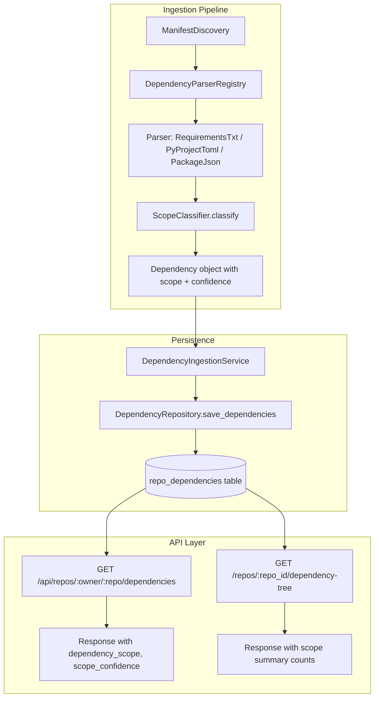

# Design Document: Dependency Scope Classification (Phase 1 — Direct Dependencies)

## Overview

This design covers Phase 1 of dependency scope classification: classifying **direct dependencies only** in the `repo_dependencies` table. Each dependency gets a `dependency_scope` (runtime, dev, test, build, optional, peer, unknown) and `scope_confidence` (high, medium, low) derived from ecosystem-specific manifest parsing rules.

Phase 1 is intentionally narrow:
- Classify direct dependencies via a new pure-function `ScopeClassifier` module.
- Integrate classification into existing parsers.
- Add `dependency_scope` and `scope_confidence` columns to `repo_dependencies`.
- Persist scope fields through the ingestion pipeline.
- Expose scope fields and summary counts in API responses.

**Explicit non-goals for Phase 1:** transitive scope inheritance, `resolved_dependencies` schema changes, UI filtering, graph filtering, runtime-only toggle.

## Architecture



The `ScopeClassifier` is a stateless, pure-function module. It receives parsed metadata (ecosystem, manifest type, dependency group, source file path) and returns a `(dependency_scope, scope_confidence)` tuple. It has no database or network dependencies, making it trivially testable.

**Design decision:** Classification happens inside each parser's `parse()` method rather than as a post-processing step. This keeps the scope assignment co-located with the parsing logic that understands manifest structure, and avoids a second pass over dependencies.

## Components and Interfaces

### 1. ScopeClassifier Module

**Location:** `src/open_source_risk_model/dependencies/scope_classifier.py`

```python
from enum import Enum
from typing import Tuple

class DependencyScope(str, Enum):
    RUNTIME = "runtime"
    DEV = "dev"
    TEST = "test"
    BUILD = "build"
    OPTIONAL = "optional"
    PEER = "peer"
    UNKNOWN = "unknown"

class ScopeConfidence(str, Enum):
    HIGH = "high"
    MEDIUM = "medium"
    LOW = "low"

def classify(
    ecosystem: str,
    manifest_type: str,
    dependency_group: str,
    source_file: str,
    is_optional: bool = False,
) -> Tuple[DependencyScope, ScopeConfidence]:
    """Classify a dependency's scope from manifest metadata.
    
    Pure function. No side effects. Deterministic.
    
    Args:
        ecosystem: "npm", "pypi", "cargo", etc.
        manifest_type: "package.json", "pyproject.toml", "requirements.txt", "Cargo.toml"
        dependency_group: The group/section the dep was parsed from (e.g. "prod", "dev", "test", "peer")
        source_file: Full manifest file path (e.g. "requirements-dev.txt")
        is_optional: Whether the dependency was marked optional in the manifest
    
    Returns:
        (DependencyScope, ScopeConfidence) tuple
    
    Note: dependency_group is normalized to "unknown" if None before classification.
    """
```

**Classification rules (by ecosystem):**

| Ecosystem | Manifest | Group / Pattern | Scope | Confidence |
|-----------|----------|-----------------|-------|------------|
| npm | package.json | `dependencies` (group="prod") | runtime | high |
| npm | package.json | `devDependencies` (group="dev") | dev | high |
| npm | package.json | `optionalDependencies` (group="optional") | optional | high |
| npm | package.json | `peerDependencies` (group="peer") | peer | medium |
| pypi | pyproject.toml | `project.dependencies` (group="prod") | runtime | high |
| pypi | pyproject.toml | `project.optional-dependencies` (is_optional=True, group not dev/test/docs) | optional | high |
| pypi | pyproject.toml | group in {dev, lint, typecheck, tooling} | dev | high |
| pypi | pyproject.toml | group = "test" | test | high |
| pypi | pyproject.toml | group = "docs" | build | medium |
| pypi | pyproject.toml | Poetry main deps (group="prod") | runtime | high |
| pypi | pyproject.toml | Poetry group="dev" | dev | high |
| pypi | pyproject.toml | Poetry group="test" | test | high |
| pypi | pyproject.toml | Poetry group="docs" | build | high |
| pypi | pyproject.toml | Poetry optional=true / extras | optional | high |
| pypi | requirements.txt | `requirements.txt` | runtime | medium |
| pypi | requirements.txt | `*dev*requirements*` or `*requirements*dev*` | dev | high |
| pypi | requirements.txt | `*test*requirements*` or `*requirements*test*` | test | high |
| pypi | requirements.txt | `*docs*requirements*` or `*requirements*docs*` | build | medium |
| pypi | requirements.txt | unrecognized filename | unknown | low |
| cargo | Cargo.toml | `[dependencies]` (group="prod") | runtime | high |
| cargo | Cargo.toml | `[dev-dependencies]` (group="dev") | dev | high |
| cargo | Cargo.toml | `[build-dependencies]` (group="build") | build | high |
| * | * | fallback | unknown | low |

### 2. Parser Integration

Each parser's `parse()` method will call `classify()` and set `dependency_scope` and `scope_confidence` on the `Dependency` dataclass. The `Dependency` dataclass gains two new fields:

```python
@dataclass
class Dependency:
    # ... existing fields ...
    dependency_scope: str = "unknown"
    scope_confidence: str = "low"
```

The `to_dict()` method will include these fields. Each parser sets them after parsing each dependency entry, using the group/section context it already has.

### 3. DependencyRepository Changes

`save_dependencies()` will persist `dependency_scope` and `scope_confidence` in the INSERT statement. The existing `get_dependencies()` already returns `SELECT *`, so the new columns will appear automatically in results.

### 4. DependencyIngestionService Changes

Minimal — the service already passes `Dependency` objects through to `save_dependencies()`. The only change is ensuring the new fields flow through the `to_dict()` conversion.

### 5. API Changes

**`GET /api/repos/{owner}/{repo}/dependencies`**: Each dependency dict in the response will include `dependency_scope` and `scope_confidence` fields (automatic from `SELECT *`).

**`GET /repos/{repo_id}/dependency-tree`**: The `SummaryMetrics` object gains scope breakdown counts. The `TreeNode.to_dict()` will include `dependency_scope` when available.

**New summary fields on `SummaryMetrics` (Phase 1 — direct-only, explicitly named):**
- `direct_runtime_dependency_count`
- `direct_dev_dependency_count`
- `direct_test_dependency_count`
- `direct_build_dependency_count`
- `direct_optional_dependency_count`
- `direct_peer_dependency_count`
- `direct_unknown_dependency_count`
- `direct_total_dependency_count`
- `scope_counts_are_direct_only: true` — boolean flag indicating these counts cover direct dependencies only, not transitive

All scope count field names use the `direct_` prefix to prevent confusion with future transitive scope counts (Phase 2). The `scope_counts_are_direct_only` flag provides a machine-readable signal for API consumers.

**API/UI label:** All scope counts MUST be labeled as `"Direct dependencies, classified from manifests"` in API response metadata and any UI display. This communicates both the scope limitation (direct only) and the heuristic nature of classification.

No `transitive_runtime_dependency_count` yet — that is a Phase 2 concern.

## Data Models

### repo_dependencies Table (Modified)

Two new columns added via migration:

```sql
ALTER TABLE repo_dependencies ADD COLUMN dependency_scope TEXT DEFAULT 'unknown';
ALTER TABLE repo_dependencies ADD COLUMN scope_confidence TEXT DEFAULT 'low';

CREATE INDEX IF NOT EXISTS idx_repo_dependencies_scope
    ON repo_dependencies(dependency_scope);
```

Existing rows get `dependency_scope = 'unknown'` and `scope_confidence = 'low'` via the DEFAULT clause. No data loss. Queries that don't reference scope columns continue to work unchanged.

**Allowed values:**
- `dependency_scope`: runtime, dev, test, build, optional, peer, unknown
- `scope_confidence`: high, medium, low

### Dependency Dataclass (Modified)

```python
@dataclass
class Dependency:
    package_name: str
    specifier: str = ""
    extras: List[str] = field(default_factory=list)
    markers: str = ""
    dependency_group: str = "prod"
    is_optional: bool = False
    manifest_path: str = ""
    dependency_scope: str = "unknown"      # NEW
    scope_confidence: str = "low"          # NEW
```

### SummaryMetrics Dataclass (Modified)

All scope count fields use the `direct_` prefix to unambiguously indicate these are direct-only counts. The `scope_counts_are_direct_only` flag provides a machine-readable signal. In Phase 2, transitive scope counts will use a separate set of fields (e.g. `transitive_runtime_dependency_count`).

```python
@dataclass
class SummaryMetrics:
    # ... existing fields ...
    direct_runtime_dependency_count: int = 0      # NEW — Phase 1
    direct_dev_dependency_count: int = 0          # NEW — Phase 1
    direct_test_dependency_count: int = 0         # NEW — Phase 1
    direct_build_dependency_count: int = 0        # NEW — Phase 1
    direct_optional_dependency_count: int = 0     # NEW — Phase 1
    direct_peer_dependency_count: int = 0         # NEW — Phase 1
    direct_unknown_dependency_count: int = 0      # NEW — Phase 1
    direct_total_dependency_count: int = 0        # NEW — Phase 1
    scope_counts_are_direct_only: bool = True     # NEW — Phase 1 flag
    scope_classification_label: str = "Direct dependencies, classified from manifests"  # NEW
    scope_note: str = "Dependency scope is classified from manifests and may not reflect actual runtime usage."  # NEW
```

### TreeNode (Phase 1 — Minimal)

`TreeNode` gains an optional `dependency_scope` field for display purposes. In Phase 1, this is populated only for direct dependencies from the `repo_dependencies` row data. Transitive nodes will show `None` until Phase 2 adds scope inheritance.

```python
@dataclass
class TreeNode:
    # ... existing fields ...
    dependency_scope: Optional[str] = None   # NEW
    scope_confidence: Optional[str] = None   # NEW
```


## Correctness Properties

*A property is a characteristic or behavior that should hold true across all valid executions of a system — essentially, a formal statement about what the system should do. Properties serve as the bridge between human-readable specifications and machine-verifiable correctness guarantees.*

### Property 1: Output Domain Validity

*For any* input to `classify()` — including arbitrary strings for ecosystem, manifest_type, dependency_group, and source_file — the returned `dependency_scope` SHALL be one of {runtime, dev, test, build, optional, peer, unknown} and the returned `scope_confidence` SHALL be one of {high, medium, low}. The function SHALL never return None, raise an exception, or produce a value outside these sets.

**Validates: Requirements 7.2, 16.2**

### Property 2: Classification Determinism

*For any* valid manifest metadata input (ecosystem, manifest_type, dependency_group, source_file, is_optional), calling `classify()` twice with identical arguments SHALL produce identical `(dependency_scope, scope_confidence)` results. The function is pure and stateless.

**Validates: Requirements 16.1**

### Property 3: Scope Count Conservation

*For any* set of direct dependency nodes where each node has an assigned `dependency_scope`, the sum of `direct_runtime_dependency_count + direct_dev_dependency_count + direct_test_dependency_count + direct_build_dependency_count + direct_optional_dependency_count + direct_peer_dependency_count + direct_unknown_dependency_count` SHALL equal `direct_total_dependency_count`. No dependency is double-counted or lost.

**Validates: Requirements 11.1, 11.2**

### Property 4: Existing Metrics Preservation

*For any* dependency tree, after scope classification is added, the existing invariant `total_dependencies == direct_dependencies + transitive_dependencies` SHALL continue to hold. Scope classification does not alter the existing counting logic.

**Validates: Requirements 14.2**

## Error Handling

### ScopeClassifier Errors

The `classify()` function is designed to never fail. It uses a chain of if/elif checks with a final fallback to `(unknown, low)`. Any unrecognized ecosystem, manifest type, or group name falls through to the default. No exceptions are raised.

### Migration Errors

If the `ALTER TABLE` migration fails (e.g., column already exists), the migration logic uses `IF NOT EXISTS`-style checks. The `_migrate_schema()` function in `db.py` already follows this pattern — it checks `PRAGMA table_info` for existing columns before adding new ones.

### Parser Integration Errors

If `classify()` were to raise an unexpected exception (it shouldn't, but defensively), the parser catches it and falls back to `dependency_scope='unknown'`, `scope_confidence='low'`. This ensures no dependency is ever stored without scope fields.

### Backwards Compatibility

- Existing rows without scope columns get defaults via `ALTER TABLE ... DEFAULT`.
- Queries that don't reference `dependency_scope` or `scope_confidence` continue to work.
- The `SummaryMetrics` new fields use `direct_` prefix and default to 0, so existing serialization is additive-only. The `scope_counts_are_direct_only` flag and `scope_classification_label` field provide explicit context for API consumers.
- `TreeNode.dependency_scope` is `Optional[str]` and omitted from `to_dict()` when `None`.

## Testing Strategy

### Unit Tests (Example-Based)

1. **Classification rule table tests**: Exhaustive tests for every row in the classification rules table. Each test provides specific (ecosystem, manifest_type, dependency_group, source_file) input and asserts the exact (scope, confidence) output. Covers:
   - npm: prod, dev, optional, peer
   - pyproject.toml PEP 621: dependencies, optional-dependencies, named groups (dev, test, docs, lint, typecheck, tooling)
   - pyproject.toml Poetry: main deps, dev/test/docs groups, optional=true
   - requirements.txt: plain, dev, test, docs, unrecognized
   - Cargo.toml: dependencies, dev-dependencies, build-dependencies
   - Fallback: unrecognized ecosystem → (unknown, low)

2. **Parser integration tests**: Parse sample manifest content, verify every `Dependency` object has correct `dependency_scope` and `scope_confidence`.

3. **Migration tests**: Verify existing rows get defaults, new rows get classified values.

4. **API response tests**: Call dependency and tree endpoints, verify scope fields appear in responses.

5. **Summary metrics tests**: Verify `direct_*` scope breakdown counts are correct for known dependency sets. Verify `scope_counts_are_direct_only` is `True`. Verify `scope_classification_label` is `"Direct dependencies, classified from manifests"`.

6. **Regression tests**: Verify existing `total_dependencies`, `direct_dependencies`, `transitive_dependencies` counts are unchanged after adding scope.

### Property-Based Tests (Hypothesis)

Property-based tests use the `hypothesis` library (already in use in this project). Each test runs a minimum of 100 iterations.

1. **Property 1 test**: Generate arbitrary strings for all `classify()` parameters. Assert output is always in valid enum sets.
   - Tag: `Feature: dependency-scope-classification, Property 1: Output domain validity`

2. **Property 2 test**: Generate arbitrary valid inputs. Call `classify()` twice. Assert results are identical.
   - Tag: `Feature: dependency-scope-classification, Property 2: Classification determinism`

3. **Property 3 test**: Generate random lists of direct dependencies with random scope assignments. Run `SummaryMetricsCalculator`. Assert sum of `direct_*` scope counts == `direct_total_dependency_count`.
   - Tag: `Feature: dependency-scope-classification, Property 3: Scope count conservation`

4. **Property 4 test**: Generate random dependency trees. Run metrics calculator. Assert `total == direct + transitive`.
   - Tag: `Feature: dependency-scope-classification, Property 4: Existing metrics preservation`

### Test File Locations

- `test/dependencies/test_scope_classifier.py` — unit + property tests for classify()
- `test/dependencies/test_scope_classifier_properties.py` — property-based tests
- `test/tree/test_scope_metrics.py` — scope count conservation tests
- `test/dependencies/test_parser_scope_integration.py` — parser integration tests
- `test/api/test_scope_api.py` — API response tests
