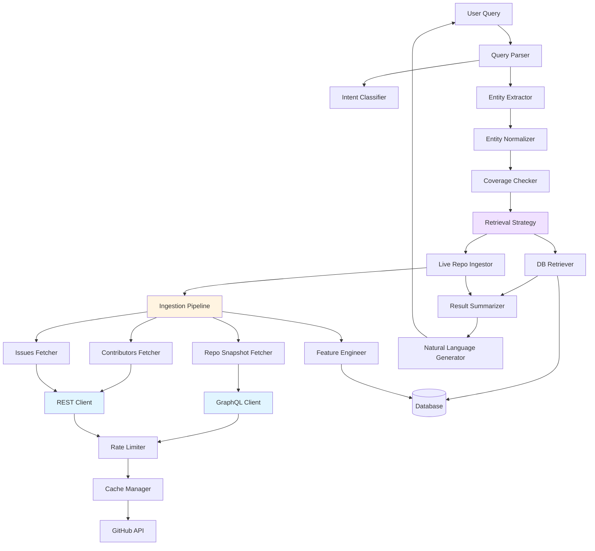

# Design Document: GitHub API Optimization and Query Coverage

## Overview

This feature introduces two critical enhancements to the open-source risk analysis system:

1. **Hybrid GraphQL/REST API Ingestion**: Reduces GitHub API calls by 50-80% through strategic use of GraphQL for repository snapshots and REST for activity data, enabling efficient ingestion of 100-1,000 repositories.

2. **Universal Query Coverage**: Enables natural language queries about any GitHub repository by combining pre-ingested database results with on-demand live ingestion, supporting provisional (fast, snapshot-only) and full (complete analysis) scoring modes.

### Current System State

The system currently maintains maintenance risk scores for 145 repositories using REST-only API ingestion. Key metrics:
- 10,396 dependencies tracked
- 86.5% dependency resolution rate
- Approaching 5,000 req/hour GitHub rate limit
- 1-hour API response cache TTL
- Maintenance risk scoring: weighted features (0-1 scale), risk bands (low/medium/high/critical)

### Problem Statement

**API Efficiency**: Current REST-only ingestion requires 15-30 API calls per repository for snapshot data that could be fetched in a single GraphQL query. This limits scalability and risks rate limit exhaustion.

**Query Coverage**: Users cannot query repositories outside the pre-ingested dataset of 145 repos. Queries for uningested repositories fail, limiting system utility.

### Solution Approach

**Hybrid API Strategy**: Use GraphQL for batch repository snapshot fetching (pushedAt, stars, releases, license, issues count) and REST for activity data requiring pagination (contributors, issue lifecycle). This reduces API calls while maintaining data completeness.

**Adaptive Batching**: GraphQL batching starts conservatively (10-15 repos per batch) and adapts based on actual query costs from GitHub's response headers. Batch sizes shrink on errors/complexity issues and grow cautiously on successes, with fallback to single-repo fetches.

**Hybrid Query System**: Implement a coverage detection and retrieval strategy selection system that:
- Returns database results for pre-ingested repos (fast)
- Performs live ingestion for missing repos (flexible)
- Combines both for hybrid queries (comprehensive)
- Supports provisional scores (snapshot-only, fast) and full scores (complete, slower)

**Data Validation with Pydantic**: All external data models (API responses, persisted payloads, GitHub data structures) use Pydantic BaseModel for automatic validation, parsing, and safer serialization. This provides better error handling for GitHub API responses and ensures data integrity at system boundaries.

### Key Design Decisions

1. **No User-Facing Latency Estimates**: The system classifies retrieval cost internally (low/medium/high) for logging and optional UI use, but does not expose latency estimates to users to avoid setting incorrect expectations.

2. **Adaptive GraphQL Batching**: Batch size starts small (10-15 repos) and adapts based on actual query costs. The system tracks GitHub's query cost headers and adjusts batch sizes conservatively - reducing by 50% on failures, increasing by 20% on successes, with a maximum of 30 repos per batch.

3. **Entity Normalization with Explicit Precedence**: Package names are normalized to repository identifiers using a strict rule hierarchy: (1) exact owner/repo format, (2) exact package mapping by ecosystem, (3) inferred mapping from aliases, (4) unresolved with warning. Edge cases like ambiguous mappings and cross-ecosystem conflicts are handled explicitly.

4. **Weighted Feature Coverage**: Minimum feature coverage threshold (default 60%) is based on WEIGHTED features, not raw count. Missing one minor feature (e.g., stars_count: 0.05 weight) should not fail scoring, but missing major feature categories (e.g., all issue metrics: 0.40+ weight) should fail.

5. **Split Retrieval Responsibilities**: DB_Retriever provides separate methods for summary retrieval (fast, query-time) and full evidence retrieval (slower, detailed inspection). This prevents query flow from becoming unnecessarily coupled to raw data structures.

6. **Evidence Scope Tracking**: All query responses include an Evidence_Scope object that tracks the source level (scored_features, raw_ingestion, or hybrid) and whether results include live fetching, cached data, or database data. This improves trust and transparency.

7. **Flexible Persistence**: Live ingestion results support three persistence modes:
   - Temporary (in-query use only)
   - Cache (1-hour TTL via Cache_Manager)
   - Optional database promotion (configurable)

8. **Conservative Issue Events Usage**: Issue events can cause API explosion. MVP uses issue metadata + comments for approximations where possible, caps issue history depth (100 issues), and defers deep per-issue event enrichment to post-MVP.

9. **Core Intent Focus**: Primary query intents are repo_lookup, repo_comparison, search_ranking, find_dependents, and missing_repo_handling, with backward compatibility for existing intents.

10. **Pydantic for External Boundaries**: All API request/response models, persisted payloads, and external data structures use Pydantic BaseModel for validation, parsing, and safer serialization. Dataclasses are used only for small internal utility objects.

## Architecture

### Component Diagram



### Data Flow

**Query Execution Flow**:
1. User submits natural language query
2. Query Parser extracts intent and entities
3. Entity Normalizer converts package names to repo identifiers
4. Coverage Checker determines which repos are in database
5. Retrieval Strategy selects DB_Retriever, Live_Repo_Ingestor, or both
6. Results are combined and formatted by Result Summarizer
7. Natural language response returned to user

**Ingestion Flow**:
1. Ingestion Pipeline receives repository list
2. Repo Snapshot Fetcher batches GraphQL queries (configurable batch size)
3. Contributors Fetcher retrieves contributor data via REST
4. Issues Fetcher retrieves issue lifecycle data via REST
5. Feature Engineer computes derived metrics
6. Results persisted to database or cache based on configuration

### Technology Stack

- **GraphQL Client**: GitHub GraphQL API v4
- **REST Client**: GitHub REST API v3
- **Rate Limiting**: Header-based tracking with exponential backoff
- **Caching**: Disk-based cache in data/github_cache/
- **Database**: Existing SQLite schema (backward compatible)
- **Configuration**: YAML format for tunable parameters

## Components and Interfaces

### 1. GraphQL Client

**Responsibility**: Execute GraphQL queries against GitHub API v4 with adaptive batching

**Interface**:
```python
class GraphQLClient:
    def execute_query(
        self,
        query: str,
        variables: Dict[str, Any],
        timeout: int = 30
    ) -> Dict[str, Any]:
        """Execute GraphQL query with retry logic."""
        pass
    
    def batch_repo_query(
        self,
        repo_identifiers: List[str],
        batch_size: int = None  # Uses config default if None
    ) -> List[Dict[str, Any]]:
        """Batch query multiple repositories using aliases with adaptive sizing."""
        pass
    
    def track_query_cost(self, response: Dict[str, Any]) -> None:
        """Track query cost from response headers for adaptive batching."""
        pass
```

**Adaptive Batching Strategy** (CRITICAL):
- Start with small configurable batch size (default: 10-15 repos per batch)
- Track query costs from X-RateLimit-Cost response header
- If query fails with complexity error, reduce batch size by 50%
- If query succeeds with low cost, cautiously increase batch size by 20% (max: 30)
- Keep fallback path to single-repo snapshot fetch on repeated failures
- Be conservative, not aggressive - prefer smaller batches that succeed
- Log batch size adjustments for monitoring

**Key Features**:
- Automatic retry with exponential backoff (3 attempts)
- GraphQL alias generation for batched queries
- Error parsing to identify failed repositories in batch
- Cursor-based pagination support
- Conservative adaptive batch sizing based on actual query costs

### 2. REST Client

**Responsibility**: Execute REST API calls against GitHub API v3

**Interface**:
```python
class RESTClient:
    def get(
        self,
        endpoint: str,
        params: Dict[str, Any] = None,
        timeout: int = 30
    ) -> Dict[str, Any]:
        """Execute GET request with retry logic."""
        pass
    
    def paginate(
        self,
        endpoint: str,
        params: Dict[str, Any] = None,
        max_pages: int = None
    ) -> Iterator[Dict[str, Any]]:
        """Follow Link header pagination."""
        pass
```

**Key Features**:
- Link header pagination
- Automatic retry with exponential backoff (3 attempts)
- 30-second timeout per request

### 3. Rate Limiter

**Responsibility**: Monitor and enforce GitHub API rate limits

**Interface**:
```python
class RateLimiter:
    def check_and_wait(self, api_type: str) -> None:
        """Check rate limit and wait if necessary."""
        pass
    
    def update_from_headers(
        self,
        headers: Dict[str, str],
        api_type: str
    ) -> None:
        """Update rate limit state from response headers."""
        pass
    
    def get_remaining(self, api_type: str) -> int:
        """Get remaining quota for API type."""
        pass
```

**Key Features**:
- Separate tracking for REST and GraphQL APIs
- Warning at 100 requests remaining
- Automatic pause when quota exhausted
- Exponential backoff for 403/429 errors (max 60s)

### 4. Repo Snapshot Fetcher

**Responsibility**: Fetch repository metadata using GraphQL with adaptive batching

**Interface**:
```python
class RepoSnapshotFetcher:
    def fetch_snapshots(
        self,
        repo_identifiers: List[str],
        batch_size: int = None
    ) -> List[RepositorySnapshot]:
        """Fetch repository snapshots with adaptive batching."""
        pass
    
    def fetch_single(
        self,
        repo_identifier: str
    ) -> RepositorySnapshot:
        """Fetch single repository snapshot (fallback for batch failures)."""
        pass
```

**Data Structure**: Uses Pydantic `RepositorySnapshot` model (see Data Models section)

### 5. Contributors Fetcher

**Responsibility**: Fetch contributor data using REST API

**Interface**:
```python
class ContributorsFetcher:
    def fetch_contributors(
        self,
        repo_identifier: str
    ) -> List[ContributorRecord]:
        """Fetch contributor data with pagination."""
        pass
    
    def fetch_contributor_stats(
        self,
        repo_identifier: str
    ) -> List[ContributorStats]:
        """Fetch detailed contributor statistics."""
        pass
```

**Data Structure**: Uses Pydantic `ContributorRecord` model (see Data Models section)

### 6. Issues Fetcher

**Responsibility**: Fetch issue lifecycle data using REST API

**Interface**:
```python
class IssuesFetcher:
    def fetch_issues(
        self,
        repo_identifier: str,
        state: str = "all"
    ) -> List[IssueRecord]:
        """Fetch issues with pagination."""
        pass
    
    def fetch_issue_events(
        self,
        repo_identifier: str,
        issue_number: int
    ) -> List[IssueEvent]:
        """Fetch events for specific issue (use sparingly - see guidance below)."""
        pass
```

**CRITICAL - Issue Events Usage Guidance**:

Issue events can cause API usage explosion. Follow these rules:

1. **Identify Required Features**: Determine which maintenance risk features TRULY require per-issue events vs. what can be approximated from issue metadata + comments
   - `avg_time_to_first_maintainer_response_days`: May need events to identify maintainer responses
   - `median_time_to_close_days`: Can use issue created_at and closed_at (no events needed)
   - `fraction_issues_closed_12mo`: Can use issue state and timestamps (no events needed)
   - `fraction_open_issues_stale_180d`: Can use issue updated_at (no events needed)

2. **Provisional Mode**: Skip deep issue enrichment entirely - use only issue list metadata

3. **Full Mode**: Fetch issue events ONLY for features that cannot be approximated otherwise

4. **Issue History Depth**: For MVP, consider capping issue history (e.g., last 100 issues) rather than fetching all historical issues

5. **Sampling Strategy**: For repos with 1000+ issues, consider sampling recent issues rather than exhaustive analysis

**Data Structure**: Uses Pydantic `IssueRecord` model (see Data Models section)

### 7. Feature Engineer

**Responsibility**: Compute derived maintenance risk metrics with weighted coverage tracking

**Interface**:
```python
class FeatureEngineer:
    def compute_features(
        self,
        snapshot: RepositorySnapshot,
        contributors: List[ContributorRecord],
        issues: List[IssueRecord]
    ) -> Dict[str, float]:
        """Compute all features from raw data."""
        pass
    
    def compute_provisional_features(
        self,
        snapshot: RepositorySnapshot,
        contributors: List[ContributorRecord]
    ) -> Dict[str, float]:
        """Compute snapshot-only features (fast mode)."""
        pass
    
    def check_feature_coverage(
        self,
        features: Dict[str, float],
        weights: Dict[str, float]
    ) -> Tuple[float, List[str]]:
        """Check WEIGHTED feature coverage and identify missing categories."""
        pass
```

**Feature Categories**:
- Repository snapshot: days_since_last_push, days_since_last_release, stars_count, archived, open_issues_count
- Contributor metrics: contributors_count, contributors_last_12mo, top_contributor_fraction_12mo
- Issue lifecycle metrics: issues_per_contributor, fraction_issues_closed_12mo, fraction_open_issues_stale_180d, avg_time_to_first_maintainer_response_days, median_time_to_close_days, open_issue_age_p90_days

**CRITICAL - Weighted Coverage Calculation**:

Coverage is based on WEIGHTED features, not raw feature count:

1. **Weight-Based Calculation**: 
   - Sum weights of available features / Sum of all feature weights
   - Example: If missing one minor feature (stars_count: 0.05 weight), coverage might be 95%
   - Example: If missing most issue-lifecycle features (combined weight > 0.40), coverage might be 55%

2. **Threshold Enforcement**:
   - Default threshold: 60% of weighted features required
   - Missing one minor feature should NOT fail score
   - Missing major feature categories (e.g., all issue metrics) SHOULD fail score

3. **Category Identification**:
   - Track which feature CATEGORIES are missing (not individual features)
   - Categories: "snapshot_metrics", "contributor_metrics", "issue_lifecycle_metrics"
   - Report missing categories in Data_Provenance

**Output**: Features matching feature_mapping_config.py schema

### 8. Ingestion Pipeline

**Responsibility**: Orchestrate repository ingestion

**Interface**:
```python
class IngestionPipeline:
    def ingest_repositories(
        self,
        repo_identifiers: List[str],
        mode: str = "full"  # "full" or "provisional"
    ) -> IngestionSummary:
        """Ingest multiple repositories with progress reporting."""
        pass
    
    def ingest_single(
        self,
        repo_identifier: str,
        mode: str = "full"
    ) -> IngestionResult:
        """Ingest single repository."""
        pass
```

**Data Structures** (using Pydantic):
```python
class IngestionResult(BaseModel):
    """Result of ingesting a single repository."""
    repo_full_name: str
    success: bool
    features: Optional[Dict[str, float]] = None
    maintenance_risk_score: Optional[float] = None
    score_completeness: str  # "full" or "provisional"
    api_calls_made: int = Field(..., ge=0)
    ingestion_time_seconds: float = Field(..., ge=0.0)
    error: Optional[str] = None
    missing_feature_categories: list[str] = Field(default_factory=list)

class IngestionSummary(BaseModel):
    """Summary of batch ingestion operation."""
    total_repos: int = Field(..., ge=0)
    successful: int = Field(..., ge=0)
    failed: int = Field(..., ge=0)
    total_api_calls: int = Field(..., ge=0)
    total_time_seconds: float = Field(..., ge=0.0)
    avg_api_calls_per_repo: float = Field(..., ge=0.0)
    avg_time_per_repo: float = Field(..., ge=0.0)
    rate_limit_remaining: Dict[str, int]
```

**Error Handling**: Continues with remaining repositories if individual fetches fail

### 9. Query Parser

**Responsibility**: Parse natural language queries

**Interface**:
```python
class QueryParser:
    def parse(self, query: str) -> ParsedQuery:
        """Parse natural language query."""
        pass
```

**Data Structures** (using Pydantic):
```python
class Entity(BaseModel):
    """Extracted entity from query."""
    type: str = Field(..., description="repository, package, or ecosystem")
    value: str = Field(..., description="Original value from query")
    normalized_value: str = Field(..., description="Canonical form after normalization")

class ParsedQuery(BaseModel):
    """Parsed query representation."""
    intent: str = Field(..., description="Classified intent")
    entities: list[Entity] = Field(default_factory=list)
    parameters: Dict[str, Any] = Field(default_factory=dict)
    confidence: float = Field(..., ge=0.0, le=1.0)
```

**Integration**: Uses existing Intent_Classifier from intent_classifier.py

### 10. Entity Normalizer

**Responsibility**: Normalize entity identifiers to canonical forms with explicit precedence rules

**Interface**:
```python
class EntityNormalizer:
    def normalize_repository(self, repo_ref: str) -> str:
        """Normalize repository reference to owner/repo format."""
        pass
    
    def normalize_package(
        self,
        package_name: str,
        ecosystem: Optional[str] = None
    ) -> NormalizationResult:
        """Normalize package name to repository identifier with confidence."""
        pass
    
    def load_mappings(self, mapping_file: str) -> None:
        """Load package-to-repo mapping table."""
        pass
```

**CRITICAL - Entity Normalization Rule Hierarchy**:

Rules are applied in strict precedence order:

1. **Exact owner/repo format** (highest priority)
   - Input: "numpy/numpy" → Output: "numpy/numpy" (confidence: 1.0)
   - Input: "django/django" → Output: "django/django" (confidence: 1.0)

2. **Exact package mapping by ecosystem** (from YAML)
   - Input: "numpy" + ecosystem="pypi" → Output: "numpy/numpy" (confidence: 0.95)
   - Input: "react" + ecosystem="npm" → Output: "facebook/react" (confidence: 0.95)

3. **Inferred mapping from known repo/package aliases**
   - Input: "numpy" (no ecosystem) → Check if unique across all ecosystems
   - If unique: Output: "numpy/numpy" (confidence: 0.80)
   - If ambiguous: Return multiple candidates with warning

4. **Unresolved entity warning** (lowest priority)
   - Input: "unknown-package" → Output: None, warning logged (confidence: 0.0)

**Handling Edge Cases**:

- **Package maps to multiple repos**: Return primary mapping + log alternatives
  - Example: "react" could be "facebook/react" (primary) or "react-tools/react" (alternative)
  
- **Repo is obvious but not in mapping table**: Use heuristic (package_name/package_name) with lower confidence
  - Example: "fastapi" → "tiangolo/fastapi" (confidence: 0.60, requires validation)
  
- **Same term exists across ecosystems**: Require ecosystem specification or return ambiguity error
  - Example: "request" exists in npm and pypi → Require ecosystem or return both with warning
  
- **Determinism**: Normalization is deterministic for same inputs - same package + ecosystem always produces same result

**Normalization Result** (using Pydantic):
```python
class NormalizationResult(BaseModel):
    """Result of entity normalization."""
    canonical_identifier: Optional[str] = Field(None, description="Normalized repo identifier")
    confidence: float = Field(..., ge=0.0, le=1.0, description="Confidence in normalization")
    alternatives: list[str] = Field(default_factory=list, description="Alternative mappings if ambiguous")
    warning: Optional[str] = Field(None, description="Warning message if unresolved or ambiguous")
```

**Normalization Examples**:
- "numpy" → "numpy/numpy"
- "flask" → "pallets/flask"
- "react" → "facebook/react"
- "django/django" → "django/django" (already normalized)

**Mapping Table Format** (YAML):
```yaml
pypi:
  numpy: numpy/numpy
  flask: pallets/flask
  requests: psf/requests
npm:
  react: facebook/react
  vue: vuejs/vue
  express: expressjs/express
```

### 11. Coverage Checker

**Responsibility**: Determine repository availability in database

**Interface**:
```python
class CoverageChecker:
    def check_coverage(
        self,
        repo_identifiers: List[str]
    ) -> CoverageReport:
        """Check which repositories are in database."""
        pass
```

**Data Structures** (using Pydantic):
```python
class RepoStatus(BaseModel):
    """Status of a repository in the database."""
    repo_full_name: str
    last_updated: datetime
    score_completeness: str  # "full" or "provisional"

class CoverageReport(BaseModel):
    """Report of repository coverage in database."""
    coverage_mode: str = Field(..., description="database_only, live_ingestion_required, or hybrid")
    in_database: list[RepoStatus] = Field(default_factory=list)
    missing: list[str] = Field(default_factory=list)
    invalid: list[str] = Field(default_factory=list)
```

### 12. Retrieval Strategy

**Responsibility**: Select optimal data retrieval approach

**Interface**:
```python
class RetrievalStrategy:
    def select_strategy(
        self,
        coverage_report: CoverageReport,
        user_preferences: Dict[str, Any]
    ) -> RetrievalPlan:
        """Select retrieval strategy based on coverage."""
        pass
```

**Data Structure** (using Pydantic):
```python
class RetrievalPlan(BaseModel):
    """Plan for retrieving repository data."""
    use_database: bool
    use_live_ingestion: bool
    live_ingestion_mode: str = Field(..., description="provisional or full")
    repos_from_database: list[str] = Field(default_factory=list)
    repos_for_ingestion: list[str] = Field(default_factory=list)
    cost_classification: str = Field(..., description="low, medium, or high (internal only)")
    evidence_scope: EvidenceScope
```

**Cost Classification** (internal logging only):
- Low: database_only
- Medium: hybrid with provisional scores
- High: live_ingestion_required with full scores

### 13. DB Retriever

**Responsibility**: Fetch data from local database with separate summary and full evidence retrieval

**Interface**:
```python
class DBRetriever:
    def retrieve_summary(
        self,
        repo_identifiers: List[str]
    ) -> List[RepoSummary]:
        """Retrieve summary data for query-time use (fast)."""
        pass
    
    def retrieve_full_evidence(
        self,
        repo_identifier: str
    ) -> RepoFullEvidence:
        """Retrieve complete evidence for detailed inspection (slower)."""
        pass
```

**CRITICAL - Split Retrieval Responsibilities**:

**Summary Retrieval** (for query-time):
- Repository name
- Maintenance risk score
- Risk band
- Feature values (for scoring)
- Data provenance (source, timestamp, completeness)
- Missing feature categories

**Full Evidence Retrieval** (for detailed inspection):
- All summary data PLUS:
- Raw Repository_Snapshot
- Raw Contributor_Record list
- Raw Issue_Record list
- Complete ingestion metadata

This prevents query flow from becoming slower and more coupled than necessary.

**Data Structures** (using Pydantic):
```python
class RepoSummary(BaseModel):
    """Summary data for query-time use."""
    repo_full_name: str
    maintenance_risk_score: float = Field(..., ge=0.0, le=1.0)
    risk_band: str = Field(..., description="low, medium, high, or critical")
    features: Dict[str, float]
    provenance: DataProvenance

class RepoFullEvidence(BaseModel):
    """Complete evidence for detailed inspection."""
    summary: RepoSummary
    snapshot: RepositorySnapshot
    contributors: list[ContributorRecord]
    issues: list[IssueRecord]
    ingestion_metadata: Dict[str, Any]
```

### 14. Live Repo Ingestor

**Responsibility**: Perform on-demand repository ingestion

**Interface**:
```python
class LiveRepoIngestor:
    def ingest(
        self,
        repo_identifiers: List[str],
        mode: str = "provisional",
        persistence_mode: str = "cache"
    ) -> List[RepoSummary]:
        """Ingest repositories on demand, returning summary data."""
        pass
```

**Persistence Modes**:
- "temporary": In-query use only, not persisted
- "cache": Store in Cache_Manager with 1-hour TTL
- "database": Promote to main database (optional, configurable)

**Returns**: Uses Pydantic `RepoSummary` model (see DB Retriever section)

### 15. Result Summarizer

**Responsibility**: Combine and format query results

**ARCHITECTURAL NOTE**: This component currently handles multiple responsibilities:
- Result combination (database + live results)
- Provenance formatting
- Natural language generation
- Explanation of contributing factors

**Recommended Split** (not mandatory for MVP, but cleaner architecture):
- **Result Merger/Formatter**: Combines database + live results, formats provenance
- **Answer Generator**: Takes formatted results and generates natural language

For MVP, a single component is acceptable, but consider splitting post-MVP for maintainability.

**Interface**:
```python
class ResultSummarizer:
    def summarize(
        self,
        results: List[RepoSummary],
        intent: str
    ) -> QueryResponse:
        """Generate natural language response from results."""
        pass
    
    def merge_results(
        self,
        db_results: List[RepoSummary],
        live_results: List[RepoSummary]
    ) -> List[RepoSummary]:
        """Merge database and live ingestion results."""
        pass
```

**Data Structure** (using Pydantic):
```python
class QueryResponse(BaseModel):
    """Response to user query."""
    natural_language_response: str
    structured_results: list[RepoSummary]
    warnings: list[str] = Field(default_factory=list)
    metadata: Dict[str, Any] = Field(default_factory=dict)
    evidence_scope: EvidenceScope
```

**Response Generation**:
- Ranks repositories by maintenance_risk_score
- Explains key contributing factors
- Includes data provenance information
- Warns about provisional scores or missing features
- Highlights comparison limitations when mixing score types

### 16. Cache Manager

**Responsibility**: Manage API response and live ingestion caching

**Interface**:
```python
class CacheManager:
    def get(self, key: str) -> Optional[Any]:
        """Retrieve cached value if not expired."""
        pass
    
    def set(
        self,
        key: str,
        value: Any,
        ttl_seconds: int = 3600
    ) -> None:
        """Store value with TTL."""
        pass
    
    def invalidate(self, pattern: str) -> int:
        """Invalidate cache entries matching pattern."""
        pass
    
    def promote_to_database(self, repo_identifier: str) -> bool:
        """Promote cached live ingestion result to database."""
        pass
```

**Cache Structure**:
- API responses: `api:{endpoint}:{repo_identifier}`
- Live ingestion: `live:{repo_identifier}:{mode}`
- Disk persistence: `data/github_cache/`
- TTL: 1 hour (configurable)

## Data Models

**CRITICAL**: All external data models use Pydantic BaseModel for validation, parsing, and safer serialization. Use dataclasses ONLY for small internal utility objects.

### Repository Snapshot
```python
from pydantic import BaseModel, Field
from datetime import datetime
from typing import Optional

class RepositorySnapshot(BaseModel):
    """GitHub repository snapshot from GraphQL API."""
    repo_full_name: str = Field(..., description="Repository identifier in owner/repo format")
    pushed_at: datetime = Field(..., description="Last push timestamp")
    latest_release: Optional[datetime] = Field(None, description="Latest release timestamp")
    stargazer_count: int = Field(..., ge=0, description="Number of stars")
    is_archived: bool = Field(..., description="Whether repository is archived")
    license_info: Optional[str] = Field(None, description="License identifier")
    open_issues_count: int = Field(..., ge=0, description="Number of open issues")
    fetched_at: datetime = Field(..., description="When this snapshot was fetched")
    
    class Config:
        json_encoders = {datetime: lambda v: v.isoformat()}
```

### Contributor Record
```python
class WeeklyActivity(BaseModel):
    """Weekly contributor activity statistics."""
    week_timestamp: int = Field(..., description="Unix timestamp for week start")
    additions: int = Field(..., ge=0, description="Lines added")
    deletions: int = Field(..., ge=0, description="Lines deleted")
    commits: int = Field(..., ge=0, description="Number of commits")

class ContributorRecord(BaseModel):
    """Contributor data from GitHub REST API."""
    login: str = Field(..., description="GitHub username")
    contributions: int = Field(..., ge=0, description="Total contributions")
    weeks: list[WeeklyActivity] = Field(default_factory=list, description="Weekly activity breakdown")
    fetched_at: datetime = Field(..., description="When this data was fetched")
    
    class Config:
        json_encoders = {datetime: lambda v: v.isoformat()}
```

### Issue Record
```python
class IssueRecord(BaseModel):
    """Issue data from GitHub REST API."""
    number: int = Field(..., ge=1, description="Issue number")
    state: str = Field(..., description="Issue state: open or closed")
    created_at: datetime = Field(..., description="Issue creation timestamp")
    closed_at: Optional[datetime] = Field(None, description="Issue closure timestamp")
    updated_at: datetime = Field(..., description="Last update timestamp")
    comments: int = Field(..., ge=0, description="Number of comments")
    author_association: str = Field(..., description="Author's association with repo")
    labels: list[str] = Field(default_factory=list, description="Issue labels")
    fetched_at: datetime = Field(..., description="When this data was fetched")
    
    class Config:
        json_encoders = {datetime: lambda v: v.isoformat()}
```

### Maintenance Risk Score
```python
class MaintenanceRiskScore(BaseModel):
    """Computed maintenance risk score with metadata."""
    repo_full_name: str = Field(..., description="Repository identifier")
    score: float = Field(..., ge=0.0, le=1.0, description="Risk score on 0-1 scale")
    risk_band: str = Field(..., description="Risk classification: low, medium, high, critical")
    features: dict[str, float] = Field(..., description="Feature values used in scoring")
    feature_weights: dict[str, float] = Field(..., description="Weights applied to features")
    score_completeness: str = Field(..., description="full or provisional")
    missing_feature_categories: list[str] = Field(default_factory=list, description="Missing feature categories")
    computed_at: datetime = Field(..., description="When score was computed")
    
    class Config:
        json_encoders = {datetime: lambda v: v.isoformat()}
```

### Data Provenance
```python
class DataProvenance(BaseModel):
    """Metadata about data source and freshness."""
    source: str = Field(..., description="database or live_fetch")
    last_updated: datetime = Field(..., description="When data was last updated")
    score_completeness: str = Field(..., description="full or provisional")
    missing_feature_categories: list[str] = Field(default_factory=list, description="Missing feature categories")
    api_calls_made: Optional[int] = Field(None, ge=0, description="API calls made during fetch")
    ingestion_time_seconds: Optional[float] = Field(None, ge=0.0, description="Time taken to ingest")
    
    class Config:
        json_encoders = {datetime: lambda v: v.isoformat()}
```

### Evidence Scope
```python
class EvidenceScope(BaseModel):
    """Tracks the scope of evidence used in query results."""
    source_level: str = Field(..., description="scored_features, raw_ingestion, or hybrid")
    includes_live_fetch: bool = Field(..., description="Whether live fetching was performed")
    includes_cached_results: bool = Field(..., description="Whether cached results were used")
    includes_database_results: bool = Field(..., description="Whether database results were used")
```

### Configuration Schema
```yaml
# config/ingestion_config.yaml
graphql:
  initial_batch_size: 10  # Conservative starting point for adaptive batching
  min_batch_size: 1  # Fallback to single-repo on repeated failures
  max_batch_size: 30  # Conservative maximum (not 50)
  batch_size_increase_factor: 1.2  # Cautious 20% increase on success
  batch_size_decrease_factor: 0.5  # Aggressive 50% decrease on failure
  timeout_seconds: 30
  track_query_costs: true  # Enable cost tracking for adaptive batching

rest:
  timeout_seconds: 30
  max_pages_per_request: 10

rate_limiting:
  warning_threshold: 100
  rest_limit: 5000
  graphql_limit: 5000

caching:
  ttl_seconds: 3600
  cache_dir: "data/github_cache"
  enable_disk_persistence: true

ingestion:
  default_mode: "full"  # "full" or "provisional"
  retry_attempts: 3
  retry_backoff_base: 2
  retry_max_wait: 60
  progress_report_interval: 10

features:
  minimum_coverage_threshold: 0.6  # 60% of WEIGHTED features required
  
persistence:
  live_ingestion_mode: "cache"  # "temporary", "cache", or "database"
  auto_promote_to_database: false

entity_normalization:
  mapping_file: "config/package_repo_mappings.yaml"

mvp_scope:
  # MVP prioritization flags
  enable_deep_issue_enrichment: false  # Defer per-issue events for post-MVP
  max_issues_per_repo: 100  # Cap issue history depth for MVP
  enable_hybrid_comparison: true  # Support hybrid queries in MVP
```


## Correctness Properties

*A property is a characteristic or behavior that should hold true across all valid executions of a system—essentially, a formal statement about what the system should do. Properties serve as the bridge between human-readable specifications and machine-verifiable correctness guarantees.*

### Property Reflection

After analyzing all acceptance criteria, I identified several areas of redundancy:

1. **API Client Properties**: Requirements 1.1, 2.1-2.5 all test endpoint calling - these can be combined into a single property about correct endpoint construction.

2. **Parsing Properties**: Requirements 1.5, 2.7 both test parsing responses into data structures - these follow the same pattern and can be combined.

3. **Cache Properties**: Requirements 4.1-4.4 and 14.1-14.4 test similar cache behavior - the core caching logic is the same, just applied to different data types.

4. **Feature Computation**: Requirements 5.1-5.10 all test individual feature computations - while each feature is different, they share the property that features should be computable from raw data.

5. **Provenance Properties**: Requirements 10.3-10.4, 11.5-11.7, 20.1-20.6 all test that provenance metadata is included - these can be combined into properties about provenance completeness.

6. **Error Handling**: Requirements 1.6, 2.8, 10.5, 11.8 all test error handling - these follow similar patterns and can be consolidated.

After reflection, I've consolidated 100+ acceptance criteria into 35 unique properties that provide comprehensive validation without redundancy.

### Property 1: GraphQL Query Execution

*For any* valid GraphQL query and variables, executing the query through GraphQL_Client should either return a successful response or a descriptive error, never silently fail.

**Validates: Requirements 1.1, 1.6**

### Property 2: Repository Snapshot Completeness

*For any* repository identifier, when a snapshot is successfully fetched, the returned Repository_Snapshot should contain all required fields: pushedAt, latestRelease, stargazerCount, isArchived, licenseInfo, and openIssuesCount.

**Validates: Requirements 1.2**

### Property 3: GraphQL Batching Correctness

*For any* list of repository identifiers and any valid batch size, batching the repositories and fetching them should return the same set of snapshots as fetching them individually (order-independent).

**Validates: Requirements 1.3, 19.1**

### Property 4: GraphQL Pagination Completeness

*For any* GraphQL query requiring pagination, following cursor-based pagination through all pages should return all available items exactly once.

**Validates: Requirements 1.4**

### Property 5: Response Parsing Round-Trip

*For any* valid API response (GraphQL or REST), parsing it into a data structure and then serializing it back should preserve all required fields.

**Validates: Requirements 1.5, 2.7**

### Property 6: REST Endpoint Construction

*For any* repository identifier and REST endpoint type (contributors, issues, etc.), the constructed URL should match the GitHub API v3 specification format.

**Validates: Requirements 2.1-2.5**

### Property 7: REST Pagination Completeness

*For any* REST endpoint requiring pagination, following Link header pagination through all pages should return all available items exactly once.

**Validates: Requirements 2.6**

### Property 8: Rate Limit Header Parsing

*For any* API response containing X-RateLimit-Remaining and X-RateLimit-Reset headers, the Rate_Limiter should correctly extract and store both values.

**Validates: Requirements 3.1, 3.2**

### Property 9: Rate Limit Separation

*For any* sequence of REST and GraphQL API calls, the rate limit tracking for REST should be independent of GraphQL tracking (modifying one should not affect the other).

**Validates: Requirements 3.5**

### Property 10: Exponential Backoff Bounds

*For any* sequence of rate limit errors, the exponential backoff wait times should increase exponentially but never exceed 60 seconds.

**Validates: Requirements 3.6**

### Property 11: Cache Key Uniqueness

*For any* two different combinations of (repository_identifier, endpoint), the cache keys generated should be distinct.

**Validates: Requirements 4.1**

### Property 12: Cache Timestamp Presence

*For any* cached item, it should have an associated timestamp indicating when it was stored.

**Validates: Requirements 4.2**

### Property 13: Cache TTL Enforcement

*For any* cached item, if its age is less than the TTL (1 hour), it should be returned on cache lookup; if its age exceeds the TTL, it should not be returned (triggering a fresh fetch).

**Validates: Requirements 4.3, 4.4, 14.3, 14.4**

### Property 14: Cache Persistence Location

*For any* cached item, it should be persisted to a file within the data/github_cache/ directory.

**Validates: Requirements 4.5**

### Property 15: Cache Invalidation Isolation

*For any* repository identifier, invalidating its cache entries should not affect cache entries for other repositories.

**Validates: Requirements 4.6**

### Property 16: Feature Computation Determinism

*For any* set of raw data (snapshot, contributors, issues), computing features twice should produce identical results.

**Validates: Requirements 5.1-5.10**

### Property 17: Feature Schema Compatibility

*For any* computed feature set, all feature names should exist in feature_mapping_config.py and all values should be numeric.

**Validates: Requirements 5.11, 17.1**

### Property 18: Ingestion Pipeline Ordering

*For any* repository, the ingestion pipeline should execute steps in order: snapshot fetch → contributors fetch → issues fetch → feature engineering → persistence.

**Validates: Requirements 6.1-6.5**

### Property 19: Ingestion Error Isolation

*For any* list of repositories where some fail to ingest, the failures should not prevent successful ingestion of other repositories in the list.

**Validates: Requirements 6.6, 16.3**

### Property 20: Ingestion Summary Completeness

*For any* ingestion operation, the returned summary should contain success_count, failure_count, total_api_calls, and these counts should sum correctly (success_count + failure_count = total_repos).

**Validates: Requirements 6.8**

### Property 21: Intent Classification Validity

*For any* query that is successfully classified, the returned intent should be one of the supported intent types from the allowlist.

**Validates: Requirements 7.2**

### Property 22: Entity Extraction Presence

*For any* query containing repository or package names, the Entity_Extractor should identify at least one entity.

**Validates: Requirements 7.3, 7.4**

### Property 23: Query Parser Output Structure

*For any* successfully parsed query, the ParsedQuery should contain intent, entities, parameters, and confidence fields.

**Validates: Requirements 7.5**

### Property 24: Coverage Status Validity

*For any* repository checked by Coverage_Checker, its status should be one of: in_database, missing, or invalid.

**Validates: Requirements 8.2**

### Property 25: Coverage Mode Determination

*For any* set of repositories, if all are in_database then coverage_mode should be database_only; if all are missing then live_ingestion_required; if mixed then hybrid.

**Validates: Requirements 8.3, 8.4, 8.5**

### Property 26: Database Timestamp Presence

*For any* repository found in the database, the Coverage_Checker should include a last_updated timestamp.

**Validates: Requirements 8.6**

### Property 27: Retrieval Strategy Consistency

*For any* coverage_mode, the selected retrieval strategy should match: database_only → DB_Retriever only, live_ingestion_required → Live_Repo_Ingestor only, hybrid → both.

**Validates: Requirements 9.1, 9.2, 9.3**

### Property 28: Score Mode Propagation

*For any* user preference for provisional or full scores, the Live_Repo_Ingestor should be configured with the matching mode.

**Validates: Requirements 9.4, 9.5**

### Property 29: Database Retrieval Completeness

*For any* repository in the database, DB_Retriever should return Repository_Snapshot, Contributor_Record, Issue_Record, Maintenance_Risk_Score, and Data_Provenance.

**Validates: Requirements 10.1, 10.2**

### Property 30: Provenance Completeness

*For any* query result (database or live), the Data_Provenance should contain source, last_updated, score_completeness, and missing_feature_categories fields.

**Validates: Requirements 10.3, 10.4, 11.5, 11.6, 11.7, 20.1-20.6**

### Property 31: Live Ingestion Mode Correctness

*For any* live ingestion request, if mode is "provisional" then only snapshot and contributor data should be fetched; if mode is "full" then snapshot, contributor, and issue data should be fetched.

**Validates: Requirements 11.2, 11.3**

### Property 32: Persistence Mode Enforcement

*For any* live ingestion with persistence_mode "temporary", results should not be stored in cache or database; with "cache", results should be in cache; with "database", results should be in database.

**Validates: Requirements 11.9, 14.6**

### Property 33: Hybrid Result Preservation

*For any* hybrid query, the combined results should preserve the Data_Provenance for each repository, allowing identification of which came from database vs live ingestion.

**Validates: Requirements 12.1, 12.2, 12.3**

### Property 34: Entity Normalization Consistency

*For any* package name that has a known mapping, normalizing it multiple times should always produce the same canonical repository identifier.

**Validates: Requirements 21.1-21.6**

### Property 35: Feature Coverage Threshold Enforcement

*For any* repository where feature coverage (weighted) is below the minimum threshold (default 60%), the system should return an error rather than a potentially misleading score.

**Validates: Requirements 22.1, 22.3, 22.4**

## Error Handling

### Error Categories

1. **Network Errors**
   - Connection timeouts (30s limit)
   - DNS resolution failures
   - SSL/TLS errors
   - Retry: 3 attempts with exponential backoff

2. **API Errors**
   - Rate limit exceeded (403/429): Wait until reset time
   - Authentication failures (401): Fail immediately with clear message
   - Not found (404): Return not_found status, don't retry
   - Server errors (5xx): Retry up to 3 times
   - GraphQL errors: Parse error response, identify failing repos in batch

3. **Data Errors**
   - Invalid repository identifier: Return invalid status
   - Missing required fields in API response: Log warning, use defaults where possible
   - Feature computation failures: Log error, mark features as missing
   - Below minimum feature coverage: Return error with explanation

4. **Cache Errors**
   - Cache read failure: Log warning, proceed with fresh fetch
   - Cache write failure: Log error, continue operation (cache is optimization)
   - Disk full: Log critical error, disable caching temporarily

5. **Database Errors**
   - Connection failure: Retry 3 times, then fail operation
   - Query timeout: Retry with longer timeout
   - Constraint violations: Log error, skip problematic record

### Error Propagation Strategy

**Fail Fast**: Authentication errors, invalid configuration
**Fail Gracefully**: Individual repository ingestion failures, cache errors
**Retry with Backoff**: Network errors, rate limits, transient API errors
**Partial Success**: Batch operations continue despite individual failures

### Error Response Format

```python
@dataclass
class ErrorResponse:
    error_type: str  # "network", "api", "data", "cache", "database"
    error_code: str  # Specific error identifier
    message: str  # Human-readable description
    details: Dict[str, Any]  # Additional context
    retry_after: Optional[int]  # Seconds to wait before retry
    affected_entities: List[str]  # Repos/packages affected
```

## Testing Strategy

### Dual Testing Approach

This feature requires both unit tests and property-based tests for comprehensive validation:

**Unit Tests**: Focus on specific examples, edge cases, and integration points
- Specific API response formats
- Error handling for known failure modes
- Configuration loading and validation
- Database schema compatibility
- Integration between components

**Property-Based Tests**: Verify universal properties across all inputs
- API client behavior with random valid inputs
- Cache behavior with various TTL scenarios
- Feature computation with random raw data
- Entity normalization with various input formats
- Ingestion pipeline with random repository lists

### Property-Based Testing Configuration

**Framework**: Use `hypothesis` for Python property-based testing

**Test Configuration**:
- Minimum 100 iterations per property test (due to randomization)
- Each property test must reference its design document property
- Tag format: `# Feature: github-api-optimization-query-coverage, Property {number}: {property_text}`

**Example Property Test Structure**:
```python
from hypothesis import given, strategies as st
import pytest

# Feature: github-api-optimization-query-coverage, Property 3: GraphQL Batching Correctness
@given(
    repo_list=st.lists(st.text(min_size=5, max_size=50), min_size=1, max_size=100),
    batch_size=st.integers(min_value=1, max_value=50)
)
@pytest.mark.property_test
def test_graphql_batching_correctness(repo_list, batch_size):
    """For any list of repos and batch size, batching should return same results as individual fetches."""
    # Test implementation
    pass
```

### Unit Test Coverage Areas

1. **API Clients**
   - GraphQL query construction with aliases
   - REST endpoint URL formatting
   - Response parsing for various formats
   - Error response handling

2. **Rate Limiting**
   - Header parsing edge cases
   - Threshold warnings at exactly 100 remaining
   - Pause behavior when quota reaches 0
   - Separate tracking verification

3. **Caching**
   - Cache key generation
   - TTL expiration at boundary (exactly 1 hour)
   - Disk persistence and recovery
   - Invalidation patterns

4. **Feature Engineering**
   - Each feature computation with known inputs
   - Edge cases: no contributors, no issues, archived repos
   - Missing data handling
   - Schema compatibility

5. **Query Processing**
   - Intent classification with example queries
   - Entity extraction from various formats
   - Normalization with known mappings
   - Coverage detection scenarios

6. **Integration**
   - End-to-end query flow (database-only)
   - End-to-end query flow (live ingestion)
   - End-to-end query flow (hybrid)
   - Backward compatibility with existing CLI

### Test Data Strategy

**Fixtures**:
- Sample API responses (GraphQL and REST)
- Example repository snapshots
- Known feature computation results
- Package-to-repo mapping samples

**Mocking**:
- GitHub API responses (avoid real API calls in tests)
- Database connections (use in-memory SQLite)
- File system operations (use temporary directories)
- Time-dependent behavior (mock datetime)

**Property Test Generators**:
- Valid repository identifiers (owner/repo format)
- API response structures matching GitHub schema
- Feature value ranges (0-1 for normalized features)
- Cache keys and timestamps

### Performance Testing

**Ingestion Performance**:
- Measure API calls per repository (target: 50-80% reduction)
- Measure ingestion time per repository
- Verify batch size optimization
- Monitor rate limit consumption

**Query Performance**:
- Database-only queries: < 100ms
- Live ingestion (provisional): < 5s
- Live ingestion (full): < 30s
- Hybrid queries: sum of components

**Cache Effectiveness**:
- Cache hit rate for repeated queries
- Cache size growth over time
- Disk I/O impact

### Backward Compatibility Testing

**Existing Functionality**:
- All existing query intents still work
- Database schema unchanged
- Feature computation produces same results
- CLI commands remain functional
- Existing test suite passes

**Migration Testing**:
- Existing cached data remains valid
- Database can be queried with new code
- Configuration files are backward compatible

## Implementation Notes

### MVP Prioritization

**MVP Scope** (deliver first):

1. **GraphQL Snapshot Ingestion**: 
   - Adaptive batching with conservative defaults
   - Fetch repository snapshot data for existing maintenance-risk features
   - Track query costs and adjust batch sizes dynamically

2. **Live Fallback for Single Repo Queries**:
   - Enable queries for missing repositories
   - Provisional mode (snapshot + contributors only) as default
   - Cache results with 1-hour TTL

3. **Provenance-Aware Query Responses**:
   - Include Evidence_Scope in all responses
   - Clear indication of data source (database vs live)
   - Warnings for provisional scores

**DEFER for Post-MVP**:

1. **Broader Multi-Repo Hybrid Comparison**:
   - MVP: Support simple hybrid queries (1-2 missing repos)
   - Post-MVP: Optimize for complex hybrid queries with many missing repos

2. **Deep Issue-Event Enrichment**:
   - MVP: Use issue metadata + comments for approximations
   - Post-MVP: Fetch per-issue events only when truly required
   - MVP: Cap issue history depth (e.g., last 100 issues)
   - Post-MVP: Full historical issue analysis

3. **Advanced Features**:
   - Parallel ingestion with worker pools
   - Incremental updates for existing repositories
   - Predictive pre-fetching based on query patterns
   - Automatic database promotion of frequently queried repos

### Phase 1: API Client Infrastructure (Week 1)
- Implement GraphQL and REST clients with retry logic
- Implement Rate Limiter with separate tracking
- Implement Cache Manager with disk persistence
- Unit tests for all components

### Phase 2: Ingestion Pipeline (Week 2)
- Implement Repo Snapshot Fetcher with batching
- Implement Contributors and Issues Fetchers
- Implement Feature Engineer with coverage checking
- Implement Ingestion Pipeline orchestration
- Property tests for ingestion flow

### Phase 3: Query Coverage System (Week 3)
- Implement Entity Normalizer with mapping table
- Implement Coverage Checker
- Implement Retrieval Strategy selector
- Implement Live Repo Ingestor
- Integration tests for query flows

### Phase 4: Result Generation (Week 4)
- Implement Result Summarizer with provenance
- Implement natural language response generation
- Implement hybrid result combination
- End-to-end testing

### Phase 5: Integration and Optimization (Week 5)
- Integrate with existing query system
- Backward compatibility verification
- Performance optimization
- Documentation and examples

### Configuration Management

**Default Configuration** (config/ingestion_config.yaml):
```yaml
graphql:
  initial_batch_size: 10  # Conservative starting point
  min_batch_size: 1
  max_batch_size: 30  # Conservative maximum
  batch_size_increase_factor: 1.2
  batch_size_decrease_factor: 0.5
  timeout_seconds: 30
  track_query_costs: true

rest:
  timeout_seconds: 30
  max_pages_per_request: 10

rate_limiting:
  warning_threshold: 100
  rest_limit: 5000
  graphql_limit: 5000

caching:
  ttl_seconds: 3600
  cache_dir: "data/github_cache"
  enable_disk_persistence: true

ingestion:
  default_mode: "full"
  retry_attempts: 3
  retry_backoff_base: 2
  retry_max_wait: 60
  progress_report_interval: 10

features:
  minimum_coverage_threshold: 0.6  # 60% of WEIGHTED features

persistence:
  live_ingestion_mode: "cache"
  auto_promote_to_database: false

mvp_scope:
  enable_deep_issue_enrichment: false
  max_issues_per_repo: 100
  enable_hybrid_comparison: true
```

**Entity Normalization Mappings** (config/package_repo_mappings.yaml):
```yaml
pypi:
  numpy: numpy/numpy
  pandas: pandas-dev/pandas
  flask: pallets/flask
  django: django/django
  requests: psf/requests
  pytest: pytest-dev/pytest
  
npm:
  react: facebook/react
  vue: vuejs/vue
  angular: angular/angular
  express: expressjs/express
  webpack: webpack/webpack
  
maven:
  junit: junit-team/junit4
  mockito: mockito/mockito
  
cargo:
  serde: serde-rs/serde
  tokio: tokio-rs/tokio
```

### Monitoring and Observability

**Metrics to Track**:
- API calls per ingestion (GraphQL vs REST breakdown)
- Cache hit rate
- Rate limit consumption rate
- Ingestion success/failure rates
- Query latency by retrieval strategy
- Feature coverage distribution

**Logging Strategy**:
- INFO: Query intents, coverage modes, retrieval strategies
- WARNING: Rate limit warnings, cache failures, low feature coverage
- ERROR: API failures, ingestion failures, database errors
- DEBUG: Individual API calls, cache operations, feature computations

**Alerting Thresholds**:
- Rate limit remaining < 100: Warning
- Rate limit exhausted: Critical
- Ingestion failure rate > 10%: Warning
- Cache write failures: Warning
- Database connection failures: Critical

### Security Considerations

**API Token Management**:
- Store GitHub token in environment variable
- Never log or cache the token
- Rotate tokens regularly
- Use fine-grained tokens with minimum required permissions

**Input Validation**:
- Validate repository identifiers (owner/repo format)
- Sanitize user queries before LLM processing
- Validate configuration values on load
- Prevent path traversal in cache directory

**Rate Limit Protection**:
- Enforce rate limits even if headers missing
- Implement circuit breaker for repeated failures
- Log suspicious patterns (rapid queries, token abuse)

**Data Privacy**:
- Cache only public repository data
- Don't cache user tokens or credentials
- Respect GitHub's terms of service
- Implement cache cleanup for old data

### Future Enhancements

**Potential Improvements**:
1. Parallel ingestion with worker pool
2. Incremental updates for existing repositories
3. Webhook-based cache invalidation
4. GraphQL subscription for real-time updates
5. Multi-level caching (memory + disk)
6. Predictive pre-fetching based on query patterns
7. Cost-based query optimization
8. Automatic batch size tuning based on API costs

**Scalability Considerations**:
- Current design supports 100-1,000 repos efficiently
- For 10,000+ repos: Consider distributed caching
- For high query volume: Add read replicas
- For real-time updates: Implement event-driven architecture

