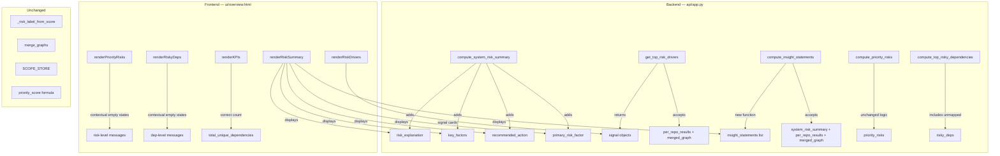

# Design Document: Insight Layer Upgrade

## Overview

This design upgrades the multi-repo Overview page from a passive data display into an interpretation layer that explains system risk. The upgrade is purely additive — no scoring formulas, graph structure, API endpoints, persistence, or page layout changes.

The core problem: the current Overview page shows risk labels and lists repos/dependencies but never explains WHY. When risk is low, the Priority Risks section shows a dead "No priority risks identified" message. Top Risk Drivers is just a repo list sorted by score. Users see data but not meaning.

The upgrade adds five capabilities:
1. **Risk Explanation** — `compute_system_risk_summary()` gains `risk_explanation`, `key_factors`, and `recommended_action` fields that explain the aggregate risk level using a [Conclusion] + [because] + [Reason] pattern.
2. **Contextual Empty States** — Priority Risks and Risky Dependencies sections show risk-level-aware messages instead of generic "nothing found" text.
3. **Signal-Based Risk Drivers** — `get_top_risk_drivers()` returns factual signal objects (category + severity + explanation) instead of a plain repo list.
4. **Insight Statements Engine** — New `compute_insight_statements()` function generates interpretive conclusions about overall system posture.
5. **Complete Dependency Counting** — Unmapped dependencies appear in counts, risky deps list, and graph output.

### Key Design Decisions

1. **Additive-only changes**: All backend functions keep their existing return fields. New fields are added alongside existing ones. No existing field is removed or renamed.
2. **No new API endpoints**: `compute_insight_statements()` is called inside the existing `POST /api/ingest-scope` flow. Its output is added to the scope response dict. `GET /api/scope/{scope_id}` returns it automatically.
3. **Deterministic text generation**: All explanation text is generated from rule-based logic (if/else on counts and thresholds), not LLM calls. This keeps the output predictable and testable.
4. **Signal objects replace repo list**: `get_top_risk_drivers()` changes its return type from `List[{repo, risk_score, risk_label}]` to `List[{signal, category, severity}]`. The frontend `renderRiskDrivers()` is updated to match. This is the only breaking change to an existing return shape, but since the function is only consumed by the Overview page (which we also update), it's safe.
5. **Frontend changes are content-only**: No new HTML sections or layout changes. New data renders inside existing `<div>` containers using the existing CSS class patterns.
6. **No generic fallbacks**: Risk explanation and key factors must always produce real, data-derived text. Vague placeholders like "risk level assessed from available data" are forbidden — they kill user trust. If no specific factors are found, the fallback must still reference real data (e.g., "no significant risk factors were detected across repositories or dependencies").
7. **Signal ordering by severity**: Risk driver signals are always sorted by severity (high → medium → low → info), then by category priority (vulnerability > maintenance > dependency). The most critical signal is always first.
8. **Primary risk factor extraction**: `compute_system_risk_summary()` returns a `primary_risk_factor` string — a single bold-line statement identifying the dominant factor driving the system's risk level. This gives users instant understanding before reading the full explanation.

## Architecture



### Data Flow

1. `POST /api/ingest-scope` processes repos and dependencies as before
2. `compute_system_risk_summary()` now also generates `risk_explanation`, `key_factors`, `recommended_action`
3. `get_top_risk_drivers()` now accepts `(per_repo_results, merged_graph)` and returns signal objects
4. New `compute_insight_statements()` is called with `(system_risk_summary, per_repo_results, merged_graph)`
5. `build_scope_response()` includes `insight_statements` in the response dict
6. Frontend render functions consume the new fields

## Components and Interfaces

### Backend Changes

#### 1. `compute_system_risk_summary()` — Extended Return

Current signature (unchanged):
```python
def compute_system_risk_summary(per_repo_results: List[dict], merged_graph: dict) -> dict:
```

New fields added to the return dict:

```python
{
    # ... all existing fields preserved ...
    "risk_explanation": str,      # [Conclusion] + [because] + [Reason]
    "key_factors": List[str],     # 1–5 short factor strings
    "recommended_action": str,    # action string based on aggregate label
    "primary_risk_factor": str,   # single dominant factor driving risk level
}
```

**Risk Explanation Generation Logic:**

```python
def _generate_risk_explanation(aggregate_label, high_risk_repos, vulnerable_dependencies,
                                high_risk_dependencies, total_repos) -> str:
    conclusion = f"Your system shows {aggregate_label.lower()} risk"
    if aggregate_label == "LOW":
        reasons = []
        if vulnerable_dependencies == 0:
            reasons.append("no vulnerable dependencies were detected")
        if high_risk_repos == 0:
            reasons.append("no high-risk repositories were found")
        if not reasons:
            # NEVER use generic fallback — always reference real data
            reasons.append("no significant risk factors were detected across repositories or dependencies")
        return conclusion + " because " + " and ".join(reasons) + "."
    else:  # MEDIUM or HIGH
        reasons = []
        if vulnerable_dependencies > 0:
            reasons.append(f"{vulnerable_dependencies} vulnerable dependenc{'y was' if vulnerable_dependencies == 1 else 'ies were'} detected")
        if high_risk_repos > 0:
            reasons.append(f"{high_risk_repos} repositor{'y shows' if high_risk_repos == 1 else 'ies show'} high maintenance risk")
        if high_risk_dependencies > 0 and vulnerable_dependencies == 0:
            reasons.append(f"{high_risk_dependencies} high-risk dependenc{'y was' if high_risk_dependencies == 1 else 'ies were'} identified")
        if not reasons:
            # NEVER use generic fallback — always reference real data
            reasons.append(f"maintenance risk scores across {total_repos} analyzed repositories exceed healthy thresholds")
        return conclusion + " because " + " and ".join(reasons) + "."
```

**Key Factors Generation:**
- Derived from the same metrics: vulnerable deps count, high-risk repos count, high-risk deps count, maintenance health, dependency concentration
- Each factor is a short string like "no vulnerable dependencies" or "2 high-risk repositories"
- Between 1 and 5 entries

**Recommended Action:**
- `"LOW"` → `"No immediate action required."`
- `"MEDIUM"` → `"Monitor dependencies and maintenance activity."`
- `"HIGH"` → `"Review vulnerable dependencies and high-risk repositories immediately."`

**Primary Risk Factor Extraction:**

The `primary_risk_factor` is a single string identifying the dominant factor. Selection priority:
1. If vulnerable dependencies > 0 → `"N vulnerable dependencies drive elevated system risk"`
2. If high-risk repos > 0 → `"N high-risk repositories contribute to elevated maintenance risk"`
3. If high-risk dependencies > 0 → `"N high-risk dependencies identified in the supply chain"`
4. If aggregate is LOW → `"No vulnerable dependencies detected"`
5. Fallback → `"No significant risk factors were detected across repositories or dependencies"`

Examples:
- LOW system: `"No vulnerable dependencies detected"`
- HIGH with 3 vuln deps: `"3 vulnerable dependencies drive elevated system risk"`
- MEDIUM with 2 high-risk repos: `"2 high-risk repositories contribute to elevated maintenance risk"`

Rendered as a bold line directly under the risk badge on the frontend.

#### 2. `get_top_risk_drivers()` — New Signature and Return Type

Current signature:
```python
def get_top_risk_drivers(per_repo_results: List[dict]) -> List[dict]:
```

New signature:
```python
def get_top_risk_drivers(per_repo_results: List[dict], merged_graph: dict) -> List[dict]:
```

New return shape:
```python
[
    {
        "signal": "No vulnerable dependencies detected",
        "category": "vulnerability",   # vulnerability | maintenance | dependency
        "severity": "info"             # info | low | medium | high
    },
    ...
]
```

**Signal Generation Rules:**

| Condition | Signal Text | Category | Severity |
|---|---|---|---|
| No vulnerable deps | "No vulnerable dependencies detected" | vulnerability | info |
| N vulnerable deps | "N vulnerable dependencies detected" | vulnerability | high |
| All repos low risk | "All repositories show low maintenance risk" | maintenance | info |
| N repos high risk | "N repositories show high maintenance risk" | maintenance | high |
| N repos medium risk | "N repositories show moderate maintenance risk" | maintenance | medium |
| Deps used by multiple repos | "N dependencies shared across multiple repositories" | dependency | medium |
| All low risk (positive) | "All components show strong maintenance activity" | maintenance | info |

When aggregate risk is LOW, at least 1 positive signal is always included.

**Signal Ordering Rules:**

Signals are always sorted before returning:
1. By severity: `high` → `medium` → `low` → `info`
2. Within same severity, by category priority: `vulnerability` → `maintenance` → `dependency`

This ensures the most critical signal is always first in the list. Users see the most important thing immediately.

#### 3. `compute_insight_statements()` — New Function

```python
def compute_insight_statements(
    system_risk_summary: dict,
    per_repo_results: List[dict],
    merged_graph: dict
) -> List[str]:
```

Returns 1–6 interpretive strings. These are distinct from Risk Driver signals:
- Risk Drivers = factual ("No vulnerable dependencies detected")
- Insight Statements = interpretive ("Your dependency supply chain appears clean and well-maintained")

**Statement Rules:**

| Condition | Statement |
|---|---|
| No vulnerable deps | "Your dependency supply chain appears clean and well-maintained." |
| All repos low maintenance risk | "Your repositories demonstrate consistent maintenance practices." |
| N high-risk repos exist | "N repositories require attention due to elevated maintenance risk, which may impact long-term system stability." |
| Deps used by multiple repos (>= 2) | "N dependencies are shared across multiple repositories, creating concentration points worth monitoring." |
| All repos + deps low risk | "Your system appears stable and well-maintained across all analyzed components." |
| High vulnerable deps (>= 3) | "Multiple vulnerable dependencies suggest the dependency supply chain needs immediate review." |

#### 4. `compute_top_risky_dependencies()` — Unmapped Inclusion

No signature change. The function already iterates over merged graph nodes of type "package" or "dependency". Since `merge_graphs()` already appends unmapped dependency nodes with `type: "package"`, they will be picked up automatically.

The only fix needed: unmapped nodes currently have empty `metadata`, so `risk_score` defaults to 0 and `cve_count` defaults to 0. This is correct behavior — they appear in the list with `risk_score: 0`, `risk_label: "LOW"`, `cve_count: 0`.

#### 5. `compute_priority_risks()` — Medium/High Repo Guarantee

Add logic: when any per-repo result has risk_label "MEDIUM" or "HIGH", ensure at least 1 priority risk item is returned. Currently, medium-risk repos are not added as candidates (only "HIGH" repos are). Fix: also add "MEDIUM" repos as candidates with severity "medium".

#### 6. `build_scope_response()` — Extended

Add `insight_statements` field:
```python
def build_scope_response(..., insight_statements: List[str] = None) -> dict:
    return {
        # ... existing fields ...
        "insight_statements": insight_statements or [],
    }
```

### Frontend Changes

#### 1. `renderRiskSummary()` — Extended

After the existing system summary text, render:
- `primary_risk_factor` as a bold line directly under the risk badge
- `risk_explanation` as a paragraph below the primary risk factor
- `key_factors` as a row of small tag/chip elements
- `recommended_action` as a call-to-action line
- `insight_statements` in a visually distinct area (light background box with italic text)

#### 2. `renderPriorityRisks()` — Contextual Empty States

Replace the generic "No priority risks identified." with risk-level-aware messages:
- LOW: "No priority risks found — your system shows low risk across all analyzed components."
- MEDIUM: "No critical risks identified, but your system shows moderate risk that warrants monitoring."
- HIGH: "Risk data is being evaluated. Review individual repository insights for detailed analysis."

#### 3. `renderRiskDrivers()` — Signal Cards

Replace the current repo-list rendering with signal card rendering:
- Each signal card shows: signal text, category badge, severity indicator
- Category badges use existing type-badge CSS pattern
- Severity uses existing severity-badge CSS pattern

#### 4. `renderRiskyDeps()` — Contextual Empty States

Replace generic empty state with:
- When empty: "No risky dependencies identified across your analyzed components."
- When all low-risk: "All analyzed dependencies show low risk — no immediate concerns."

#### 5. `renderKPIs()` — No Code Change Needed

`total_unique_dependencies` already comes from `system_risk_summary` which already counts merged graph package nodes. With unmapped deps now in the graph, the count is automatically correct.

## Data Models

### Extended System Risk Summary

```python
{
    # Existing fields (unchanged)
    "total_repos": int,
    "high_risk_repos": int,
    "medium_risk_repos": int,
    "low_risk_repos": int,
    "total_unique_dependencies": int,
    "dependencies_used_by_multiple_repos": int,
    "high_risk_dependencies": int,
    "vulnerable_dependencies": int,
    "aggregate_risk_score": float,
    "aggregate_label": str,           # "LOW" | "MEDIUM" | "HIGH"
    "system_summary": str,
    "per_repo_results": List[dict],

    # New fields
    "risk_explanation": str,          # [Conclusion] + [because] + [Reason]
    "key_factors": List[str],         # 1–5 short strings
    "recommended_action": str,        # action based on aggregate label
    "primary_risk_factor": str,       # single dominant factor driving risk level
}
```

### Risk Driver Signal Object

```python
{
    "signal": str,        # factual statement about a risk factor
    "category": str,      # "vulnerability" | "maintenance" | "dependency"
    "severity": str,      # "info" | "low" | "medium" | "high"
}
```

### Insight Statement

Plain string. List of 1–6 strings in the scope response under `insight_statements`.

### Extended Scope Response

```python
{
    # Existing fields (unchanged)
    "scope_id": str,
    "name": str,
    "status": str,
    "system_risk_summary": dict,      # now includes risk_explanation, key_factors, recommended_action
    "priority_risks": List[dict],
    "top_risk_drivers": List[dict],   # now signal objects instead of repo list
    "top_risky_dependencies": List[dict],  # now includes unmapped deps
    "graph": dict,
    "errors": dict,

    # New field
    "insight_statements": List[str],
}
```

### Recommended Action Mapping

| Aggregate Label | Recommended Action |
|---|---|
| LOW | "No immediate action required." |
| MEDIUM | "Monitor dependencies and maintenance activity." |
| HIGH | "Review vulnerable dependencies and high-risk repositories immediately." |

### Priority Risk Empty State Messages

| Aggregate Label | Message |
|---|---|
| LOW | "No priority risks found — your system shows low risk across all analyzed components." |
| MEDIUM | "No critical risks identified, but your system shows moderate risk that warrants monitoring." |
| HIGH | "Risk data is being evaluated. Review individual repository insights for detailed analysis." |


## Correctness Properties

*A property is a characteristic or behavior that should hold true across all valid executions of a system — essentially, a formal statement about what the system should do. Properties serve as the bridge between human-readable specifications and machine-verifiable correctness guarantees.*

### Property 1: Unmapped dependencies are counted in total_unique_dependencies

*For any* list of dependency names (some mapped to repos via PACKAGE_TO_REPO, some not), after building the merged graph and computing the system risk summary, the `total_unique_dependencies` count should be greater than or equal to the number of unmapped dependency names provided.

**Validates: Requirements 1.1, 1.2**

### Property 2: Unmapped dependencies appear in risky deps with default values

*For any* merged graph containing unmapped package nodes (nodes with type "package" and empty metadata), `compute_top_risky_dependencies()` should include each unmapped dependency in its output with `risk_score` of 0, `risk_label` of "LOW", `cve_count` of 0, and an empty `used_by_repos` list.

**Validates: Requirements 1.3, 5.2**

### Property 3: Risk explanation follows pattern and matches aggregate label

*For any* valid per_repo_results and merged_graph, the `risk_explanation` string in the system risk summary should: (a) contain the word "because", (b) start with "Your system shows", (c) end with a period, (d) reference at least one factor from dependencies, repos, or maintenance, (e) when aggregate label is "LOW", reference the absence of high-risk factors, and (f) when aggregate label is "MEDIUM" or "HIGH", reference specific risk factors present.

**Validates: Requirements 2.1, 2.2, 2.3, 2.4**

### Property 4: Key factors list length invariant

*For any* valid per_repo_results and merged_graph, the `key_factors` list in the system risk summary should contain between 1 and 5 entries inclusive, where each entry is a non-empty string.

**Validates: Requirements 2.5, 2.6**

### Property 5: Recommended action maps to aggregate label

*For any* valid per_repo_results and merged_graph, the `recommended_action` string should be exactly "No immediate action required." when aggregate label is "LOW", exactly "Monitor dependencies and maintenance activity." when "MEDIUM", and exactly "Review vulnerable dependencies and high-risk repositories immediately." when "HIGH".

**Validates: Requirements 2.7, 2.8, 2.9, 2.10**

### Property 6: Medium or high-risk repos guarantee non-empty priority risks

*For any* per_repo_results where at least one result has risk_label "MEDIUM" or "HIGH", `compute_priority_risks()` should return a non-empty list containing at least 1 priority risk item.

**Validates: Requirements 3.4**

### Property 7: Risk driver signals have valid structure

*For any* valid per_repo_results and merged_graph, every item returned by `get_top_risk_drivers()` should contain: (a) a `signal` field that is a non-empty string, (b) a `category` field that is one of "vulnerability", "maintenance", or "dependency", and (c) a `severity` field that is one of "info", "low", "medium", or "high".

**Validates: Requirements 4.1**

### Property 8: Vulnerability signals match vulnerability state

*For any* merged graph with zero vulnerable dependencies (no nodes with cve_count > 0), `get_top_risk_drivers()` should include a signal with category "vulnerability" and severity "info". *For any* merged graph with N > 0 vulnerable dependencies, `get_top_risk_drivers()` should include a signal with category "vulnerability" and severity "high" that references the count N.

**Validates: Requirements 4.2, 4.5**

### Property 9: Maintenance signals and positive signal guarantee

*For any* per_repo_results where all repos have risk_label "LOW", `get_top_risk_drivers()` should include at least one signal with category "maintenance" and severity "info", and the overall output should contain at least 1 signal. *For any* per_repo_results where N repos have risk_label "HIGH" (N > 0), the output should include a signal with category "maintenance" and severity "high" referencing the count N.

**Validates: Requirements 4.3, 4.4, 4.7**

### Property 10: Insight statements count invariant

*For any* valid system_risk_summary, per_repo_results, and merged_graph, `compute_insight_statements()` should return a list of between 1 and 6 strings inclusive, where each string is non-empty.

**Validates: Requirements 6.2, 6.7**

### Property 11: Insight statement content matches input conditions

*For any* inputs where no vulnerable dependencies exist, `compute_insight_statements()` should include a statement about clean dependency supply chain. *For any* inputs where all repos show low maintenance risk, the output should include a statement about consistent maintenance practices. *For any* inputs where N high-risk repos exist (N > 0), the output should include a statement referencing those repos. *For any* inputs where M dependencies are shared across multiple repos (M > 0), the output should include a statement about dependency concentration.

**Validates: Requirements 6.3, 6.4, 6.5, 6.6**

### Property 12: Risk explanation never contains generic fallback text

*For any* valid per_repo_results and merged_graph, the `risk_explanation` string should never contain the phrases "assessed from available data", "risk level assessed", or any vague placeholder text. The explanation must always reference specific data-derived factors (dependencies, repos, or maintenance).

**Validates: Design Decision 6 (No generic fallbacks)**

### Property 13: Risk driver signals are ordered by severity then category

*For any* valid per_repo_results and merged_graph, the list returned by `get_top_risk_drivers()` should be sorted such that: (a) signals with severity "high" appear before "medium", which appear before "low", which appear before "info", and (b) within the same severity, signals with category "vulnerability" appear before "maintenance", which appear before "dependency".

**Validates: Design Decision 7 (Signal ordering)**

### Property 14: Primary risk factor is always a non-empty data-derived string

*For any* valid per_repo_results and merged_graph, the `primary_risk_factor` string in the system risk summary should be non-empty and should never contain generic placeholder text. When vulnerable dependencies exist, it should reference them. When no risk factors exist, it should reference the absence of risk factors.

**Validates: Design Decision 8 (Primary risk factor extraction)**

## Error Handling

### Backend Error Handling

All new logic is additive to existing functions. Error handling follows the existing pattern:

| Scenario | Behavior |
|---|---|
| `risk_explanation` generation fails | Fall back to empty string `""`. Existing `system_summary` still displays. |
| `key_factors` generation produces empty list | Force at least 1 real factor derived from data: `["no significant risk factors detected across analyzed components"]`. NEVER use vague placeholder text. |
| `compute_insight_statements()` raises exception | Return empty list `[]`. Frontend renders without insight section. |
| `get_top_risk_drivers()` receives empty per_repo_results | Return at least 1 generic info signal: `{"signal": "No repositories analyzed yet", "category": "maintenance", "severity": "info"}` |
| `get_top_risk_drivers()` receives empty merged_graph | Skip dependency-related signals, return only repo-based signals |
| Division by zero in aggregate score (no valid scores) | Already handled — existing code returns 0.0. New explanation logic handles 0.0 correctly. |

### Frontend Error Handling

| Scenario | Behavior |
|---|---|
| `risk_explanation` missing from response | Skip rendering explanation paragraph. Show only existing `system_summary`. |
| `key_factors` missing or empty | Skip rendering factor tags. |
| `recommended_action` missing | Skip rendering action line. |
| `insight_statements` missing or empty | Skip rendering insight section. |
| `top_risk_drivers` contains old format (repo list) | Graceful degradation — check for `signal` field; if absent, fall back to rendering repo name. |
| Contextual empty state message undefined for risk level | Fall back to generic "No items identified." |

### Backward Compatibility

The frontend checks for new fields before rendering them. If the backend hasn't been updated yet (e.g., cached scope data from before the upgrade), the page renders exactly as before — no crashes, no broken layout.

## Testing Strategy

### Property-Based Tests (Hypothesis)

**Test file**: `test/multi_repo/test_insight_layer_properties.py`

Property tests target the pure computation functions using the Hypothesis library. Each test runs a minimum of 100 iterations.

| Property | Function Under Test | Tag |
|---|---|---|
| Property 1 | `compute_system_risk_summary()` | Feature: insight-layer-upgrade, Property 1: Unmapped deps counted |
| Property 2 | `compute_top_risky_dependencies()` | Feature: insight-layer-upgrade, Property 2: Unmapped deps default values |
| Property 3 | `compute_system_risk_summary()` | Feature: insight-layer-upgrade, Property 3: Risk explanation pattern |
| Property 4 | `compute_system_risk_summary()` | Feature: insight-layer-upgrade, Property 4: Key factors length |
| Property 5 | `compute_system_risk_summary()` | Feature: insight-layer-upgrade, Property 5: Recommended action mapping |
| Property 6 | `compute_priority_risks()` | Feature: insight-layer-upgrade, Property 6: Priority risks guarantee |
| Property 7 | `get_top_risk_drivers()` | Feature: insight-layer-upgrade, Property 7: Signal structure |
| Property 8 | `get_top_risk_drivers()` | Feature: insight-layer-upgrade, Property 8: Vulnerability signals |
| Property 9 | `get_top_risk_drivers()` | Feature: insight-layer-upgrade, Property 9: Maintenance signals |
| Property 10 | `compute_insight_statements()` | Feature: insight-layer-upgrade, Property 10: Statement count |
| Property 11 | `compute_insight_statements()` | Feature: insight-layer-upgrade, Property 11: Statement content |
| Property 12 | `compute_system_risk_summary()` | Feature: insight-layer-upgrade, Property 12: No generic fallbacks |
| Property 13 | `get_top_risk_drivers()` | Feature: insight-layer-upgrade, Property 13: Signal ordering |
| Property 14 | `compute_system_risk_summary()` | Feature: insight-layer-upgrade, Property 14: Primary risk factor |

**Generators needed:**
- `per_repo_results` generator: list of dicts with `repo` (random string), `risk_score` (float 0.0–1.0), `risk_label` (derived from score via thresholds), `error` (None or random string)
- `merged_graph` generator: dict with `nodes` list (mix of package/dependency nodes with random metadata including `risk_score`, `cve_count`, `source_repos`) and `edges` list
- `system_risk_summary` generator: output of `compute_system_risk_summary()` called with generated inputs (avoids duplicating summary logic in tests)

### Unit Tests (pytest)

**Test file**: `test/multi_repo/test_insight_layer_unit.py`

Example-based tests for specific scenarios:
- Risk explanation for LOW with no vulnerabilities produces expected text
- Risk explanation for HIGH with 3 vulnerable deps produces expected text
- Recommended action exact string matching for each label
- Priority risks empty state messages for each risk level (frontend logic)
- Risky deps empty state messages (frontend logic)
- Signal generation with zero repos (edge case)
- Insight statements with all-healthy system
- Insight statements with mixed risk levels
- Backward compatibility: old-format scope data doesn't crash frontend

### Frontend Tests

**Test file**: `test/ui/test_overview_upgrade.js`

- `renderRiskSummary()` displays risk_explanation, key_factors tags, recommended_action
- `renderPriorityRisks()` shows contextual empty state for each risk level
- `renderRiskDrivers()` renders signal cards with category badges and severity indicators
- `renderRiskyDeps()` shows contextual empty state messages
- Insight statements render in dedicated section
- Graceful degradation when new fields are missing from data

### Preservation Tests

Existing test suites must continue to pass unchanged:
- `test/multi_repo/test_scope_properties.py` — all existing property tests
- `test/multi_repo/test_scope_unit.py` — all existing unit tests
- `test/multi_repo/test_scope_integration.py` — all existing integration tests
