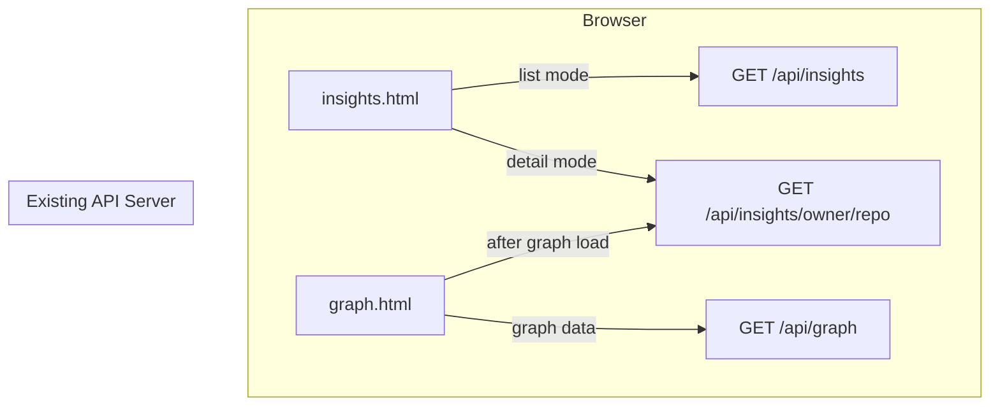

# Design Document: Insight UI Integration

## Overview

This feature adds two pure-frontend UI components to the Deep Signal system:

1. **insights.html** — A new standalone page providing a filterable, sortable, paginated cross-repo insights dashboard with drill-down detail view.
2. **Insight Summary Panel** — A compact panel injected into the existing `graph.html` page that shows per-repo insight data alongside the supply chain graph.

Both components consume the existing `GET /api/insights` and `GET /api/insights/{owner}/{repo}` REST endpoints. No backend changes are required. The implementation uses vanilla HTML, CSS, and JavaScript with no build tools or external frameworks, matching the existing project conventions.

### Key Design Decisions

- **Single-file architecture for insights.html**: All CSS and JS are inline within the HTML file, matching the pattern established by `index.html` and `graph.html`. No separate `.js` or `.css` files for the dashboard.
- **Two-mode routing via query parameter**: `insights.html` serves both list and detail views, switching based on the presence of a `?repo=owner%2Frepo` query parameter. This avoids needing a router or multiple HTML files.
- **Non-blocking insight panel on graph page**: The insight fetch on `graph.html` is fire-and-forget after graph load — it never blocks or disrupts the graph visualization.
- **CSS variable reuse**: All styling derives from the same `:root` CSS variables used in `index.html` and `graph.html`, ensuring visual consistency without a shared stylesheet.

## Architecture



### File Structure

| File | Action | Purpose |
|------|--------|---------|
| `ui/insights.html` | **Create** | New insights dashboard page (list + detail modes) |
| `ui/graph.html` | **Modify** | Add insight summary panel HTML/CSS, add inline JS to fetch and render insight data after graph load |
| `ui/graph-viz.js` | **No change** | Existing graph visualization logic remains untouched |

The table container uses `overflow-x: auto` to allow horizontal scrolling on narrower viewports rather than breaking the layout.

### State Management

**insights.html** manages state via a single `appState` object in the inline `<script>`:

```javascript
const appState = {
  mode: "list",        // "list" | "detail"
  repo: null,          // string | null — from URL ?repo= param
  // List mode state
  filters: {
    label: null,       // "HIGH" | "MEDIUM" | "LOW" | null
    has_cves: null,    // true | null (never false)
    has_maintainer_risk: null,
    has_stale_release: null,
    min_score: null,   // number | null
  },
  sort_by: "score",
  order: "desc",
  limit: 25,
  offset: 0,
  total: 0,
  items: [],
  // Detail mode state
  detail: null,        // API response object | null
  // UI state
  loading: false,
  error: null,
};
```

State changes flow unidirectionally: user interaction → update `appState` → call `fetchAndRender()` → update DOM.

### URL Routing

- **List mode**: `insights.html` or `insights.html?label=HIGH&sort_by=score` — no `repo` param
- **Detail mode**: `insights.html?repo=numpy%2Fnumpy` — `repo` param present
- Mode detection happens on page load and on `popstate` events. On `popstate` events (browser back/forward), the app rehydrates mode and relevant state from the current URL query parameters before fetching and rendering.
- Navigation from list→detail uses `history.pushState`; "Back to list" uses `history.pushState` to remove the `repo` param

## Components and Interfaces

### 1. insights.html — Inline JavaScript Functions

#### API Client Functions

```
fetchInsightsList(filters, sort_by, order, limit, offset) → Promise<{total, items}>
```
- Builds URL: `GET {API_BASE}/api/insights?sort_by=...&order=...&limit=...&offset=...`
- Appends filter params only when non-null (omits unchecked booleans entirely)
- Returns parsed JSON or throws with HTTP status + detail

```
fetchRepoInsight(owner, repo) → Promise<RepoInsightDetail>
```
- Calls `GET {API_BASE}/api/insights/{owner}/{repo}`
- Returns parsed JSON or throws

#### Rendering Functions

```
renderTable(items) → void
```
- Clears and rebuilds the `<tbody>` from `appState.items`
- Each row: repo link, score (mono font, 3 decimals), label indicator, reasons list, signal badges

```
renderDetailView(detail) → void
```
- Shows single-repo detail: score, label, base risk, reasons, direct signals table
- Includes "Back to list" and "Open in graph view" links (graph link uses URL-encoded repo name: `graph.html?repo=owner%2Frepo`)

```
renderSummaryStrip(items, total) → void
```
- The summary strip is explicitly page-scoped. It displays:
  - `"Showing {returned} of {total}"` as the total count (where `returned` is the number of items on the current page and `total` is the API `total` field)
  - HIGH/MEDIUM/LOW counts computed only from the current page items
  - Counts are labeled `"On this page:"` to avoid confusion with full-dataset aggregate counts

```
renderPagination(total, offset, limit) → void
```
- Updates "1–25 of 145" text
- Enables/disables Previous/Next buttons

```
renderLoading() → void / renderError(message) → void / renderEmpty() → void
```
- Swap visibility of loading, error, empty-state, and table containers

#### State Management Functions

```
onFilterChange() → void
```
- Reads all filter control values into `appState.filters`
- Resets `appState.offset = 0`
- Calls `fetchAndRender()`

```
onSortChange() → void
```
- Reads sort dropdown values into `appState.sort_by` and `appState.order`
- Resets `appState.offset = 0`
- Calls `fetchAndRender()`

```
onPageChange(direction) → void
```
- Adjusts `appState.offset` by ±`appState.limit`
- Clamps to `[0, total - limit]`
- Calls `fetchAndRender()`

```
navigateToDetail(repoFullName) → void
```
- Sets `appState.mode = "detail"`, `appState.repo = repoFullName`
- Pushes URL state
- Fetches and renders detail view

```
navigateToList() → void
```
- Sets `appState.mode = "list"`, `appState.repo = null`
- Pushes URL state
- Fetches and renders list view

### 2. graph.html — Insight Summary Panel

#### HTML Addition

A new `<div id="insightPanel">` is added between the explanation panel and the `.main-container` div:

```html
<div id="insightPanel" class="panel" style="display:none;"
     aria-label="Insight summary">
  <div id="insightContent">Loading insight…</div>
</div>
```

#### Inline JS Addition (in graph.html, after the existing `<script>` block)

```
fetchAndRenderInsight(owner, repo) → void
```
- Called after `loadGraph()` succeeds (inside the existing `try` block, after `renderGraph()`)
- Fetches `GET {API_BASE}/api/insights/{owner}/{repo}`
- On success: populates `#insightContent` with score, label indicator, reasons, signal badges; shows the panel. The panel's `aria-label` is set dynamically on success using the repo name from the API response (e.g., `"Insight summary for numpy/numpy"`), not statically in the HTML template.
- On 404: shows "No insight data available for this repository."
- On other error: shows "Could not load insight data"
- Never throws — all errors are caught and displayed gracefully

### 3. Shared CSS Patterns

Both pages use these component styles:

#### Label Indicator

```css
.label-indicator {
  display: inline-block;
  padding: 2px 10px;
  border-radius: 999px;
  font-size: 12px;
  font-weight: 800;
  text-transform: uppercase;
  letter-spacing: .5px;
}
.label-high    { background: rgba(239,68,68,.15); color: #ef4444; }
.label-medium  { background: rgba(234,179,8,.15);  color: #eab308; }
.label-low     { background: rgba(34,197,94,.15);  color: #22c55e; }
```

#### Signal Badge

```css
.signal-badge {
  display: inline-block;
  padding: 2px 8px;
  border-radius: 999px;
  font-size: 11px;
  font-weight: 700;
  letter-spacing: .3px;
}
.signal-high   { background: rgba(239,68,68,.15); color: #ef4444; }
.signal-medium { background: rgba(234,179,8,.15);  color: #eab308; }
.signal-mild   { background: rgba(234,88,12,.15);  color: #ea580c; }
```

#### Summary Strip

```css
.summary-strip {
  display: flex;
  gap: 12px;
  margin-bottom: 14px;
}
.summary-stat {
  flex: 1;
  padding: 10px;
  border-radius: 10px;
  border: 1px solid var(--border);
  background: rgba(0,0,0,.18);
  text-align: center;
}
.summary-stat .num {
  font-size: 20px;
  font-weight: 800;
  font-family: var(--mono);
}
.summary-stat .label {
  font-size: 11px;
  color: var(--muted2);
  margin-top: 4px;
  text-transform: uppercase;
  letter-spacing: .5px;
}
```

## Data Models

### API Response: `GET /api/insights` (List)

```json
{
  "total": 145,
  "returned": 25,
  "items": [
    {
      "repo_full_name": "numpy/numpy",
      "graph_signal_score": 0.312,
      "graph_signal_label": "MEDIUM",
      "base_maintenance_risk": 0.45,
      "base_maintenance_label": "MEDIUM",
      "reasons": [
        "2 known CVEs found in dependency graph",
        "Top contributor accounts for 34% of commits"
      ],
      "signals": {
        "has_cves": true,
        "cve_count": 2,
        "maintainer_concentration": "medium",
        "top_contributor": "user123",
        "top_contributor_fraction": 0.34,
        "release_staleness": "info",
        "days_since_release": 15
      }
    }
  ]
}
```

**Query Parameters:**

| Param | Type | Default | Description |
|-------|------|---------|-------------|
| `sort_by` | string | `"score"` | `score`, `base_risk`, `cve_count`, `maintainer_fraction`, `release_staleness` |
| `order` | string | `"desc"` | `asc` or `desc` |
| `label` | string | null | `HIGH`, `MEDIUM`, `LOW` |
| `has_cves` | bool | null | Only sent when `true` |
| `has_maintainer_risk` | bool | null | Only sent when `true` |
| `has_stale_release` | bool | null | Only sent when `true` |
| `min_score` | float | null | 0.0–1.0 |
| `limit` | int | 25 | 1–500 |
| `offset` | int | 0 | ≥0 |

### API Response: `GET /api/insights/{owner}/{repo}` (Detail)

```json
{
  "repo_full_name": "numpy/numpy",
  "base_maintenance_risk": 0.45,
  "base_maintenance_label": "MEDIUM",
  "graph_signal_score": 0.312,
  "graph_signal_label": "MEDIUM",
  "reasons": [
    "2 known CVEs found in dependency graph",
    "Top contributor accounts for 34% of commits"
  ],
  "direct_signals": [
    {
      "signal_name": "cve_risk",
      "severity": "high",
      "score_contribution": 0.400,
      "reason": "2 known CVEs found in dependency graph"
    },
    {
      "signal_name": "maintainer_concentration",
      "severity": "medium",
      "score_contribution": 0.150,
      "reason": "Top contributor accounts for 34% of commits"
    },
    {
      "signal_name": "release_staleness",
      "severity": "info",
      "score_contribution": 0.000,
      "reason": "Latest release was 15 days ago"
    }
  ],
  "top_risky_dependencies": []
}
```

### Frontend Data Structures

**Label color mapping** (used by both pages):

```javascript
const LABEL_COLORS = {
  HIGH:   { bg: "rgba(239,68,68,.15)", text: "#ef4444" },
  MEDIUM: { bg: "rgba(234,179,8,.15)",  text: "#eab308" },
  LOW:    { bg: "rgba(34,197,94,.15)",  text: "#22c55e" },
};
```

**Signal severity color mapping:**

```javascript
const SEVERITY_COLORS = {
  high:   { bg: "rgba(239,68,68,.15)", text: "#ef4444" },
  medium: { bg: "rgba(234,179,8,.15)",  text: "#eab308" },
  mild:   { bg: "rgba(234,88,12,.15)",  text: "#ea580c" },
};
```

**Signal badge text mapping** (list mode, from `signals` summary):

```javascript
function signalBadgeText(signals) {
  const badges = [];
  if (signals.has_cves) {
    // CVE badge always uses "high" severity styling in v1 as a visual simplification.
    // The backend CVE signal can be "high" (critical/high CVEs present) or "medium"
    // (CVEs present but no critical/high), but the badge does not distinguish between
    // these in v1. The `signals.has_cves` flag is only true when severity != "info",
    // so the badge only appears for repos with actual CVE risk.
    badges.push({
      text: signals.cve_count > 1 ? `${signals.cve_count} CVEs` : "CVE",
      severity: "high"
    });
  }
  if (signals.maintainer_concentration !== "info") {
    badges.push({
      text: "Maintainer",
      severity: signals.maintainer_concentration
    });
  }
  if (signals.release_staleness !== "info") {
    badges.push({
      text: "Stale release",
      severity: signals.release_staleness
    });
  }
  return badges;
}
```


## Correctness Properties

*A property is a characteristic or behavior that should hold true across all valid executions of a system — essentially, a formal statement about what the system should do. Properties serve as the bridge between human-readable specifications and machine-verifiable correctness guarantees.*

### Property 1: Label-to-color mapping is total and correct

*For any* `graph_signal_label` value in `{"HIGH", "MEDIUM", "LOW"}`, the label indicator rendering function should produce an element with the correct background and text color: HIGH→red (`#ef4444`), MEDIUM→yellow (`#eab308`), LOW→green (`#22c55e`).

**Validates: Requirements 2.3, 2.4, 2.5**

### Property 2: Signal badges appear only for non-info signals with correct text

*For any* signals summary object (with `has_cves`, `cve_count`, `maintainer_concentration`, `release_staleness` fields), the badge rendering function should: (a) produce a badge only when the signal severity is not `"info"`, (b) use text "CVE" when `cve_count` is 1, `"{n} CVEs"` when `cve_count > 1`, "Maintainer" for maintainer concentration, and "Stale release" for release staleness, and (c) apply the correct severity color to each badge.

**Validates: Requirements 2.6**

### Property 3: App state maps to correct API query parameters

*For any* combination of filter values (`label`, `has_cves`, `has_maintainer_risk`, `has_stale_release`, `min_score`), sort values (`sort_by`, `order`), and pagination values (`limit`, `offset`), the URL construction function should: (a) include only non-null filter params, (b) never include `false` for boolean filters (omit them entirely when unchecked), (c) include `sort_by` and `order` params, and (d) include `limit` and `offset` params.

**Validates: Requirements 3.4, 3.5, 4.3**

### Property 4: Pagination range text is correct

*For any* `offset` ≥ 0, `limit` > 0, and `total` ≥ 0, the pagination range text function should produce `"{offset+1}–{min(offset+limit, total)} of {total}"`. When `total` is 0, it should display `"0 of 0"`.

**Validates: Requirements 5.2**

### Property 5: Pagination button enabled/disabled state

*For any* `offset` ≥ 0, `limit` > 0, and `total` ≥ 0: the "Previous" button is disabled if and only if `offset === 0`, and the "Next" button is disabled if and only if `offset + limit >= total`.

**Validates: Requirements 5.4, 5.5**

### Property 6: Pagination offset arithmetic is bounded

*For any* current `offset` ≥ 0, `limit` > 0, and `total` ≥ 0: clicking "Next" sets offset to `offset + limit` (only when `offset + limit < total`), and clicking "Previous" sets offset to `max(0, offset - limit)`. The resulting offset is always ≥ 0.

**Validates: Requirements 5.6, 5.7**

### Property 7: Filter/sort change resets offset to zero

*For any* app state with `offset > 0`, when any filter or sort parameter changes, the resulting offset after the state update must be `0`.

**Validates: Requirements 5.8**

### Property 8: Repo name URL encoding round trip

*For any* `repo_full_name` string containing exactly one `/` (e.g., `"owner/repo"`), encoding it with `encodeURIComponent` for the `?repo=` query parameter and then decoding with `decodeURIComponent` should produce the original string. Additionally, the encoded form should contain `%2F` instead of `/`.

**Validates: Requirements 6.2, 6.3**

### Property 9: Detail view graph link points to correct URL

*For any* `repo_full_name` in `"owner/repo"` format, the "Open in graph view" link should have `href` equal to `"graph.html?repo=owner%2Frepo"` (with the repo name URL-encoded, matching the encoding used in `insights.html` links). Note: `graph.html` will need to decode the `repo` query parameter when reading it.

**Validates: Requirements 6.7**

### Property 10: Insight render output contains all required fields

*For any* valid insight API response object (with `graph_signal_score`, `graph_signal_label`, `reasons`, and signal data), the render function output (as an HTML string) should contain: the score rounded to 3 decimal places, the label text, every reason string, and a signal badge for each non-info signal.

**Validates: Requirements 2.2, 7.3**

### Property 11: Summary strip counts match current page item labels

*For any* list of insight items on the current page and an API `total` value, the summary strip should display: `"Showing {returned} of {total}"` where `returned` is the page item count, and HIGH/MEDIUM/LOW counts that equal the count of items with each respective `graph_signal_label` on the current page only.

**Validates: Requirements 11.1**

### Property 12: Error display includes status code and detail

*For any* HTTP error status code (4xx or 5xx) and error detail string, the error rendering function should produce output containing both the numeric status code and the detail text.

**Validates: Requirements 8.2**

### Property 13: Insight panel aria-label contains repo name

*For any* `repo_full_name` string, the insight summary panel's `aria-label` attribute should equal `"Insight summary for {repo_full_name}"`.

**Validates: Requirements 9.6**

## Error Handling

### insights.html Errors

| Scenario | Behavior |
|----------|----------|
| API fetch fails (network error) | Display error in `.err` container with message text. Table area shows nothing (no empty state). |
| API returns 4xx/5xx | Display error with HTTP status code and response detail in `.err` container. |
| API returns 200 with `total: 0` | Show "No repositories match the current filters." in table area. No error container. |
| Detail mode: API returns 404 | Show "Repository not found" message in detail area. Include "Back to list" link. |
| Detail mode: API returns 5xx | Show error with status code and detail. Include "Back to list" link. |
| Invalid `repo` query param (no slash) | Attempt the API call; let the API return 404/422 and handle as above. |
| JavaScript error in rendering | Wrap render functions in try/catch; show generic "Rendering error" in `.err` container. |

### graph.html Insight Panel Errors

| Scenario | Behavior |
|----------|----------|
| Insight API returns 404 | Panel shows "No insight data available for this repository." |
| Insight API returns 5xx or network error | Panel shows "Could not load insight data." |
| Insight fetch fails for any reason | Graph visualization continues to function normally. Panel error is self-contained. |
| Graph load fails | Insight panel fetch is never initiated. Panel remains hidden. |

### Error Container Pattern

Both pages use the existing `.err` class pattern:

```html
<div id="err" class="err"></div>
```

```javascript
function showError(msg) {
  const box = document.getElementById("err");
  box.style.display = msg ? "block" : "none";
  box.textContent = msg || "";
}
```

Errors are cleared at the start of every new fetch operation (Requirement 8.4).

## Testing Strategy

### Dual Testing Approach

This feature requires both unit tests and property-based tests. Since this is a pure frontend feature with no build tools, tests will target the **pure logic functions** extracted from the inline scripts. Test files will be JavaScript files that import/exercise these functions.

### Extractable Pure Functions for Testing

The following functions from `insights.html` are pure (no DOM dependency) and testable:

1. `buildApiUrl(state)` — converts app state to API URL with query params. Empty string values from form controls are treated the same as `null` for all optional filter parameters (`label`, `min_score`). They are omitted from the API request.
2. `signalBadgeText(signals)` — converts signals summary to badge descriptors
3. `labelColorClass(label)` — maps label string to CSS class
4. `paginationRangeText(offset, limit, total)` — computes "1–25 of 145" text
5. `paginationButtonState(offset, limit, total)` — returns `{prevDisabled, nextDisabled}`
6. `nextOffset(offset, limit, total)` / `prevOffset(offset, limit)` — offset arithmetic
7. `encodeRepoParam(repoFullName)` / `decodeRepoParam(encoded)` — URL encoding
8. `graphViewUrl(repoFullName)` — builds graph.html link with URL-encoded repo name (e.g., `graph.html?repo=owner%2Frepo`). Note: `graph.html` must decode the `repo` param when reading it.
9. `insightPanelAriaLabel(repoFullName)` — builds aria-label string
10. `summaryCounts(items)` — computes HIGH/MEDIUM/LOW counts from current page items array (page-scoped only)
11. `formatErrorMessage(status, detail)` — formats error display text

### Property-Based Testing

- **Library**: [fast-check](https://github.com/dubzzz/fast-check) (JavaScript property-based testing library). fast-check is used in the test environment only and is not part of the runtime UI bundle. The UI files contain no test dependencies.
- **Minimum iterations**: 100 per property test
- **Tag format**: `Feature: insight-ui-integration, Property {N}: {title}`

Each correctness property (1–13) maps to exactly one property-based test. Tests generate random inputs using fast-check arbitraries:

- Random label strings from `{"HIGH", "MEDIUM", "LOW"}`
- Random signals objects with severity from `{"high", "medium", "mild", "info"}` and random cve_count
- Random filter/sort/pagination state combinations
- Random `owner/repo` strings
- Random insight response objects

### Unit Tests

Unit tests cover specific examples, edge cases, and integration points:

- **Edge cases**: empty items list, zero total, offset at boundary, repo names with special characters
- **Error scenarios**: 404 response handling, 500 response handling, network failure
- **DOM integration**: loading state visibility, error container display/hide, empty state message conditions
- **Accessibility**: aria-label values, table header `scope` attributes, `aria-live` on pagination

### Test File Structure

```
test/ui/
  test_insights_logic.js       # Property tests + unit tests for pure functions
  test_graph_insight_panel.js   # Unit tests for insight panel integration
```

### What NOT to Test

- Visual appearance (colors, spacing, gradients) — verified by manual review
- CSS variable consistency — verified by code review
- Keyboard navigation — relies on native HTML semantics
- Async timing of non-blocking fetch — architectural constraint, not a unit-testable property
