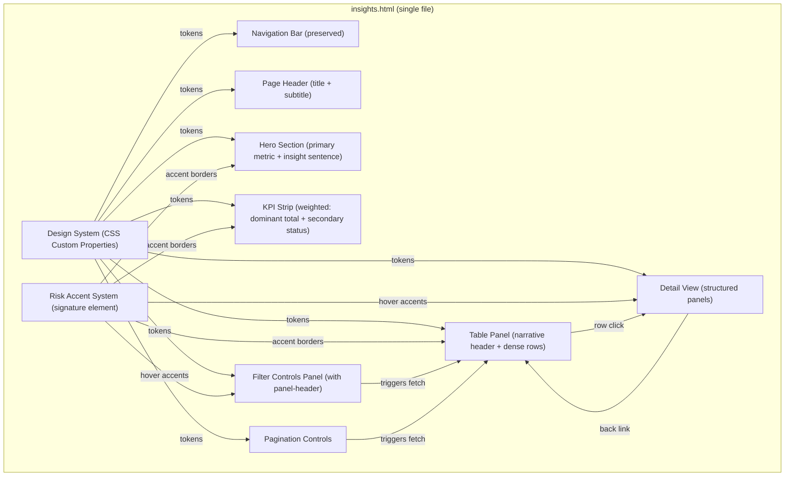
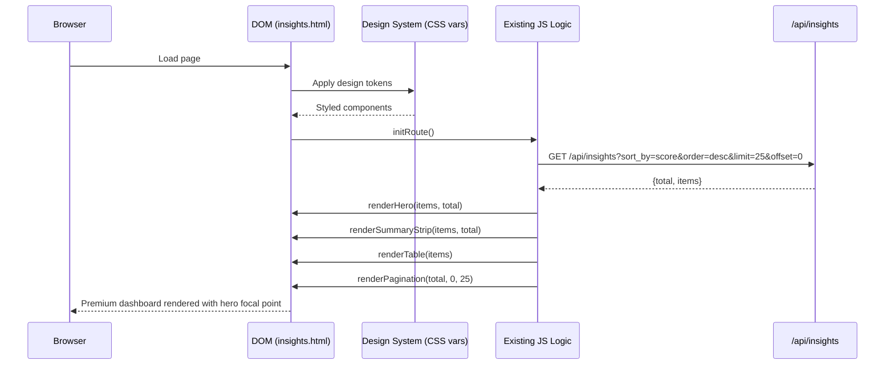
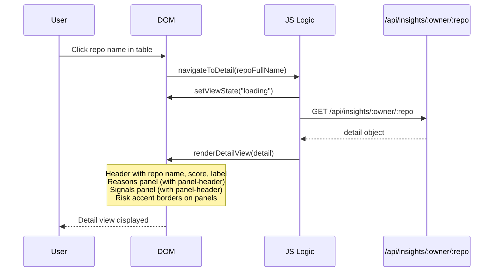

# Design Document: Insights Dashboard Redesign

## Overview

This feature is a visual and layout redesign of `ui/insights.html` — transforming it from a functional but flat dark-themed dashboard into a premium, structured, analytical SaaS dashboard inspired by Stripe, Linear, Vercel, and Palantir aesthetics. The redesign targets strong visual hierarchy, clean spacing, subtle depth/layering, minimal but intentional color usage, and high readability.

The redesign introduces a clear focal point ("Hero Moment") that interprets data for the user, weighted KPI cards that establish system scale before detail, panel identity through headers and accents, narrative framing for the data table, intentional density control (dense tables, relaxed cards), and a signature "Risk Accent System" that threads risk color through borders, highlights, and focus states — creating a visual identity unique to Deep Signal.

This is a CSS/HTML restructuring with one small JavaScript addition (`generateInsightText`). All existing JavaScript logic (API fetching, filtering, sorting, pagination, detail view, navigation bar) is preserved exactly as-is. The deliverable is a single `ui/insights.html` file with upgraded inline styles, structural HTML additions (hero section, weighted KPI strip, panel headers, narrative table framing), and the insight text generator.

The design system establishes a constrained set of tokens (colors, spacing, radii, shadows) that every component references, ensuring visual consistency across the entire page.

## Architecture



## Updated Page Hierarchy

```
Nav Bar (preserved)
Page Header (title + subtitle)
Hero Section (primary metric + insight sentence)        ← NEW (Gap 1)
KPI Strip (weighted: dominant total + secondary status) ← UPGRADED (Gap 2)
Filter Controls Panel (with panel-header)               ← UPGRADED (Gap 3)
Table Panel (narrative header + dense rows)              ← UPGRADED (Gap 4, 5)
Pagination
Detail View (structured panels)                         ← UPGRADED (Gap 3, 6)
```

## Sequence Diagrams

### Main Page Load Flow



### Detail View Navigation



## Components and Interfaces

### Component 1: Design System (CSS Custom Properties)

**Purpose**: Single source of truth for all visual tokens — colors, spacing, typography, shadows, radii.

**Interface**:
```css
:root {
  /* Background layers */
  --bg: #0a0e13;
  --bg-surface: #0f1419;
  --bg-elevated: #151b23;
  --bg-overlay: #1a222c;

  /* Borders */
  --border: rgba(255, 255, 255, 0.06);
  --border-subtle: rgba(255, 255, 255, 0.04);
  --border-emphasis: rgba(255, 255, 255, 0.10);

  /* Text */
  --text-primary: rgba(255, 255, 255, 0.92);
  --text-secondary: rgba(255, 255, 255, 0.55);
  --text-tertiary: rgba(255, 255, 255, 0.35);

  /* Accent (single color: cyan-blue) */
  --accent: #3b82f6;
  --accent-muted: rgba(59, 130, 246, 0.15);

  /* Status colors */
  --status-high-bg: rgba(239, 68, 68, 0.12);
  --status-high-text: #ef4444;
  --status-high-border: rgba(239, 68, 68, 0.35);
  --status-medium-bg: rgba(234, 179, 8, 0.12);
  --status-medium-text: #eab308;
  --status-medium-border: rgba(234, 179, 8, 0.35);
  --status-low-bg: rgba(34, 197, 94, 0.12);
  --status-low-text: #22c55e;
  --status-low-border: rgba(34, 197, 94, 0.35);

  /* Spacing scale (strict: 4, 8, 12, 16, 24, 32) */
  --sp-4: 4px;
  --sp-8: 8px;
  --sp-12: 12px;
  --sp-16: 16px;
  --sp-24: 24px;
  --sp-32: 32px;

  /* Radius */
  --radius-sm: 6px;
  --radius-md: 10px;
  --radius-lg: 14px;
  --radius-pill: 999px;

  /* Shadows */
  --shadow-sm: 0 1px 2px rgba(0, 0, 0, 0.3);
  --shadow-md: 0 2px 8px rgba(0, 0, 0, 0.25);
  --shadow-lg: 0 4px 16px rgba(0, 0, 0, 0.3);

  /* Typography */
  --font-sans: -apple-system, BlinkMacSystemFont, "Segoe UI", Roboto,
    Helvetica, Arial, sans-serif;
  --font-mono: "SF Mono", SFMono-Regular, ui-monospace, Menlo, Monaco,
    Consolas, monospace;
}
```

**Responsibilities**:
- Provide all color, spacing, radius, shadow, and typography tokens
- Include `--status-*-border` tokens for the Risk Accent System (Gap 6)
- Ensure consistency across every component
- Enable easy theme adjustments from a single location

### Component 2: Page Header

**Purpose**: Establish page identity with clear visual hierarchy.

**Interface**:
```html
<div class="page-header">
  <h1 class="page-title">Insights Dashboard</h1>
  <p class="page-subtitle">Risk analysis across monitored repositories</p>
</div>
```

**Responsibilities**:
- Large, bold title for page identity
- Muted subtitle for context
- Consistent spacing below (var(--sp-24))

### Component 3: Hero / Primary Insight Block (NEW — Gap 1)

**Purpose**: Provide a clear focal point where the user immediately "gets it". Shifts the dashboard from "showing metrics" to a "decision interface" by interpreting data for the user. Uses a left/right split layout for visual tension and hierarchy — the big number anchors the left, the insight text fills the right.

**Interface**:
```html
<div id="heroSection" class="hero" style="display:none;">
  <div class="hero-left">
    <div class="hero-value" id="heroValue">145</div>
    <div class="hero-label">Repositories</div>
  </div>
  <div class="hero-right">
    <div class="hero-insight" id="heroInsight">
      <span class="text-high">12 high-risk</span> repositories driven by dependency vulnerabilities
    </div>
  </div>
</div>
```

```css
.hero {
  display: flex;
  align-items: center;
  gap: var(--sp-24);
  padding: var(--sp-24);
  margin-bottom: var(--sp-16);
  background: var(--bg-elevated);
  border: 1px solid var(--border);
  border-radius: var(--radius-lg);
  box-shadow: var(--shadow-sm);
}
/* Left/right split: left anchors the big number, right fills with insight */
.hero-left {
  display: flex;
  flex-direction: column;
  align-items: flex-start;
  min-width: 120px;
}
.hero-right {
  flex: 1;
}
.hero-value {
  font-size: 36px;
  font-weight: 800;
  font-family: var(--font-mono);
  color: var(--text-primary);
}
.hero-label {
  font-size: 11px;
  color: var(--text-tertiary);
  text-transform: uppercase;
  letter-spacing: 0.5px;
  margin-top: var(--sp-4);
}
.hero-insight {
  font-size: 15px;
  color: var(--text-secondary);
  line-height: 1.5;
  border-left: 3px solid var(--border);  /* dynamic: set to dominant risk color via JS */
  padding-left: var(--sp-16);
}
/* Risk color in text emphasis (Refinement 2) */
.text-high { color: var(--status-high-text); }
.text-medium { color: var(--status-medium-text); }
.text-low { color: var(--status-low-text); }
```

**Dynamic Insight Text Logic** (NEW JavaScript):
```javascript
/**
 * generateInsightText(items)
 * Produces a human-readable insight sentence from the current items.
 * - If HIGH count > 0: "{high_count} high-risk repositories — {top_reason}"
 *   where top_reason is the most common reason across HIGH items
 * - If no HIGH: "All repositories are within acceptable risk thresholds. No immediate action required."
 */
function generateInsightText(items) {
  var highItems = [];
  for (var i = 0; i < items.length; i++) {
    if ((items[i].graph_signal_label || "").toUpperCase() === "HIGH") {
      highItems.push(items[i]);
    }
  }
  if (highItems.length === 0) {
    return "All repositories are within acceptable risk thresholds. No immediate action required.";
  }
  // Find most common reason across HIGH items
  var reasonCounts = {};
  for (var j = 0; j < highItems.length; j++) {
    var reasons = highItems[j].reasons || [];
    for (var k = 0; k < reasons.length; k++) {
      var r = reasons[k];
      reasonCounts[r] = (reasonCounts[r] || 0) + 1;
    }
  }
  var topReason = "";
  var topCount = 0;
  for (var reason in reasonCounts) {
    if (reasonCounts[reason] > topCount) {
      topCount = reasonCounts[reason];
      topReason = reason;
    }
  }
  var suffix = topReason ? " \u2014 " + topReason.toLowerCase() : "";
  return highItems.length + " high-risk repositor" +
    (highItems.length === 1 ? "y" : "ies") + suffix;
}
```

**Risk Accent on Hero Insight** (Gap 6):
The `.hero-insight` left border color is dynamically set based on the dominant risk level:
- If HIGH items exist: `border-left-color: var(--status-high-border)`
- If only MEDIUM: `border-left-color: var(--status-medium-border)`
- If only LOW: `border-left-color: var(--status-low-border)`

**Responsibilities**:
- Display total repo count as the primary "hero" metric
- Generate and display a dynamic insight sentence interpreting the data
- Provide a visual focal point that anchors the entire dashboard
- Risk-colored left border on insight text (signature element)

### Component 4: KPI Summary Strip (UPGRADED — Gap 2)

**Purpose**: Weighted horizontal row of metric cards. First card (Total Repos) is dominant at 1.5x size; status count cards are secondary and smaller.

**Interface**:
```html
<div id="summaryStrip" class="kpi-strip" style="display:none;">
  <div class="kpi-card kpi-card-dominant">
    <span class="kpi-value kpi-value-lg">145</span>
    <span class="kpi-label">Total Repos</span>
  </div>
  <div class="kpi-card kpi-card-secondary">
    <span class="kpi-value" style="color:var(--status-high-text);">12</span>
    <span class="kpi-label">High Risk</span>
  </div>
  <div class="kpi-card kpi-card-secondary">
    <span class="kpi-value" style="color:var(--status-medium-text);">45</span>
    <span class="kpi-label">Medium Risk</span>
  </div>
  <div class="kpi-card kpi-card-secondary">
    <span class="kpi-value" style="color:var(--status-low-text);">88</span>
    <span class="kpi-label">Low Risk</span>
  </div>
</div>
```

```css
.kpi-strip {
  display: flex;
  gap: var(--sp-12);
  margin-bottom: var(--sp-16);
}
.kpi-card {
  display: flex;
  flex-direction: column;
  align-items: flex-start;  /* Left-aligned for analytical feel (Refinement 3) */
  padding: var(--sp-12) var(--sp-16);
  background: var(--bg-elevated);
  border: 1px solid var(--border);
  border-radius: var(--radius-md);
}
/* Dominant card: 1.5x size, flex: 1.5 */
.kpi-card-dominant {
  flex: 1.5;
  padding: var(--sp-16) var(--sp-24);
}
.kpi-card-dominant .kpi-value-lg {
  font-size: 28px;
}
/* Secondary cards: smaller */
.kpi-card-secondary {
  flex: 1;
}
.kpi-value {
  font-size: 20px;
  font-weight: 700;
  font-family: var(--font-mono);
  color: var(--text-primary);
}
.kpi-label {
  font-size: 11px;
  color: var(--text-tertiary);
  text-transform: uppercase;
  letter-spacing: 0.5px;
  margin-top: var(--sp-4);
}
```

**Risk Accent on HIGH KPI Card** (Gap 6):
The HIGH risk KPI card gets a subtle top border accent:
```css
.kpi-card-high {
  border-top: 2px solid var(--status-high-border);
}
```

**Responsibilities**:
- Dominant first card answers "how big is the system?" before "what's inside it?"
- Secondary cards show status breakdown at smaller scale
- Status-colored values for HIGH/MEDIUM/LOW
- HIGH card gets risk accent top border (signature element)
- Responsive: stack vertically on mobile

### Component 5: Panel System (UPGRADED — Gap 3)

**Purpose**: Consistent container for all content sections, now with identity through panel headers.

**Interface**:
```css
.panel {
  background: var(--bg-elevated);
  border: 1px solid var(--border);
  border-radius: var(--radius-lg);
  box-shadow: var(--shadow-sm);
  padding: var(--sp-24);
  margin-bottom: var(--sp-16);
  transition: border-color 0.15s ease;
}
/* Risk accent: panel hover (Gap 6) */
.panel:hover {
  border-color: var(--border-emphasis);
}

/* Panel header with title + optional action/subtitle (Gap 3) */
/* Panel header divider for section feel (Refinement 4) */
.panel-header {
  display: flex;
  justify-content: space-between;
  align-items: center;
  padding-bottom: var(--sp-12);
  border-bottom: 1px solid var(--border-subtle);
  margin-bottom: var(--sp-16);
}
.section-title {
  font-size: 15px;  /* Pushed typography hierarchy (Refinement 7) */
  font-weight: 700;
  color: var(--text-primary);
  margin: 0;
}
.panel-subtitle {
  font-size: 12px;
  color: var(--text-tertiary);
}
```

**Responsibilities**:
- Every panel has identity through a `.panel-header` with title + optional subtitle/action
- Panel header has bottom border divider for section feel (Refinement 4)
- Section title uses 15px for stronger typography hierarchy (Refinement 7)
- Hover state shifts border color for subtle interactivity (signature element)
- Slight elevation via shadow and border contrast
- Consistent padding using spacing scale

### Component 6: Data Table Panel (UPGRADED — Gap 4, Gap 5)

**Purpose**: Primary data display wrapped in narrative framing with dense row spacing.

**Narrative Framing** (Gap 4):
```html
<div class="panel">
  <div class="panel-header">
    <h3 class="section-title">Repositories by Risk</h3>
    <span class="panel-subtitle">Sorted by score, descending</span>
  </div>
  <div class="table-wrap">
    <table><!-- table content --></table>
  </div>
</div>
```

**Dense Table Rows** (Gap 5):
```css
/* Dense mode for tables — tighter padding for faster scanning */
tbody td {
  padding: var(--sp-8) var(--sp-12);  /* 8px vertical, 12px horizontal */
  border-bottom: 1px solid var(--border-subtle);
  vertical-align: middle;
}
thead th {
  padding: var(--sp-8) var(--sp-12);
  font-size: 11px;
  color: var(--text-tertiary);
  font-weight: 700;
  text-transform: uppercase;
  letter-spacing: 0.5px;
  border-bottom: 1px solid var(--border);
}
/* Faster hover transition for sharper feel (Refinement 5) */
tbody tr {
  transition: background 0.12s ease;
}
```

**Risk Accent on HIGH Table Rows** (Gap 6):
```css
/* HIGH-risk rows get a subtle left border accent */
tbody tr.row-high {
  border-left: 2px solid var(--status-high-border);
}
```

The `renderTable` function adds `class="row-high"` to `<tr>` elements where `item.graph_signal_label === "HIGH"`.

**Responsibilities**:
- Narrative header gives context: "Repositories by Risk" + sort description
- Dense row padding (8-10px vertical) for faster scanning
- Risk accent left border on HIGH rows (signature element)
- Column hierarchy preserved: repo name (bold) > score (mono) > label (pill) > reasons (muted) > signals (badges)
- Smooth hover transitions (0.12s for sharper feel — Refinement 5)

### Component 7: Label Indicators

**Purpose**: Risk level pills with clear color contrast.

**Interface**:
```css
.label-indicator {
  display: inline-block;
  padding: var(--sp-4) var(--sp-12);
  border-radius: var(--radius-pill);
  font-size: 11px;
  font-weight: 700;
  text-transform: uppercase;
  letter-spacing: 0.5px;
}
.label-high   { background: var(--status-high-bg);   color: var(--status-high-text); }
.label-medium { background: var(--status-medium-bg); color: var(--status-medium-text); }
.label-low    { background: var(--status-low-bg);    color: var(--status-low-text); }
```

### Component 8: Signal Badges

**Purpose**: Visual signal indicators as tinted pills.

**Interface**:
```css
.signal-badge {
  display: inline-block;
  padding: var(--sp-4) var(--sp-8);
  border-radius: var(--radius-pill);
  font-size: 11px;
  font-weight: 600;
  letter-spacing: 0.3px;
}
.signal-high   { background: var(--status-high-bg);   color: var(--status-high-text); }
.signal-medium { background: var(--status-medium-bg); color: var(--status-medium-text); }
.signal-mild   { background: rgba(234, 88, 12, 0.12); color: #ea580c; }
```

### Component 9: Filter & Sort Controls (UPGRADED — Gap 3)

**Purpose**: Cohesive horizontal control bar wrapped in a panel with identity header.

**Interface**:
```html
<div class="panel">
  <div class="panel-header">
    <h3 class="section-title">Filters & Sorting</h3>
  </div>
  <div class="filter-bar">
    <!-- existing filter controls -->
  </div>
</div>
```

```css
.filter-bar {
  display: flex;
  flex-wrap: wrap;
  gap: var(--sp-12);
  align-items: center;
}
.filter-bar select,
.filter-bar input[type="number"] {
  padding: var(--sp-8) var(--sp-12);
  border-radius: var(--radius-md);
  border: 1px solid var(--border);
  background: var(--bg-surface);
  color: var(--text-primary);
  font-size: 13px;
}
```

### Component 10: Pagination

**Purpose**: Minimal, polished page navigation.

**Interface**:
```css
.pagination {
  display: flex;
  align-items: center;
  justify-content: center;
  gap: var(--sp-16);
  padding: var(--sp-16) 0;
}
.pagination .range-text {
  font-size: 13px;
  color: var(--text-secondary);
  font-family: var(--font-mono);
}
```

### Component 11: Detail View (UPGRADED — Gap 3, Gap 6)

**Purpose**: Single-repo deep dive with structured panels, each having identity headers.

**Interface**:
```html
<div class="detail-view">
  <div class="detail-header">
    <h2 class="detail-title">{repo_full_name}</h2>
    <div class="detail-links"><!-- back + cross-page links --></div>
  </div>
  <div class="detail-meta">
    <div class="meta-card meta-card-score"><!-- score (dominant element — Refinement 6) --></div>
    <div class="meta-card"><!-- label --></div>
    <div class="meta-card"><!-- base risk --></div>
  </div>
  <div class="panel">
    <div class="panel-header">
      <h3 class="section-title">Reasons</h3>
    </div>
    <ul class="reasons-list"><!-- reasons --></ul>
  </div>
  <div class="panel">
    <div class="panel-header">
      <h3 class="section-title">Direct Signals</h3>
      <span class="panel-subtitle">{signal_count} signals detected</span>
    </div>
    <table class="signals-table"><!-- signal rows --></table>
  </div>
</div>
```

**Responsibilities**:
- Each section wrapped in a panel with `.panel-header`
- Panel hover shows border-color shift (signature element)
- Relaxed padding on panels (var(--sp-24)) contrasts with dense table rows

### Component 12: Density Control System (NEW — Gap 5)

**Purpose**: Intentional density variation between tables and cards/panels.

**Interface**:
```css
/* Dense mode: tables — tighter rows for faster scanning */
tbody td {
  padding: var(--sp-8) var(--sp-12);  /* 8-10px vertical */
}
thead th {
  padding: var(--sp-8) var(--sp-12);
}
.signals-table td {
  padding: var(--sp-8) var(--sp-12);
}
.signals-table th {
  padding: var(--sp-8) var(--sp-12);
}

/* Relaxed mode: cards and panels — more breathing room */
.panel {
  padding: var(--sp-24);  /* 24px */
}
.kpi-card {
  padding: var(--sp-12) var(--sp-16);  /* 12-16px */
}
.kpi-card-dominant {
  padding: var(--sp-16) var(--sp-24);  /* 16-24px */
}
.hero {
  padding: var(--sp-24);  /* 24px */
}
.meta-card {
  padding: var(--sp-12) var(--sp-16);  /* 12-16px */
}
/* Dominant score in detail view (Refinement 6) */
.meta-card-score .meta-value {
  font-size: 32px;
  font-weight: 800;
  font-family: var(--font-mono);
}
```

**Responsibilities**:
- Tables use dense padding (8px vertical) for fast scanning
- Cards and panels use relaxed padding (16-24px) for breathing room
- Creates intentional visual rhythm — not uniform spacing

### Component 13: Risk Accent System (NEW — Gap 6)

**Purpose**: Signature visual element that threads risk color through the entire interface via borders, highlights, and focus states. Creates a visual identity unique to Deep Signal.

**Implementations**:

```css
/* 1. Hero insight block: left border in dominant risk color */
.hero-insight {
  border-left: 3px solid var(--border);  /* default */
}
.hero-insight-high {
  border-left-color: var(--status-high-border);
}
.hero-insight-medium {
  border-left-color: var(--status-medium-border);
}
.hero-insight-low {
  border-left-color: var(--status-low-border);
}

/* 2. HIGH KPI card: subtle top border accent */
.kpi-card-high {
  border-top: 2px solid var(--status-high-border);
}

/* 3. HIGH table rows: subtle left border accent */
tbody tr.row-high {
  border-left: 2px solid var(--status-high-border);
}

/* 4. Panel hover: border-color shift */
.panel:hover {
  border-color: var(--border-emphasis);
}
```

**Responsibilities**:
- Create a visual thread that says "this is Deep Signal" — not generic dark UI
- Hero insight border reflects the dominant risk level
- HIGH KPI card has a red top accent
- HIGH table rows have a red left accent
- All panels respond to hover with border emphasis

## Data Models

### Design Token Model

```typescript
interface DesignTokens {
  // Background layers (darkest to lightest)
  bg: string;           // #0a0e13 — page background
  bgSurface: string;    // #0f1419 — input/control backgrounds
  bgElevated: string;   // #151b23 — panels, cards
  bgOverlay: string;    // #1a222c — hover states, overlays

  // Borders (low to high contrast)
  border: string;       // rgba(255,255,255,0.06)
  borderSubtle: string; // rgba(255,255,255,0.04)
  borderEmphasis: string; // rgba(255,255,255,0.10)

  // Text (high to low emphasis)
  textPrimary: string;   // rgba(255,255,255,0.92)
  textSecondary: string; // rgba(255,255,255,0.55)
  textTertiary: string;  // rgba(255,255,255,0.35)

  // Accent
  accent: string;       // #3b82f6
  accentMuted: string;  // rgba(59,130,246,0.15)

  // Status (includes border tokens for Risk Accent System)
  statusHighBg: string;      statusHighText: string;      statusHighBorder: string;
  statusMediumBg: string;    statusMediumText: string;    statusMediumBorder: string;
  statusLowBg: string;       statusLowText: string;       statusLowBorder: string;

  // Spacing (strict scale)
  spacing: [4, 8, 12, 16, 24, 32];

  // Radius
  radiusSm: 6;  radiusMd: 10;  radiusLg: 14;  radiusPill: 999;
}
```

### Component State Model (unchanged)

The existing `appState` object is preserved exactly:

```typescript
interface AppState {
  mode: "list" | "detail";
  repo: string | null;
  filters: {
    label: string | null;
    has_cves: boolean | null;
    has_maintainer_risk: boolean | null;
    has_stale_release: boolean | null;
    min_score: number | null;
  };
  sort_by: string;
  order: "asc" | "desc";
  limit: number;
  offset: number;
  total: number;
  items: InsightItem[];
  detail: InsightDetail | null;
  loading: boolean;
  error: string | null;
}
```

**Validation Rules**:
- All spacing values MUST come from the defined scale: 4, 8, 12, 16, 24, 32
- All colors MUST reference CSS custom properties, never hardcoded inline
- All radii MUST use one of the four defined radius tokens
- Background gradient on body is removed in favor of flat dark background
- Status border tokens (`--status-*-border`) MUST be used for all risk accent borders

## Key Functions with Formal Specifications

### Function 1: generateInsightText(items) — NEW (Gap 1)

```javascript
function generateInsightText(items) {
  var highItems = [];
  for (var i = 0; i < items.length; i++) {
    if ((items[i].graph_signal_label || "").toUpperCase() === "HIGH") {
      highItems.push(items[i]);
    }
  }
  if (highItems.length === 0) {
    return "All repositories are within acceptable risk thresholds. No immediate action required.";
  }
  var reasonCounts = {};
  for (var j = 0; j < highItems.length; j++) {
    var reasons = highItems[j].reasons || [];
    for (var k = 0; k < reasons.length; k++) {
      reasonCounts[reasons[k]] = (reasonCounts[reasons[k]] || 0) + 1;
    }
  }
  var topReason = "";
  var topCount = 0;
  for (var reason in reasonCounts) {
    if (reasonCounts[reason] > topCount) {
      topCount = reasonCounts[reason];
      topReason = reason;
    }
  }
  var suffix = topReason ? " \u2014 " + topReason.toLowerCase() : "";
  return highItems.length + " high-risk repositor" +
    (highItems.length === 1 ? "y" : "ies") + suffix;
}
```

**Preconditions:**
- `items` is a valid array of insight objects, each with `graph_signal_label` (string) and `reasons` (string array)

**Postconditions:**
- If no HIGH items: returns exactly `"All repositories are within acceptable risk thresholds. No immediate action required."`
- If HIGH items exist: returns `"{count} high-risk repositor(y|ies) — {top_reason}"` where top_reason is the most frequent reason across all HIGH items (lowercased)
- Singular "repository" when count is 1, plural "repositories" otherwise
- Pure function — no side effects, no DOM access

### Function 2: getDominantRiskLevel(items) — NEW (Gap 6)

```javascript
function getDominantRiskLevel(items) {
  var counts = summaryCounts(items);
  if (counts.high > 0) return "high";
  if (counts.medium > 0) return "medium";
  if (counts.low > 0) return "low";
  return "none";
}
```

**Preconditions:**
- `items` is a valid array of insight objects with `graph_signal_label`

**Postconditions:**
- Returns "high" if any HIGH items exist (highest priority)
- Returns "medium" if no HIGH but MEDIUM items exist
- Returns "low" if only LOW items exist
- Returns "none" if items is empty
- Pure function — no side effects

### Function 3: renderHero(items, total) — NEW (Gap 1)

```javascript
function renderHero(items, total) {
  var heroSection = document.getElementById("heroSection");
  document.getElementById("heroValue").textContent = total;
  // Set insight text with risk color in text (Refinement 2)
  var insightEl = document.getElementById("heroInsight");
  var dominant = getDominantRiskLevel(items);
  var insightText = generateInsightText(items);
  // Wrap the risk count in a text-color span for inline risk emphasis
  if (dominant !== "none") {
    insightEl.innerHTML = '<span class="text-' + dominant + '">' +
      insightText.split(" — ")[0] + '</span>' +
      (insightText.indexOf(" — ") !== -1 ? ' — ' + insightText.split(" — ")[1] : '');
  } else {
    insightEl.textContent = insightText;
  }
  // Set risk accent border color on insight text
  insightEl.className = "hero-insight";
  if (dominant !== "none") {
    insightEl.classList.add("hero-insight-" + dominant);
  }
  heroSection.style.display = "flex";
}
```

**Preconditions:**
- `items` is a valid array, `total` is a non-negative integer
- DOM elements `#heroSection`, `#heroValue`, `#heroInsight` exist

**Postconditions:**
- Hero value shows `total`
- Hero insight text matches `generateInsightText(items)` output
- Insight border color class matches `getDominantRiskLevel(items)`
- Hero section is visible (display: flex)

### Function 4: renderSummaryStrip(items, total) — UPDATED (Gap 2)

```javascript
function renderSummaryStrip(items, total) {
  var strip = document.getElementById("summaryStrip");
  var counts = summaryCounts(items);
  // Dominant card (1.5x) for total, secondary cards for status counts
  strip.innerHTML =
    '<div class="kpi-card kpi-card-dominant">' +
      '<span class="kpi-value kpi-value-lg">' + total + '</span>' +
      '<span class="kpi-label">Total Repos</span>' +
    '</div>' +
    '<div class="kpi-card kpi-card-secondary kpi-card-high">' +
      '<span class="kpi-value" style="color:var(--status-high-text);">' + counts.high + '</span>' +
      '<span class="kpi-label">High Risk</span>' +
    '</div>' +
    '<div class="kpi-card kpi-card-secondary">' +
      '<span class="kpi-value" style="color:var(--status-medium-text);">' + counts.medium + '</span>' +
      '<span class="kpi-label">Medium Risk</span>' +
    '</div>' +
    '<div class="kpi-card kpi-card-secondary">' +
      '<span class="kpi-value" style="color:var(--status-low-text);">' + counts.low + '</span>' +
      '<span class="kpi-label">Low Risk</span>' +
    '</div>';
}
```

**Preconditions:**
- `items` is a valid array of insight objects with `graph_signal_label` property
- `total` is a non-negative integer
- DOM element `#summaryStrip` exists

**Postconditions:**
- Strip contains exactly 4 KPI cards
- First card has class `kpi-card-dominant` and shows `total` value with `kpi-value-lg` class
- Remaining 3 cards have class `kpi-card-secondary`
- HIGH card additionally has class `kpi-card-high` (risk accent top border)
- HIGH count uses `--status-high-text` color
- MEDIUM count uses `--status-medium-text` color
- LOW count uses `--status-low-text` color

### Function 5: renderTable(items) — UPDATED (Gap 4, Gap 5, Gap 6)

The existing `renderTable` function is updated to:
1. Add `class="row-high"` to `<tr>` elements where `item.graph_signal_label === "HIGH"` (Gap 6 — risk accent)
2. Table is now wrapped in a panel with narrative header (Gap 4 — done in HTML structure)
3. Dense row padding is handled by CSS (Gap 5)

```javascript
// Inside the row-building loop, add:
if (item.graph_signal_label === "HIGH") {
  tr.className = "row-high";
}
```

**Preconditions:**
- `items` is a valid array of insight objects
- DOM element `#insightsBody` exists

**Postconditions:**
- All existing row rendering behavior preserved
- Rows with `graph_signal_label === "HIGH"` have class `row-high` (triggers left border accent)
- Table narrative header ("Repositories by Risk" + sort subtitle) rendered via panel-header in HTML

### Function 6: renderDetailView(detail) — UPDATED (Gap 3)

Updated to wrap reasons and signals sections in panels with `.panel-header`:

```javascript
// Reasons section now wrapped:
'<div class="panel">' +
  '<div class="panel-header"><h3 class="section-title">Reasons</h3></div>' +
  '<ul class="reasons-list">' + lis + '</ul>' +
'</div>'

// Signals section now wrapped:
'<div class="panel">' +
  '<div class="panel-header">' +
    '<h3 class="section-title">Direct Signals</h3>' +
    '<span class="panel-subtitle">' + detail.direct_signals.length + ' signals detected</span>' +
  '</div>' +
  signalsTableHtml +
'</div>'
```

**Preconditions:**
- `detail` is a valid insight detail object
- DOM element `#detailView` exists

**Postconditions:**
- Detail view contains header with repo name, back link, and cross-page links
- Meta section shows score, label, and base risk in separate cards
- Reasons section wrapped in panel with `.panel-header` containing title
- Signals section wrapped in panel with `.panel-header` containing title + signal count subtitle
- All panels respond to hover with border-color shift (risk accent)

### Function 7: setViewState(state) — UPDATED

```javascript
function setViewState(state) {
  // Manages mutually exclusive visibility of UI containers
  // States: "loading", "error", "empty", "list", "detail"
  // NEW: also manages hero section visibility
}
```

**Preconditions:**
- `state` is one of: "loading", "error", "empty", "list", "detail"
- All referenced DOM elements exist (including `#heroSection`)

**Postconditions:**
- Exactly one state is visible at a time
- "list" state shows: hero + KPI strip + table panel + pagination
- "detail" state shows: detail view only
- "loading" state shows: loading indicator only (hero hidden)
- "error" state shows: error message only (hero hidden)
- "empty" state shows: empty message only (hero hidden)

### Function 8: fetchAndRender() — UPDATED

Updated orchestrator now also calls `renderHero`:

```javascript
async function fetchAndRender() {
  // ... existing logic ...
  if (appState.total === 0) {
    renderEmpty();
  } else {
    setViewState("list");
    renderHero(appState.items, appState.total);      // NEW
    renderSummaryStrip(appState.items, appState.total); // UPDATED (weighted)
    renderTable(appState.items);                       // UPDATED (row-high class)
    renderPagination(appState.total, appState.offset, appState.limit);
  }
  // ... existing error handling ...
}
```

## Algorithmic Pseudocode

### CSS Token Application Algorithm

```pascal
ALGORITHM applyDesignSystem()
INPUT: CSS custom properties defined in :root
OUTPUT: All components styled consistently

BEGIN
  // Step 1: Background hierarchy (darkest to lightest)
  body.background ← var(--bg)                    // #0a0e13
  panel.background ← var(--bg-elevated)           // #151b23
  input.background ← var(--bg-surface)            // #0f1419
  hover.background ← var(--bg-overlay)            // #1a222c

  // Step 2: Text hierarchy (highest to lowest emphasis)
  title.color ← var(--text-primary)               // 92% white
  body_text.color ← var(--text-secondary)          // 55% white
  label.color ← var(--text-tertiary)               // 35% white

  // Step 3: Spacing with density control (Gap 5)
  FOR each spacing_value IN component_paddings DO
    ASSERT spacing_value IN {4, 8, 12, 16, 24, 32}
  END FOR
  // Dense context: tables use 8px vertical
  // Relaxed context: panels/cards use 16-24px

  // Step 4: Status colors (consistent across all components)
  FOR each status IN {HIGH, MEDIUM, LOW} DO
    label_pill[status].background ← var(--status-{status}-bg)
    label_pill[status].color ← var(--status-{status}-text)
    signal_badge[status].background ← var(--status-{status}-bg)
    signal_badge[status].color ← var(--status-{status}-text)
    kpi_value[status].color ← var(--status-{status}-text)
  END FOR

  // Step 5: Risk Accent System (Gap 6)
  hero_insight.border_left_color ← var(--status-{dominant}-border)
  kpi_card_high.border_top ← var(--status-high-border)
  table_row_high.border_left ← var(--status-high-border)
  panel.hover.border_color ← var(--border-emphasis)
END
```

### Hero Insight Generation Algorithm

```pascal
ALGORITHM generateInsightText(items)
INPUT: items — array of insight objects with graph_signal_label and reasons
OUTPUT: insight_text — human-readable insight sentence

BEGIN
  // Step 1: Filter HIGH items
  highItems ← FILTER items WHERE graph_signal_label = "HIGH"

  // Step 2: Handle no-risk case
  IF COUNT(highItems) = 0 THEN
    RETURN "All repositories are within acceptable risk thresholds. No immediate action required."
  END IF

  // Step 3: Find most common reason across HIGH items
  reasonCounts ← empty map
  FOR each item IN highItems DO
    FOR each reason IN item.reasons DO
      reasonCounts[reason] ← reasonCounts[reason] + 1
    END FOR
  END FOR

  topReason ← key with MAX value in reasonCounts

  // Step 4: Build sentence
  count ← COUNT(highItems)
  suffix ← IF topReason ≠ "" THEN " — " + lowercase(topReason) ELSE ""
  noun ← IF count = 1 THEN "repository" ELSE "repositories"

  RETURN count + " high-risk " + noun + suffix
END
```

### Component Rendering Algorithm (UPDATED)

```pascal
ALGORITHM renderPage(appState)
INPUT: appState with mode, items, total, filters, detail
OUTPUT: Rendered dashboard view

BEGIN
  // Step 1: Always render nav bar (preserved)
  renderNav(getCurrentPageId(), getRepoFromUrl())

  // Step 2: Always render page header
  renderPageHeader("Insights Dashboard", "Risk analysis across monitored repositories")

  // Step 3: Branch on mode
  IF appState.mode = "list" THEN
    // Step 3a: Render filter controls panel (with panel-header — Gap 3)
    renderFilterPanel(appState.filters, appState.sort_by, appState.order)

    // Step 3b: Fetch data
    data ← fetchInsightsList(appState)

    IF data.total = 0 THEN
      setViewState("empty")
    ELSE
      // Step 3c: Render Hero section (NEW — Gap 1)
      insightText ← generateInsightText(data.items)
      dominantRisk ← getDominantRiskLevel(data.items)
      renderHero(data.total, insightText, dominantRisk)

      // Step 3d: Render weighted KPI strip (UPGRADED — Gap 2)
      counts ← summaryCounts(data.items)
      renderSummaryStrip(data.items, data.total)
      // First card: dominant (1.5x), rest: secondary
      // HIGH card gets risk accent top border (Gap 6)

      // Step 3e: Render table with narrative framing (Gap 4) and dense rows (Gap 5)
      FOR each item IN data.items DO
        renderTableRow(item)
        IF item.graph_signal_label = "HIGH" THEN
          row.class ← "row-high"  // Risk accent left border (Gap 6)
        END IF
      END FOR

      // Step 3f: Render pagination
      renderPagination(data.total, appState.offset, appState.limit)

      setViewState("list")
    END IF

  ELSE IF appState.mode = "detail" THEN
    // Step 3g: Render detail view with panel headers (Gap 3) and risk accents (Gap 6)
    detail ← fetchRepoInsight(owner, repo)
    renderDetailHeader(detail.repo_full_name, detail.graph_signal_score, detail.graph_signal_label)
    renderDetailMeta(detail)
    renderReasonsPanel(detail.reasons)       // wrapped in panel with panel-header
    renderSignalsPanel(detail.direct_signals) // wrapped in panel with panel-header + subtitle
    setViewState("detail")
  END IF
END
```

## Example Usage

### Hero Section Rendering

```html
<!-- Hero section with left/right split and risk accent border (Refinement 1) -->
<div id="heroSection" class="hero">
  <div class="hero-left">
    <div class="hero-value" id="heroValue">145</div>
    <div class="hero-label">Repositories</div>
  </div>
  <div class="hero-right">
    <div class="hero-insight hero-insight-high" id="heroInsight">
      <span class="text-high">12 high-risk repositories</span> — dependency vulnerabilities detected
    </div>
  </div>
</div>
```

### Weighted KPI Strip

```html
<!-- Dominant total + secondary status cards -->
<div class="kpi-strip">
  <div class="kpi-card kpi-card-dominant">
    <span class="kpi-value kpi-value-lg">145</span>
    <span class="kpi-label">Total Repos</span>
  </div>
  <div class="kpi-card kpi-card-secondary kpi-card-high">
    <span class="kpi-value" style="color:var(--status-high-text);">12</span>
    <span class="kpi-label">High Risk</span>
  </div>
  <div class="kpi-card kpi-card-secondary">
    <span class="kpi-value" style="color:var(--status-medium-text);">45</span>
    <span class="kpi-label">Medium Risk</span>
  </div>
  <div class="kpi-card kpi-card-secondary">
    <span class="kpi-value" style="color:var(--status-low-text);">88</span>
    <span class="kpi-label">Low Risk</span>
  </div>
</div>
```

### Panel with Header (Filter Controls)

```html
<div class="panel">
  <div class="panel-header">
    <h3 class="section-title">Filters & Sorting</h3>
  </div>
  <div class="filter-bar">
    <!-- existing filter controls preserved -->
  </div>
</div>
```

### Table Panel with Narrative Framing

```html
<div class="panel" id="tablePanel">
  <div class="panel-header">
    <h3 class="section-title">Repositories by Risk</h3>
    <span class="panel-subtitle">Sorted by score, descending</span>
  </div>
  <div class="table-wrap">
    <table>
      <thead>
        <tr>
          <th scope="col">Repository</th>
          <th scope="col">Score</th>
          <th scope="col">Label</th>
          <th scope="col">Reasons</th>
          <th scope="col">Signals</th>
        </tr>
      </thead>
      <tbody id="insightsBody">
        <!-- rows with class="row-high" for HIGH items -->
      </tbody>
    </table>
  </div>
</div>
```

### Detail View with Panel Headers

```html
<div class="detail-view">
  <div class="detail-header">
    <h2 class="detail-title">numpy/numpy</h2>
    <div class="detail-links">
      <a href="#" id="backToList">← Back to list</a>
      <a href="graph.html?repo=numpy%2Fnumpy">Open in Graph</a>
      <a href="dependency-tree.html?repo=numpy%2Fnumpy">Open in Dependency Tree</a>
    </div>
  </div>

  <div class="detail-meta">
    <div class="meta-card meta-card-score">
      <span class="meta-label">Score</span>
      <span class="meta-value">0.847</span>
    </div>
    <div class="meta-card">
      <span class="meta-label">Label</span>
      <span class="meta-value"><span class="label-indicator label-high">HIGH</span></span>
    </div>
    <div class="meta-card">
      <span class="meta-label">Base Maintenance Risk</span>
      <span class="meta-value mono">0.623</span>
    </div>
  </div>

  <div class="panel">
    <div class="panel-header">
      <h3 class="section-title">Reasons</h3>
    </div>
    <ul class="reasons-list">
      <li>High CVE exposure detected</li>
      <li>Maintainer concentration risk</li>
    </ul>
  </div>

  <div class="panel">
    <div class="panel-header">
      <h3 class="section-title">Direct Signals</h3>
      <span class="panel-subtitle">3 signals detected</span>
    </div>
    <table class="signals-table"><!-- signal rows --></table>
  </div>
</div>
```

### Density Control Comparison

```css
/* Dense: table rows — fast scanning */
tbody td { padding: 8px 12px; }   /* var(--sp-8) var(--sp-12) */

/* Relaxed: panels — breathing room */
.panel { padding: 24px; }          /* var(--sp-24) */
.hero { padding: 24px; }           /* var(--sp-24) */
.kpi-card { padding: 12px 16px; }  /* var(--sp-12) var(--sp-16) */
```

## Correctness Properties

*A property is a characteristic or behavior that should hold true across all valid executions of a system — essentially, a formal statement about what the system should do. Properties serve as the bridge between human-readable specifications and machine-verifiable correctness guarantees.*

### Property 1: Spacing scale constraint

*For any* CSS property value that represents spacing (padding, margin, gap) in the redesigned stylesheet, the value SHALL be one of: 4px, 8px, 12px, 16px, 24px, or 32px. No other spacing values are permitted.

**Validates: Requirements 2.1, 2.2**

### Property 2: Color token exclusivity

*For any* color value used in the redesigned stylesheet (excluding transparent and inherit), the value SHALL reference a CSS custom property defined in `:root`. No hardcoded hex/rgba values shall appear outside the `:root` block, except within the existing JavaScript `LABEL_COLORS` and `SEVERITY_COLORS` constants which are preserved as-is.

**Validates: Requirements 3.1, 3.2**

### Property 3: Status color consistency

*For any* component that displays a risk level (label indicators, signal badges, KPI values, hero insight border, table row accents), the color mapping SHALL be: HIGH → `--status-high-*`, MEDIUM → `--status-medium-*`, LOW → `--status-low-*`. This mapping is identical across all components including the Risk Accent System.

**Validates: Requirements 12.2, 12.3, 12.4, 12.6, 12.7, 16.1, 16.2, 16.3**

### Property 4: generateInsightText correctness

*For any* array of insight items passed to `generateInsightText`:
- If zero items have `graph_signal_label === "HIGH"`: returns exactly `"All repositories are within acceptable risk thresholds. No immediate action required."`
- If N items (N > 0) have `graph_signal_label === "HIGH"`: returns `"{N} high-risk repositor(y|ies) — {most_common_reason}"` where most_common_reason is the reason string with the highest frequency across all HIGH items' reasons arrays, lowercased
- Singular "repository" when N === 1, plural "repositories" when N > 1

**Validates: Requirements 5.1, 5.2, 5.3, 5.4**

### Property 5: generateInsightText and getDominantRiskLevel purity

*For any* array of insight items, calling `generateInsightText(items)` or `getDominantRiskLevel(items)` twice with the same input SHALL produce identical output, and neither function SHALL modify the input array or any global state.

**Validates: Requirements 5.6, 7.5**

### Property 6: getDominantRiskLevel priority ordering

*For any* array of insight items, `getDominantRiskLevel` SHALL return the highest-priority risk level present: "high" if any HIGH items exist, "medium" if no HIGH but MEDIUM items exist, "low" if only LOW items exist, "none" if the array is empty.

**Validates: Requirements 7.1, 7.2, 7.3, 7.4**

### Property 7: Hero rendering correctness

*For any* array of insight items and total count, when `renderHero(items, total)` is called, the hero value element SHALL display `total` and the hero insight text SHALL match the output of `generateInsightText(items)`.

**Validates: Requirements 4.1, 4.2**

### Property 8: Hero risk accent border

*For any* rendered hero section, the `.hero-insight` element SHALL have a left border whose color class matches the dominant risk level: `hero-insight-high` if any HIGH items exist, `hero-insight-medium` if only MEDIUM items exist, `hero-insight-low` if only LOW items exist.

**Validates: Requirements 6.1, 6.2, 6.3, 16.1**

### Property 9: KPI strip weighted layout

*For any* rendered KPI strip, the strip SHALL contain exactly 4 cards. The first card (Total Repos) SHALL have class `kpi-card-dominant` with `flex: 1.5` and larger font size (`kpi-value-lg`), while the remaining three status cards SHALL have class `kpi-card-secondary` with `flex: 1`. The HIGH card SHALL additionally have class `kpi-card-high` with a top border accent.

**Validates: Requirements 8.1, 8.2, 8.3, 8.7**

### Property 10: Table column hierarchy

*For any* table row, the repo name cell SHALL have `font-weight: 700` (bold), the score cell SHALL use `font-family: var(--font-mono)`, the label cell SHALL contain a pill element with status color, the reasons cell SHALL use muted text color, and the signals cell SHALL contain badge elements. This column hierarchy is maintained for all rows.

**Validates: Requirements 10.2**

### Property 11: Risk accent on HIGH table rows

*For any* table row where the item's `graph_signal_label === "HIGH"`, the `<tr>` element SHALL have class `row-high` which applies `border-left: 2px solid var(--status-high-border)`. Rows where `graph_signal_label` is not "HIGH" SHALL NOT have class `row-high`.

**Validates: Requirements 10.3, 16.3, 19.13**

### Property 12: Density control

*For any* table cell (`tbody td`, `thead th`, `.signals-table td`, `.signals-table th`), vertical padding SHALL be `var(--sp-8)` (8px — dense mode). *For any* panel, card, or hero element, padding SHALL be `var(--sp-16)` or greater (relaxed mode). Dense and relaxed contexts SHALL NOT use the same padding values.

**Validates: Requirements 11.1, 11.2, 11.3, 17.1, 17.2, 17.3, 17.4, 17.5**

### Property 13: Preserved pure function equivalence

*For any* valid inputs, the pure helper functions `buildApiUrl`, `signalBadgeText`, `labelColorClass`, `paginationRangeText`, `paginationButtonState`, `nextOffset`, `prevOffset`, and `summaryCounts` SHALL produce output identical to the current (pre-redesign) implementation.

**Validates: Requirements 19.1, 19.2, 19.3, 19.4, 19.5, 19.6, 19.11**

### Property 14: View state mutual exclusivity

*For any* valid state string passed to `setViewState`, exactly one UI container group SHALL be visible. The "list" state SHALL show hero, KPI strip, table, and pagination. The "detail" state SHALL show only the detail view. The "loading", "error", and "empty" states SHALL hide hero, KPI strip, table, pagination, and detail view.

**Validates: Requirements 4.3, 4.4, 19.15**

### Property 15: Panel identity

*For any* panel containing content (filter controls, table, detail reasons, detail signals), the panel SHALL contain a `.panel-header` child with a `.section-title` element. The table panel SHALL additionally have a `.panel-subtitle` showing sort context. The signals panel SHALL have a `.panel-subtitle` showing signal count.

**Validates: Requirements 9.1, 9.2, 9.3, 9.4, 9.5, 9.6**

### Property 16: Detail view rendering completeness

*For any* valid detail object passed to `renderDetailView`, the rendered output SHALL contain a header with the repository name and navigation links, meta cards for score, label, and base risk, a reasons panel with Panel_Header, and a signals panel with Panel_Header including signal count subtitle.

**Validates: Requirements 15.1, 15.2, 15.3, 15.4**

### Property 17: Panel hover accent

*For any* `.panel` element, the CSS SHALL include a hover rule that transitions `border-color` to `var(--border-emphasis)` with a smooth transition (0.15s ease).

**Validates: Requirements 16.4, 18.2**

### Property 18: No external dependencies

*For any* element in the redesigned page, styling and behavior SHALL be achieved using only inline HTML, CSS, and JavaScript. No external CSS frameworks, JavaScript libraries, or CDN references are permitted.

**Validates: Requirements 22.1, 22.2, 22.3, 22.4, 22.5**

### Property 19: Accessibility preservation

*For any* interactive element, existing `aria-label`, `aria-live`, `aria-current`, and `scope` attributes SHALL be preserved. The `<nav>` element SHALL retain `aria-label="Main navigation"`. All form controls SHALL retain their associated labels.

**Validates: Requirements 21.1, 21.2, 21.3, 21.4, 21.5**

### Property 20: Navigation bar preservation

*For any* rendered page state, the `<nav class="ds-nav">` element SHALL be present as the first child of `.wrap`, with identical structure and styling to the current implementation, including `aria-label="Main navigation"` and `aria-current="page"` on the active link.

**Validates: Requirements 20.1, 20.2, 20.3, 20.4**

## Error Handling

### Error Scenario 1: API Fetch Failure

**Condition**: `/api/insights` returns non-200 status
**Response**: Error message displayed in `.err` container with existing `formatErrorMessage()` logic
**Recovery**: User adjusts filters or retries; error clears on next successful fetch
**Visual**: Error container uses `--status-high-bg` background with `--status-high-text` border (consistent with design system). Hero section hidden during error state.

### Error Scenario 2: Empty Results

**Condition**: API returns `total: 0`
**Response**: Empty state message displayed; hero, KPI strip, and pagination hidden
**Recovery**: User adjusts filters to broaden search
**Visual**: Centered muted text using `--text-secondary`

### Error Scenario 3: Detail View 404

**Condition**: Single repo fetch returns 404
**Response**: Error message with "Back to list" link in detail view
**Recovery**: User clicks back to return to list view
**Visual**: Error panel with back navigation link

### Error Scenario 4: Hero Insight with No Reasons (Edge Case)

**Condition**: HIGH items exist but all have empty `reasons` arrays
**Response**: `generateInsightText` returns `"{count} high-risk repositor(y|ies)"` with no suffix (topReason is empty string)
**Recovery**: N/A — graceful degradation, no error
**Visual**: Hero insight text displays without the "— reason" suffix

## Testing Strategy

### Unit Testing Approach

Testing focuses on:

1. **CSS Token Audit**: Verify all spacing values in the stylesheet match the defined scale (4, 8, 12, 16, 24, 32)
2. **Color Token Audit**: Verify all color references use CSS custom properties from `:root`
3. **Functional Regression**: Verify all existing JS functions produce identical output before and after redesign
4. **DOM Structure**: Verify required elements (`#heroSection`, `#heroValue`, `#heroInsight`, `#summaryStrip`, `#tableContainer`, `#detailView`, `nav.ds-nav`) exist
5. **Accessibility Audit**: Verify all `aria-*` attributes and `scope` attributes are preserved
6. **Hero Insight Text**: Unit test `generateInsightText` with various item arrays
7. **Dominant Risk Level**: Unit test `getDominantRiskLevel` with various item arrays
8. **Panel Headers**: Verify all panels contain `.panel-header` with `.section-title`
9. **Density Audit**: Verify table cells use dense padding, panels use relaxed padding

### Property-Based Testing Approach

**Property Test Library**: fast-check (JavaScript)

Property tests validate pure helper functions:
- `generateInsightText(items)` — for any array of items with random labels and reasons:
  - Returns string containing HIGH count when HIGH items exist
  - Returns "All repositories are within acceptable risk thresholds. No immediate action required." when no HIGH items
  - Uses singular "repository" for count 1, plural for count > 1
  - Top reason is the most frequent reason across HIGH items
- `getDominantRiskLevel(items)` — for any array of items:
  - Returns "high" if any HIGH items exist
  - Returns "medium" if no HIGH but MEDIUM items exist
  - Returns "low" if only LOW items exist
  - Returns "none" for empty array
- `summaryCounts(items)` — produces correct HIGH/MEDIUM/LOW counts for any array
- `paginationRangeText(offset, limit, total)` — produces correct range string for any valid inputs
- `signalBadgeText(signals)` — produces correct badges for any signal combination
- `labelColorClass(label)` — maps correctly for any label string

### Visual Regression Testing

Manual visual verification against the design spec:
- Hero section visible with correct focal point hierarchy
- KPI strip shows weighted layout (dominant total + secondary status)
- All panels have identity headers
- Table wrapped in narrative panel with sort context
- Dense table rows vs relaxed panel padding
- Risk accent borders visible on: hero insight, HIGH KPI card, HIGH table rows
- Panel hover shows border-color shift
- Background hierarchy: page < panel < hover
- Text hierarchy: primary > secondary > tertiary
- Status colors consistent across all components
- Hover states smooth and subtle
- Detail view properly sectioned with panel headers

### Integration Testing Approach

- Load page with API running, verify all views render correctly
- Verify hero section renders with correct insight text and risk accent
- Verify KPI strip shows weighted layout
- Test filter/sort/pagination cycle — hero and KPI update correctly
- Test list → detail → back navigation
- Verify detail view panels have headers
- Test URL routing (`?repo=` parameter)
- Verify nav bar links work correctly
- Test responsive layout at mobile breakpoint (700px)

## Performance Considerations

- **No gradient background**: The existing radial gradients on `body` are replaced with a flat `var(--bg)` color, reducing paint complexity
- **Minimal shadows**: Only `--shadow-sm` used on panels (single layer), avoiding expensive multi-layer shadows
- **CSS transitions limited to**: `background`, `border-color`, `color`, `transform` — all GPU-compositable properties
- **No animations**: Only hover transitions (0.15s), no keyframe animations
- **Table rendering**: Minimal addition (class assignment for `row-high`) — no performance impact
- **Hero rendering**: Single DOM update per fetch cycle — negligible cost
- **`generateInsightText`**: O(n) scan of items array — trivial for expected dataset sizes

## Security Considerations

- No new external resources loaded (no CDN, no external CSS/JS)
- No new user input handling (all inputs preserved as-is)
- No changes to API communication (fetch calls unchanged)
- `generateInsightText` operates on data already fetched from the API — no new attack surface
- CSP-compatible: all styles and scripts remain inline

## Dependencies

- **None added**: The redesign introduces zero new external dependencies
- **Preserved**: Existing dependency on `/api/insights` API endpoint
- **Preserved**: Existing inline navigation helpers from ui-navigation-unification spec
- **Preserved**: Existing `graph-viz.js` cross-reference pattern (not used in insights.html but URL building is shared)
- **New internal**: `generateInsightText()` and `getDominantRiskLevel()` — pure functions added inline, no external deps
