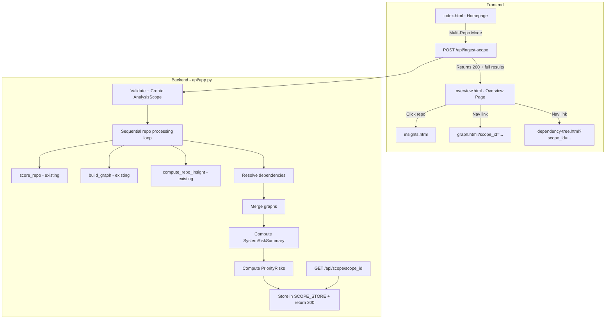

# Design Document: Multi-Repo Ingestion MVP

## Overview

This design transforms Deep Signal from a single-repository analysis tool into a multi-repo system risk analyzer. Users define an "Analysis Scope" containing multiple repos and optional dependency names, trigger a single ingestion, and receive a unified risk overview highlighting prioritized risks across the entire software system.

The MVP is intentionally constrained: in-memory scope storage (no DB persistence), fully synchronous processing (returns 200 with complete results), best-effort dependency-to-repo mapping via a hardcoded dict, and static HTML/JS frontend (no framework, no build step). The backend extends the existing FastAPI app with two new endpoints. The frontend adds a multi-repo input mode on the homepage, a new Overview page, and scope-aware behavior on existing Graph and Dependency Tree pages.

### Key Design Decisions

1. **In-memory scope store**: A plain Python `dict` keyed by `scope_id`. Scopes are lost on restart — acceptable for MVP.
2. **Fully synchronous processing**: The `POST /api/ingest-scope` endpoint processes repos sequentially and returns HTTP 200 with complete results. No polling needed. This simplifies the MVP at the cost of blocking the caller (mitigated by the 10-repo cap). Future: async + 202 + polling.
3. **Reuse existing pipelines**: `score_repo()` and `build_graph()` are called per-repo exactly as the single-repo flow does. No new scoring or graph-building logic.
4. **Graph merging**: Union of nodes/edges across repo graphs, deduplicating by `node.id`, with a `source_repos` list added to each merged node. Edges are deduplicated by (source, target, type) tuple — different relationship types between the same nodes are preserved, never collapsed.
5. **Best-effort dependency mapping**: A hardcoded `PACKAGE_TO_REPO` dict maps common package names to GitHub repos. If a dependency maps to a repo → run full scoring pipeline. If not → include as a graph-only package node with no risk score. This is explicitly best-effort and may be incomplete.
6. **Simple mean aggregation**: Aggregate risk score is the arithmetic mean of non-error repo risk scores. This is intentionally simple for MVP — future versions may weight by dependency count or repo importance.
7. **Frontend is vanilla JS**: No React, no build step. New `overview.html` page follows the same pattern as `insights.html` and `graph.html`.

## Architecture



### Request Flow

1. User enters repos in multi-repo mode on homepage → POST to `/api/ingest-scope`
2. Backend validates input, creates scope entry, generates `scope_id`
3. For each repo: call `score_repo()`, `build_graph()`, `compute_repo_insight()`, collect results
4. For each dependency: if mapped to repo → run full pipeline; if unmapped → create graph-only package node
5. Merge individual graphs into a single `Merged_Graph` (deduplicate nodes by ID, track source repos)
6. Compute `SystemRiskSummary` with repo-level AND dependency-level metrics
7. Compute `PriorityRisk` list (top 3–5 items ranked by priority score)
8. Set scope status to `"complete"`, `"partial"`, or `"failed"`
9. Return HTTP 200 with `{ scope_id, status, system_risk_summary, priority_risks, graph, ... }`
10. Frontend redirects to `overview.html?scope_id=...`, loads data from `GET /api/scope/{scope_id}`

## Components and Interfaces

### Backend Components

#### 1. Scope Store Module (`api/app.py` — inline)

```python
# In-memory scope store — module-level dict
SCOPE_STORE: Dict[str, dict] = {}
```

No separate module needed for MVP. The store is a plain dict in `app.py`.

#### 2. `POST /api/ingest-scope` Endpoint

```python
class IngestScopeRequest(BaseModel):
    name: str
    repos: List[str]                    # owner/repo format, max 10
    dependencies: Optional[List[str]] = []  # package names

class IngestScopeResponse(BaseModel):
    scope_id: str
    status: str                         # "complete" | "partial" | "failed"
    system_risk_summary: dict
    priority_risks: List[dict]
    graph: dict
```

Returns HTTP 200 with complete results (synchronous). No polling.

Validation:
- `repos` + `dependencies` must not both be empty → 422
- `repos` length must be ≤ 10 (MVP performance constraint) → 422
- Each repo string validated via existing `_normalize_repo_name()`

Processing loop (synchronous):
```python
for repo in repos:
    try:
        score_data = score_repo(repo)
        graph_obj = build_graph(repo, score_data, config)
        insight = compute_repo_insight(repo, graph_repo)
        per_repo_results.append(success_result)
        graphs.append((repo, graph_obj))
    except Exception as e:
        per_repo_results.append({"repo": repo, "error": str(e)})

# Dependency resolution
for dep in dependencies:
    mapped_repo = PACKAGE_TO_REPO.get(dep)
    if mapped_repo:
        # Run full pipeline for mapped dependency
        try:
            score_data = score_repo(mapped_repo)
            graph_obj = build_graph(mapped_repo, score_data, config)
            graphs.append((mapped_repo, graph_obj))
        except Exception:
            pass  # Best-effort, continue
    else:
        # Graph-only node — no risk score
        unmapped_nodes.append({"id": f"pkg:{dep}", "type": "package", "label": dep})
```

#### 3. Graph Merger Function

```python
def merge_graphs(graphs: List[Tuple[str, Graph]], unmapped_nodes: List[dict]) -> dict:
    """Merge multiple repo graphs into a single merged graph dict."""
```

Deduplication strategy:
- Key nodes by `node.id`
- First occurrence wins for node properties
- Append `source_repos` list to each node tracking which repos contributed it
- Edges are deduplicated by `(source, target, relationship_type)` tuple
- Different relationship types between the same node pair are PRESERVED, never collapsed
- Unmapped dependency nodes are added as standalone package nodes

#### 4. System Risk Summary Computation

```python
def compute_system_risk_summary(per_repo_results: List[dict], merged_graph: dict) -> dict:
```

Computes:
- **Repo-level**: total count, high/medium/low counts, per-repo breakdown
- **Dependency-level**: total unique deps (from merged graph package nodes), deps used by multiple repos (source_repos length > 1), high-risk deps (risk_score ≥ 0.60), vulnerable deps (CVE count > 0)
- **Aggregate score**: arithmetic mean of non-error repo risk scores (intentionally simple for MVP)
- **Aggregate label**: LOW/MEDIUM/HIGH based on standard thresholds
- **System summary sentence**: human-readable 1–2 sentence explanation, e.g. "Your system shows moderate risk driven by dependency overlap and 3 vulnerable packages."

#### 5. Priority Risk Computation

```python
def compute_priority_risks(per_repo_results: List[dict], merged_graph: dict) -> List[dict]:
```

Each candidate risk item gets a numeric `priority_score`:

```python
SEVERITY_BASE = {"high": 3.0, "medium": 2.0, "low": 1.0}

priority_score = (
    SEVERITY_BASE[severity]
    + (usage_count * 0.5)    # how many repos depend on this
    + (cve_count * 1.0)      # CVE presence amplifies priority
)
```

Sources:
- High-risk repos (type: "repo", severity from risk_label)
- Dependencies with CVEs (type: "dependency")
- Dependencies used by many repos (type: "dependency", concentration risk)
- Single-maintainer repos (type: "maintainer")

All candidates are scored, sorted descending by `priority_score`, and top 3–5 returned. Each item: `{name, type, reason, severity, priority_score, used_by_repos}`.

#### 6. `GET /api/scope/{scope_id}` Endpoint

Returns the full scope object from `SCOPE_STORE`. Returns 404 if not found. Since processing is synchronous, the scope is always complete when retrieved.

#### 7. Dependency-to-Repo Mapping

```python
PACKAGE_TO_REPO: Dict[str, str] = {
    "flask": "pallets/flask",
    "requests": "psf/requests",
    "sqlalchemy": "sqlalchemy/sqlalchemy",
    "django": "django/django",
    "numpy": "numpy/numpy",
    "pandas": "pandas-dev/pandas",
    "fastapi": "tiangolo/fastapi",
    "express": "expressjs/express",
    "react": "facebook/react",
    "lodash": "lodash/lodash",
    "axios": "axios/axios",
    "scikit-learn": "scikit-learn/scikit-learn",
}
```

Resolution rule:
- If dependency maps to repo → run full scoring pipeline, include in per_repo_results
- If not → include as graph-only package node (no risk score, no scoring pipeline)
- This is explicitly best-effort for MVP and may be incomplete

### Frontend Components

#### 1. Homepage Multi-Repo Toggle (`ui/index.html`)

Adds a toggle control in the hero section:
- **Single Repo mode** (default): existing input + "Scan a Repository" button — unchanged
- **Multi-Repo mode**: textarea for repos (one per line), scope name input, "Analyze System" button

Toggle is a simple two-button segmented control. Mode switch shows/hides the appropriate input group.

#### 2. Overview Page (`ui/overview.html`)

New page following the same structure as existing pages:
- Loads `design-system.css`, `nav.js`, `config.js`
- Reads `scope_id` from URL query params
- Fetches `GET /api/scope/{scope_id}` (single load, no polling needed)
- Renders:

**A. System Risk Summary** (top of page, most prominent):
- Overall risk label (LOW/MEDIUM/HIGH) as large badge
- 1–2 sentence system summary, e.g. "Your system shows moderate risk driven by dependency overlap and vulnerable packages."
- This is the product centerpiece — immediate understanding of system risk

**B. KPI cards**: total repos, unique deps, high-risk deps, vulnerable deps, aggregate score

**C. Priority Risks**: top 3–5 items with name, type badge, reason, severity, and "used by X repos" where applicable

**D. Top Risk Drivers**: top 5 repos by descending risk score, clickable to insights page

**E. Risky Dependencies**: sorted by `priority_score` (combines risk score AND usage frequency), each showing package name, risk score, used_by_repos list, CVE count. "Used by X repos" shown prominently on every dependency card.

**F. Actions**: "Open Graph" and "Open Dependency Tree" links with scope_id

- Error states: missing scope_id → error with link to homepage; 404 → error message
- Partial results: if status is "partial", show warning banner about failed repos

#### 3. Navigation Update (`ui/nav.js`)

Add "Overview" entry to `NAV_PAGES` between "Home" and "Insights":
```javascript
{ pageId: "overview", label: "Overview", file: "overview.html" }
```

Add `parseScopeParam()` to handle `scope_id` query param. Propagate `scope_id` to Overview, Graph, and Tree links when present.

#### 4. Scope-Aware Graph Page (`ui/graph.html` + `ui/graph-viz.js`)

When `scope_id` is present in URL:
- Fetch merged graph from `GET /api/scope/{scope_id}` instead of single-repo graph
- Hide single-repo input controls
- Display scope name as page title
- Render merged graph using existing vis.js visualization

#### 5. Scope-Aware Dependency Tree Page (`ui/dependency-tree.html` + `ui/dependency-tree.js`)

When `scope_id` is present in URL:
- Fetch scope data from `GET /api/scope/{scope_id}`
- Build combined tree from merged graph data
- Hide single-repo input controls
- Display scope name as page title

## Data Models

### AnalysisScope (in-memory dict structure)

```python
{
    "scope_id": "scope_abc123",
    "name": "My Project Stack",
    "repos": ["numpy/numpy", "pandas-dev/pandas"],
    "dependencies": ["flask", "sqlalchemy"],
    "status": "complete",              # complete | partial | failed
    "created_at": "2024-01-15T10:30:00Z",
    "system_risk_summary": {
        "total_repos": 2,
        "total_unique_dependencies": 47,
        "dependencies_used_by_multiple_repos": 8,
        "high_risk_dependencies": 5,
        "vulnerable_dependencies": 3,
        "high_risk_repos": 1,
        "medium_risk_repos": 0,
        "low_risk_repos": 1,
        "aggregate_risk_score": 0.42,    # simple mean of non-error repo scores
        "aggregate_label": "MEDIUM",
        "system_summary": "Your system shows moderate risk driven by dependency overlap and 3 vulnerable packages.",
        "per_repo_results": [
            {"repo": "numpy/numpy", "risk_score": 0.35, "risk_label": "LOW", "error": None}
        ]
    },
    "priority_risks": [
        {
            "name": "requests",
            "type": "dependency",
            "reason": "Used by 2 repos, has 2 known CVEs",
            "severity": "high",
            "priority_score": 6.0,
            "used_by_repos": ["numpy/numpy", "psf/requests"]
        }
    ],
    "top_risky_dependencies": [
        {
            "package_name": "requests",
            "risk_score": 0.7,
            "risk_label": "HIGH",
            "used_by_repos": ["numpy/numpy", "psf/requests"],
            "cve_count": 2,
            "priority_score": 6.0
        }
    ],
    "graph": {
        "nodes": [...],  # merged, deduplicated, with source_repos
        "edges": [...]   # deduplicated by (source, target, type), different types preserved
    },
    "errors": {}  # repo -> error message for failed repos
}
```

### Merged Graph Node (extended)

Each node in the merged graph gets `source_repos`:

```python
{
    "id": "pkg:pypi/requests",
    "type": "dependency",
    "label": "requests",
    "properties": {
        "source_repos": ["numpy/numpy", "psf/requests"],
        # ... existing properties preserved
    }
}
```

### Merged Graph Edge Deduplication

Edges are deduplicated by the tuple `(source_id, target_id, relationship_type)`:
- Same source + target + same type → keep one, discard duplicate
- Same source + target + DIFFERENT type → keep both (different relationship types are never collapsed)

### Risk Label Thresholds

Consistent with existing `_risk_label_from_score()`:
- `< 0.30` → LOW
- `0.30 – 0.59` → MEDIUM
- `≥ 0.60` → HIGH

### Priority Score Formula

```python
SEVERITY_BASE = {"high": 3.0, "medium": 2.0, "low": 1.0}

priority_score = (
    SEVERITY_BASE.get(severity, 1.0)
    + (len(used_by_repos) * 0.5)
    + (cve_count * 1.0)
)
```

## Correctness Properties

### Property 1: Scope creation round-trip

*For any* valid scope name, list of repos (1-10), and list of dependencies, creating an AnalysisScope and then retrieving it by scope_id should return an object containing the same name, repos, dependencies, and a valid status field.

**Validates: Requirements 1.1, 3.1**

### Property 2: Scope ID uniqueness

*For any* N scope creation calls (N ≤ 20), all returned scope_ids should be distinct strings with no collisions.

**Validates: Requirements 1.2**

### Property 3: Graph merge deduplication and source tracking

*For any* set of 2+ graphs containing overlapping node IDs, merging them should produce a graph where: (a) each unique node ID appears exactly once, (b) each merged node's `source_repos` list contains all repos that contributed that node, (c) edges with different relationship types between the same nodes are all preserved, (d) edges with the same (source, target, type) tuple appear exactly once, and (e) the total node count is ≤ the sum of input node counts.

**Validates: Requirements 2.6, 2.7**

### Property 4: System risk summary correctness

*For any* list of per-repo results with risk scores and labels, the computed SystemRiskSummary should satisfy: (a) `total_repos` equals the length of the input list, (b) `high_risk_repos + medium_risk_repos + low_risk_repos` equals the count of non-error repos, (c) `aggregate_risk_score` is the arithmetic mean of non-error repo risk scores, and (d) `aggregate_label` matches the label threshold for the aggregate score.

**Validates: Requirements 2.8**

### Property 5: Status computation from processing outcomes

*For any* list of per-repo processing results where each result is either success or failure: if all succeed the status should be "complete", if all fail the status should be "failed", and if some succeed and some fail the status should be "partial".

**Validates: Requirements 2.10**

### Property 6: Priority risk ranking by score

*For any* set of risk items with computed priority_scores, the priority risk list should be: (a) sorted by priority_score descending, (b) limited to at most 5 items, and (c) each item should contain name, type, reason, severity, priority_score, and used_by_repos fields.

**Validates: Requirements 2.11**

### Property 7: Dependency resolution — mapped vs unmapped

*For any* dependency name in PACKAGE_TO_REPO, resolution should return the mapped repo and the dependency should be processed through the full scoring pipeline. *For any* dependency name NOT in the mapping, it should be included as a graph-only package node with no risk score.

**Validates: Requirements 2.9**

### Property 8: Top risk drivers sorting

*For any* list of per-repo results with risk scores, the top risk drivers list should be sorted in descending order by risk score and contain at most 5 entries.

**Validates: Requirements 5.4**

### Property 9: Oversized repo list rejection

*For any* list of repos with length > 10, the ingest-scope endpoint should return HTTP 422.

**Validates: Requirements 2.3**

### Property 10: Partial failure resilience

*For any* list of N repos (N ≥ 2) where K repos fail (0 < K < N), the system should still produce valid results for the (N - K) successful repos, and the per_repo_results should contain error details for exactly the K failed repos.

**Validates: Requirements 2.5**

## Error Handling

### Backend Errors

| Scenario | HTTP Status | Response |
|---|---|---|
| Empty repos + empty dependencies | 422 | `{"detail": "At least one repo or dependency required"}` |
| More than 10 repos | 422 | `{"detail": "Maximum 10 repos allowed (MVP performance constraint)"}` |
| Invalid repo format | 422 | `{"detail": "Invalid repo format: {repo}"}` |
| Scope not found | 404 | `{"detail": "Scope not found: {scope_id}"}` |
| Single repo pipeline failure | Recorded in per_repo_results | Processing continues for remaining repos |
| All repos fail | 200 (scope created) | Status set to "failed", errors in per_repo_results |
| Unexpected server error | 500 | Standard FastAPI error response |

### Frontend Errors

| Scenario | Behavior |
|---|---|
| Missing scope_id in URL | Display error message with link to homepage |
| Scope not found (404) | Display "Scope not found" error with link to homepage |
| Network error loading scope | Display error with retry button |
| Ingest-scope returns error | Display error inline on homepage, don't navigate |

### Partial Failure Handling

When some repos succeed and others fail:
- Status is set to `"partial"`
- `per_repo_results` contains both successful results (with scores) and failed results (with error messages)
- `system_risk_summary` is computed from successful repos only
- `priority_risks` are computed from available data
- Overview page renders available data with a warning banner about partial results

## Testing Strategy

### Property-Based Tests (Hypothesis)

**Test file**: `test/multi_repo/test_scope_properties.py`

Property tests target the pure computation functions:
- `merge_graphs()` — Property 3
- `compute_system_risk_summary()` — Property 4
- `compute_scope_status()` — Property 5
- `compute_priority_risks()` — Property 6
- `resolve_dependency()` — Property 7
- `get_top_risk_drivers()` — Property 8
- Scope store operations — Properties 1, 2
- Input validation — Properties 9, 10

### Unit Tests (pytest)

**Test file**: `test/multi_repo/test_scope_unit.py`

- Endpoint returns 200 with valid input
- Endpoint returns 422 for empty input
- Endpoint returns 422 for >10 repos
- GET /api/scope returns 404 for unknown ID
- Status values match expected set
- Priority score formula produces correct values
- Dependency resolution: mapped → full pipeline, unmapped → graph-only node

### Integration Tests (pytest)

**Test file**: `test/multi_repo/test_scope_integration.py`

- Full endpoint flow with mocked `score_repo` and `build_graph`
- Partial failure scenario (one repo fails, others succeed)
- Dependency resolution with mixed mapped/unmapped packages
- System summary sentence generation

### Frontend Tests

**Test file**: `test/ui/test_overview_logic.js`

- KPI computation from scope data
- Priority risk rendering with used_by_repos
- Top risk drivers sorting
- Error display for missing scope_id
- System risk summary sentence display
