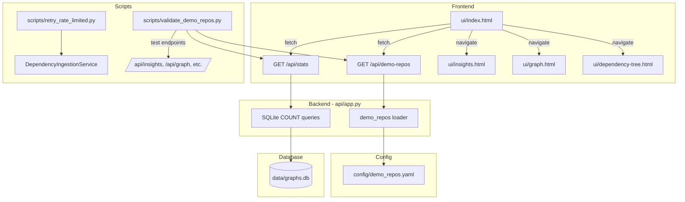

# Design Document: Pre-Deployment Finalization

## Overview

This design covers six workstreams that prepare Deep Signal for production deployment and demo readiness:

1. **Retry Rate-Limited Repos** — A targeted script modification to re-ingest `yaml/pyyaml` and `ytdl-org/youtube-dl`.
2. **Demo Repo Config** — A YAML config file with 15–25 curated repos, a loader module with DB validation, and a new `/api/demo-repos` endpoint.
3. **Stats Endpoint** — A `GET /api/stats` endpoint returning dataset coverage metrics from SQLite.
4. **Homepage Wiring** — Replace the hardcoded `EXPLORE` object in `ui/index.html` with data fetched from `/api/demo-repos` and `/api/stats`.
5. **QA Validation Script** — An automated script that tests demo repos against all API endpoints.
6. **Deployment Configuration** — Configurable `API_BASE`, CORS settings, env var documentation, and a deployment guide.

The design prioritizes minimal changes to existing code, reuses the existing ingestion pipeline, and avoids new database tables.

## Architecture



### Key Design Decisions

1. **Demo repos served via API endpoint (`GET /api/demo-repos`)** rather than embedded static JSON or inline JS. This keeps the frontend decoupled from config and allows the backend to enrich entries with live risk labels from the database.

2. **`API_BASE` made configurable via a shared `ui/config.js`** file that all HTML pages import. This single file sets `window.DS_API_BASE` from an environment-injected value or falls back to `""` (same-origin). This avoids editing every HTML file for deployment.

3. **Stats endpoint uses simple COUNT DISTINCT queries** against existing `repo_graphs` and `repo_dependencies` tables — no new tables or materialized views needed.

4. **Retry script is a new standalone script** (`scripts/retry_rate_limited.py`) rather than modifying `fill_missing_deps.py`, keeping the original script's general-purpose behavior intact.

## Components and Interfaces

### 1. Retry Script — `scripts/retry_rate_limited.py`

A focused script that targets only the two rate-limited repos.

```python
# Interface
def main() -> int:
    """
    Retry ingestion for rate-limited repos.
    Returns 0 on success, 1 if any repo fails.
    """
```

- Hardcodes target list: `["yaml/pyyaml", "ytdl-org/youtube-dl"]`
- Calls `DependencyIngestionService.ingest_repo(repo, refresh=True, resolve_packages=True)`
- Then runs `TransitiveResolver.resolve_repo()` for each
- Then runs `enrich_graphs.py` logic (or calls `compute_repo_insight`) for each
- Logs HTTP status codes on rate-limit failures
- Exits with non-zero status on failure

### 2. Demo Repo Config — `src/open_source_risk_model/config/demo_repos.yaml`

```yaml
# Curated demo repositories for Deep Signal homepage and QA validation
repos:
  - repo: "numpy/numpy"
    tags: ["well-maintained", "popular", "deep-tree"]
  - repo: "pallets/flask"
    tags: ["well-maintained", "popular"]
  - repo: "django/django"
    tags: ["well-maintained", "popular", "deep-tree"]
  - repo: "facebook/react"
    tags: ["popular", "deep-tree"]
  - repo: "expressjs/express"
    tags: ["well-maintained", "popular"]
  - repo: "axios/axios"
    tags: ["popular"]
  - repo: "psf/requests"
    tags: ["well-maintained", "popular"]
  - repo: "scikit-learn/scikit-learn"
    tags: ["popular", "deep-tree"]
  - repo: "tensorflow/tensorflow"
    tags: ["popular", "deep-tree"]
  - repo: "lodash/lodash"
    tags: ["popular"]
  - repo: "minimistjs/minimist"
    tags: ["high-risk", "vulnerable"]
  - repo: "Marak/colors.js"
    tags: ["high-risk"]
  - repo: "dominictarr/event-stream"
    tags: ["high-risk", "vulnerable"]
  - repo: "AhmedAli7O1/node-ipc"
    tags: ["high-risk"]
  - repo: "fastapi/fastapi"
    tags: ["well-maintained", "popular"]
  - repo: "torvalds/linux"
    tags: ["popular", "deep-tree"]
  - repo: "vuejs/vue"
    tags: ["popular"]
  - repo: "yaml/pyyaml"
    tags: ["popular"]
  - repo: "ytdl-org/youtube-dl"
    tags: ["popular"]
```

### 3. Demo Repos Loader — `src/open_source_risk_model/config/demo_repos.py`

```python
@dataclass
class DemoRepo:
    repo: str          # "owner/repo"
    tags: list[str]    # e.g. ["high-risk", "popular"]

@dataclass
class DemoRepoConfig:
    repos: list[DemoRepo]

def load_demo_repos() -> DemoRepoConfig:
    """Load and parse demo_repos.yaml from the config directory."""

def validate_demo_repos(db_path: str) -> list[DemoRepo]:
    """
    Load demo repos and validate each against the database.
    Returns only repos that pass all checks.
    Logs warnings for repos missing graph, dependency, or insight data.
    """
```

Validation checks per repo:
- Exists in `repo_graphs` table
- Has at least one row in `repo_dependencies` table
- `compute_repo_insight()` returns a non-null score

### 4. Stats Endpoint — `GET /api/stats`

Added to `api/app.py`:

```python
@app.get("/api/stats")
def get_stats():
    """Return dataset coverage statistics."""
    # Returns:
    {
        "total_repos": 145,           # COUNT DISTINCT repo_full_name FROM repo_graphs
        "fully_analyzed_repos": 122,   # COUNT DISTINCT repos in BOTH repo_graphs AND repo_dependencies
        "coverage_ratio": 0.84         # fully_analyzed / total, rounded to 2 decimals
    }
```

SQL queries:
```sql
SELECT COUNT(DISTINCT repo_full_name) FROM repo_graphs;

SELECT COUNT(DISTINCT rg.repo_full_name)
FROM repo_graphs rg
INNER JOIN repo_dependencies rd ON rg.repo_full_name = rd.repo_full_name;
```

### 5. Demo Repos Endpoint — `GET /api/demo-repos`

Added to `api/app.py`:

```python
@app.get("/api/demo-repos")
def get_demo_repos():
    """Return curated demo repos with live risk labels."""
    # Returns:
    {
        "repos": [
            {
                "repo": "numpy/numpy",
                "name": "numpy",
                "owner": "numpy",
                "tags": ["well-maintained", "popular", "deep-tree"],
                "risk_label": "LOW"   # from compute_repo_insight
            },
            ...
        ]
    }
```

This endpoint loads from `demo_repos.yaml`, enriches each entry with the current `graph_signal_label` from the insights computation, and returns the full list. Risk label lookup is cached per request since the insights are computed from the DB.

### 6. Frontend Config — `ui/config.js`

```javascript
// API base URL configuration
// For production: set window.DS_API_BASE before this script loads,
// or configure your reverse proxy to serve API and frontend from same origin.
window.DS_API_BASE = window.DS_API_BASE || "";
```

All HTML files will import this script and replace hardcoded `API_BASE` references with `window.DS_API_BASE`. When served behind a reverse proxy (same origin), the empty string means relative URLs work. For split deployments, set `window.DS_API_BASE = "https://api.example.com"` before the config script.

### 7. Homepage Updates — `ui/index.html`

Changes:
- Import `ui/config.js`
- Remove hardcoded `EXPLORE` object
- On load, fetch `/api/demo-repos` and `/api/stats`
- Render repo chips grouped by tag (high-risk, well-maintained, popular)
- Add trust signal line: "Analyzing {N}+ open-source repositories..."
- Graceful fallback: if `/api/stats` fails, show count from demo-repos length or static "100+"

### 8. QA Validation Script — `scripts/validate_demo_repos.py`

```python
def main(api_base: str = "http://127.0.0.1:8000") -> int:
    """
    Test demo repos against all API endpoints.
    Returns 0 if all pass, 1 if any fail.
    """
```

For each demo repo (minimum 5), tests:
1. `GET /api/insights/{owner}/{repo}` → 200, non-null `score`
2. `GET /api/graph?repo={owner}/{repo}` → 200, ≥1 node, ≥1 edge
3. `GET /repos/{owner}/{repo}/dependency-tree` → 200, non-empty `tree`
4. `GET /api/score?repo={owner}/{repo}` → 200

Also tests:
5. `GET /api/stats` → 200, valid fields
6. `GET /api/demo-repos` → 200, non-empty list

Prints summary: `PASSED: X | FAILED: Y | TOTAL: Z`

### 9. Deployment Documentation — `docs/DEPLOYMENT.md` (update)

Updates to existing deployment doc covering:
- Required env vars: `GITHUB_TOKEN`, `OPENAI_API_KEY`, `GRAPH_DB_PATH`, `GRAPH_DB_ENABLED`
- Optional env vars: `CORS_ALLOWED_ORIGINS`, `DS_API_BASE`
- CORS configuration for production
- Frontend `API_BASE` strategy
- Reverse proxy setup (nginx example)
- Startup validation (token check, DB check)

## Data Models

### Demo Repo Config Schema (YAML)

```yaml
repos:
  - repo: string       # Required. "owner/repo" format
    tags: [string]      # Optional. Allowed: high-risk, deep-tree, well-maintained, popular, vulnerable
```

### Stats Response Schema (JSON)

```json
{
  "total_repos": "integer >= 0",
  "fully_analyzed_repos": "integer >= 0",
  "coverage_ratio": "float 0.00–1.00, 2 decimal places"
}
```

### Demo Repos Response Schema (JSON)

```json
{
  "repos": [
    {
      "repo": "owner/repo",
      "name": "repo",
      "owner": "owner",
      "tags": ["tag1", "tag2"],
      "risk_label": "HIGH | MEDIUM | LOW | null"
    }
  ]
}
```

### Existing Database Tables Used (no changes)

- `repo_graphs` — `repo_full_name TEXT PRIMARY KEY`
- `repo_dependencies` — `repo_full_name TEXT, package_name TEXT, ...`
- `resolved_dependencies` — `repo_full_name TEXT, ...`

No new tables are created. All queries are read-only COUNT/JOIN operations against existing tables.


## Correctness Properties

*A property is a characteristic or behavior that should hold true across all valid executions of a system — essentially, a formal statement about what the system should do. Properties serve as the bridge between human-readable specifications and machine-verifiable correctness guarantees.*

### Property 1: Demo Repo Validation Correctness

*For any* demo repo configuration (list of repo entries) and *for any* database state (sets of repos in `repo_graphs`, `repo_dependencies`, and insight scores), the `validate_demo_repos` function SHALL return exactly those repos where all three conditions hold: (a) the repo exists in `repo_graphs`, (b) the repo has at least one entry in `repo_dependencies`, and (c) `compute_repo_insight` returns a non-null score. Furthermore, for every repo that fails validation, a warning SHALL be logged containing the repo name and the specific missing data category (graph, dependencies, or insight).

**Validates: Requirements 2.4, 2.5, 2.6, 2.7**

### Property 2: Stats Computation Correctness

*For any* database state with an arbitrary set of repos in `repo_graphs` and an arbitrary (possibly overlapping) set of repos in `repo_dependencies`, the stats computation SHALL return `total_repos` equal to the distinct count of repos in `repo_graphs`, `fully_analyzed_repos` equal to the distinct count of repos present in both tables, and `coverage_ratio` equal to `round(fully_analyzed_repos / total_repos, 2)` when `total_repos > 0`, or `0.00` when `total_repos == 0`.

**Validates: Requirements 4.2, 4.3, 4.4, 4.5**

### Property 3: QA Report Consistency

*For any* set of test results (each being a pass or fail with associated repo name, endpoint path, HTTP status code, and response summary), the QA script's summary SHALL report `passed + failed == total`, and every failed test SHALL include the repository name, endpoint path, HTTP status code, and response body summary in its failure report.

**Validates: Requirements 5.6, 5.7**

## Error Handling

| Scenario | Handling |
|---|---|
| Retry script: GitHub 403 rate limit | Log repo name + HTTP 403, exit with code 1 |
| Retry script: Network timeout | Log error, continue to next repo, exit 1 if any failed |
| Demo repo loader: YAML file missing | Raise `FileNotFoundError` with descriptive message |
| Demo repo loader: Invalid YAML syntax | Raise `ValueError` with parse error details |
| Demo repo loader: Repo fails DB validation | Log warning, exclude from returned list (don't raise) |
| Stats endpoint: DB unavailable | Return HTTP 503 with `{"detail": "Database is not available"}` |
| Stats endpoint: Empty database | Return `{"total_repos": 0, "fully_analyzed_repos": 0, "coverage_ratio": 0.00}` |
| Demo-repos endpoint: DB unavailable | Return repos from YAML without `risk_label` enrichment (label = null) |
| Demo-repos endpoint: Insight computation fails for a repo | Set `risk_label` to null for that repo, continue |
| Homepage: `/api/stats` fetch fails | Display fallback text "Analyzing 100+ open-source repositories..." |
| Homepage: `/api/demo-repos` fetch fails | Display empty explore section with "Unable to load repositories" message |
| QA script: Endpoint returns non-200 | Record as failure with status code and body, continue testing |
| QA script: Network error to API | Record as failure with error message, continue testing |
| Frontend: `config.js` missing | `window.DS_API_BASE` defaults to `""` (same-origin), no crash |

## Testing Strategy

### Property-Based Tests (using Hypothesis)

Three property tests, each running a minimum of 100 iterations:

1. **Demo repo validation** — Generate random repo configs (1–30 entries with random owner/repo strings and tags) and random DB states (random subsets present in each table). Mock `compute_repo_insight` to return null or non-null randomly. Verify the validated list matches the expected intersection.
   - Tag: `Feature: pre-deployment-finalization, Property 1: Demo Repo Validation Correctness`

2. **Stats computation** — Generate random sets of repo names for `repo_graphs` and `repo_dependencies` tables (0–50 entries each). Insert into an in-memory SQLite DB. Call the stats computation function and verify all three fields match expected values.
   - Tag: `Feature: pre-deployment-finalization, Property 2: Stats Computation Correctness`

3. **QA report consistency** — Generate random lists of test results (pass/fail, random repo names, random endpoints, random status codes). Feed to the report generator and verify summary counts and failure report contents.
   - Tag: `Feature: pre-deployment-finalization, Property 3: QA Report Consistency`

### Unit Tests (example-based)

- Config loading: YAML with valid entries, missing file, invalid syntax
- Config schema: entries with valid/invalid tags, missing repo field
- Stats endpoint: empty DB returns zeros, single repo, mixed state
- Demo-repos endpoint: returns enriched list, handles missing insights gracefully
- Retry script: mock successful ingestion, mock rate-limit failure with correct logging
- Frontend config.js: verify `DS_API_BASE` defaults correctly

### Integration Tests

- Retry script end-to-end (against test DB with mock GitHub responses)
- QA validation script against running test server
- Homepage fetch + render cycle (manual or Playwright)
- CORS headers on cross-origin requests
- Startup behavior with/without `GITHUB_TOKEN`

### Test Configuration

- Property-based testing library: **Hypothesis** (already used in the project)
- Minimum iterations: 100 per property test
- Each property test tagged with design document reference
