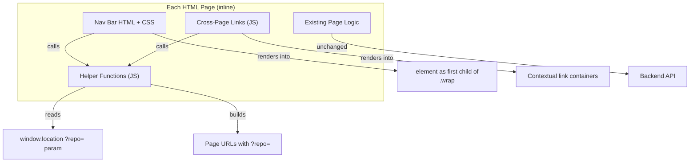

# Design Document: UI Navigation Unification

## Overview

This feature adds a unified navigation bar and cross-page linking to the four existing Deep Signal HTML pages (index.html, graph.html, dependency-tree.html, insights.html). The core challenge is introducing consistent navigation while preserving each page's existing behavior, propagating repository context via `?repo=` query parameters, and staying within the project's no-framework, inline-everything architecture.

The design introduces a small set of pure helper functions and a nav bar HTML/CSS block that are duplicated inline in each page. Graph.html gains auto-load behavior when a `?repo=` param is present. Cross-page contextual links appear after a repo is loaded on each page.

> **Dev/test source files:** The helper functions are also maintained in `ui/nav-helpers.js` and `ui/nav-render.js` for development/test synchronization only. These files are NOT referenced by the HTML pages at runtime. The HTML pages inline these functions directly.

### Key Design Decisions

1. **Inline duplication over shared files**: The project has no build tools and no shared JS/CSS files. Rather than introducing a shared `nav.js`, the nav markup, styles, and helper functions are duplicated in each page's inline `<style>` and `<script>` blocks. This matches the existing pattern and avoids new infrastructure.

2. **`?repo=` as the universal context token**: All four pages already use or can trivially support `?repo=owner/name` as a query parameter. This becomes the single mechanism for cross-page context transfer.

3. **Auto-load on graph.html**: Currently graph.html prefills from `?repo=` but does NOT auto-load. We add a small inline script that calls `loadGraph()` after the existing prefill IIFE when a `?repo=` param is present, with a guard flag to prevent duplicate loads from the existing event listeners.

4. **dependency-tree.html already auto-loads**: The existing `applyUrlState()` + `if (repoInput.value.trim()) loadTree(false)` at the bottom of dependency-tree.js already handles auto-load from URL. No changes needed for auto-load behavior.

5. **insights.html already handles `?repo=`**: The existing `initRoute()` IIFE handles `?repo=` for detail mode. No changes needed for that routing behavior.

## Architecture



### Page-Level Architecture

Each page follows this structure after the change:

```
<div class="wrap">
  <nav class="ds-nav"> ... </nav>       ← NEW: injected nav bar
  <div class="topbar"> ... </div>        ← EXISTING: unchanged
  ... existing page content ...
  <div id="crossLinks"> ... </div>       ← NEW: contextual cross-page links (shown after repo load)
</div>
```

The nav bar is injected as the first child of `.wrap` on each page, before the existing `.topbar`. This keeps the nav visually at the top without restructuring existing DOM.

## Components and Interfaces

### 1. Navigation Helper Functions (duplicated in each page)

These pure functions have no DOM dependencies and are the core logic for URL handling:

```javascript
/**
 * parseRepoParam(searchString) → string|null
 * Core parsing logic extracted for testability. Takes a query string
 * (e.g. "?repo=numpy%2Fnumpy"), extracts the repo param, decodes it,
 * and validates owner/name format. Returns null if missing, empty, or malformed.
 * This function does NOT read from window.location — it accepts the search
 * string as a parameter, making it directly testable in property-based tests
 * without simulating URL state.
 */
function parseRepoParam(searchString) {
  var params = new URLSearchParams(searchString);
  var raw = params.get("repo");
  if (!raw) return null;
  var decoded = decodeURIComponent(raw);
  if (!decoded || !decoded.trim()) return null;
  decoded = decoded.trim();
  // Validate exact owner/name format (exactly one slash)
  var slashIndex = decoded.indexOf("/");
  if (slashIndex === -1 || slashIndex === 0 || slashIndex === decoded.length - 1 || decoded.indexOf("/", slashIndex + 1) !== -1) return null;
  return decoded;
}

/**
 * getRepoFromUrl() → string|null
 * Thin wrapper that reads ?repo= from current URL via parseRepoParam.
 * Returns null if missing, empty, or malformed.
 */
function getRepoFromUrl() {
  return parseRepoParam(window.location.search);
}

/**
 * buildPageUrl(page, repo) → string
 * Builds a URL for a target page, optionally including ?repo= param.
 * page: "index.html" | "insights.html" | "graph.html" | "dependency-tree.html"
 * repo: string|null — if non-null, appended as ?repo=encodeURIComponent(repo)
 */
function buildPageUrl(page, repo) {
  if (repo) return page + "?repo=" + encodeURIComponent(repo);
  return page;
}

/**
 * getCurrentPageId() → string
 * Returns the current page identifier based on window.location.pathname.
 * Returns one of: "index", "insights", "graph", "dependency-tree"
 * Fallback: if the path ends in "/" or has no recognized page filename,
 * the function treats it as "index" (the home page).
 */
function getCurrentPageId() {
  var path = window.location.pathname;
  if (path.indexOf("insights") !== -1) return "insights";
  if (path.indexOf("graph") !== -1) return "graph";
  if (path.indexOf("dependency-tree") !== -1) return "dependency-tree";
  // Fallback: paths ending in "/" or with no known page filename → "index"
  return "index";
}

/**
 * renderNav(currentPageId, repo) → void
 * Creates the <nav> element and inserts it as the first child of .wrap.
 * Applies aria-current="page" to the active link.
 * If repo is non-null, all nav links include ?repo= param.
 * Idempotent: if a <nav class="ds-nav"> already exists, it is removed
 * before inserting the new one. This prevents duplicate nav bars if
 * initialization runs twice.
 */
function renderNav(currentPageId, repo) {
  var existing = document.querySelector("nav.ds-nav");
  if (existing) existing.remove();
  // ... create and insert new nav element ...
}
```

### 2. Nav Bar HTML/CSS Structure

The nav bar uses a `<nav>` element with `aria-current="page"` on the active link:

```html
<nav class="ds-nav" aria-label="Main navigation">
  <span class="ds-nav-brand">Deep Signal</span>
  <div class="ds-nav-links">
    <a href="index.html" class="ds-nav-link active" aria-current="page">Home</a>
    <a href="insights.html" class="ds-nav-link">Insights</a>
    <a href="graph.html?repo=numpy%2Fnumpy" class="ds-nav-link">Graph</a>
    <a href="dependency-tree.html?repo=numpy%2Fnumpy" class="ds-nav-link">Dependency Tree</a>
  </div>
</nav>
```

CSS uses existing theme variables:

```css
.ds-nav {
  display: flex;
  align-items: center;
  gap: 18px;
  padding: 10px 14px;
  margin-bottom: 14px;
  border-radius: var(--radius);
  border: 1px solid var(--border);
  background: linear-gradient(180deg, rgba(255,255,255,.06), rgba(255,255,255,.02));
  box-shadow: var(--shadow);
}
.ds-nav-brand {
  font-size: 15px;
  font-weight: 800;
  color: var(--text);
  margin-right: auto;
}
.ds-nav-links { display: flex; gap: 6px; }
.ds-nav-link {
  padding: 6px 12px;
  border-radius: 10px;
  font-size: 13px;
  font-weight: 600;
  color: var(--muted);
  text-decoration: none;
  transition: background .15s ease, color .15s ease;
}
.ds-nav-link:hover { background: rgba(255,255,255,.08); color: var(--text); }
.ds-nav-link.active {
  background: rgba(255,255,255,.10);
  color: var(--text);
}
```

### 3. Cross-Page Links Component

#### getCrossLinks(currentPageId, repo)

Returns an array of `{label, href, targetPageId}` data objects (not DOM elements). The actual DOM rendering of cross-links happens in each page's inline script, not in this helper. This separation keeps the helper pure and testable.

Each page renders contextual links after a repo is loaded. The links use consistent labels per Requirement 15:

- "Open in Insights" → `insights.html?repo=...`
- "Open in Graph" → `graph.html?repo=...`
- "Open in Dependency Tree" → `dependency-tree.html?repo=...`

Cross-links explicitly exclude the current page — a link to the page the user is already on is never rendered. Specifically:
- **index.html**: Shows all three links ("Open in Insights", "Open in Graph", "Open in Dependency Tree") since it is the home page, not one of the target pages.
- **graph.html**: Shows "Open in Insights" + "Open in Dependency Tree" (excludes "Open in Graph").
- **dependency-tree.html**: Shows "Open in Insights" + "Open in Graph" (excludes "Open in Dependency Tree").
- **insights.html detail**: Shows "Open in Graph" + "Open in Dependency Tree" (excludes "Open in Insights").

#### Cross-Link Placement Per Page

Each page renders cross-links in a specific location within its existing DOM:

| Page | Placement |
|------|-----------|
| **index.html** | Below the results grid (after the `.grid` div), near the scored repo results |
| **graph.html** | Inside the existing `.panel` controls section, below the repo input controls |
| **dependency-tree.html** | Inside the `#summarySection` panel, below the `#repoHeader` div |
| **insights.html** | Inside the `.detail-links` div in the detail view header, alongside the existing "Back to list" and "Open in graph view" links |

Links are styled as a row of pill-style links using existing `.btn` styling. The container is hidden when no repo context exists and shown after a repo loads.

### 4. Page-Specific Integration Points

| Page | Repo Source | Auto-Load Change | Cross-Link Trigger |
|------|------------|-------------------|-------------------|
| index.html | URL `?repo=` on initial load OR `repoInput.value` after scoring (the actually-scored repo) | None needed | After `score()` renders results |
| graph.html | `?repo=` param or `repoInput.value` after load | Add auto-load call when `?repo=` present | After `loadGraph()` completes |
| dependency-tree.html | `?repo=` param (existing `applyUrlState()`) | None needed (already auto-loads) | After `loadTree()` completes |
| insights.html | `appState.repo` in detail mode | None needed (existing `initRoute()`) | In `renderDetailView()` |

### 5. Graph.html Auto-Load Change

The existing graph.html has an IIFE at the bottom of the inline `<script>` block (after `graph-viz.js` is loaded) that prefills `repoInput` from `?repo=` but does not call `loadGraph()`. We replace that IIFE with one that also triggers auto-load:

```javascript
// Replaces the existing prefill IIFE — runs once after DOM is ready
// and after the repoInput element is available (bottom of inline script,
// after graph-viz.js is loaded).
// Reuses getRepoFromUrl() to ensure the strict owner/name validation
// is applied consistently (no separate URL re-parsing).
(function() {
  var repo = getRepoFromUrl();
  if (repo) {
    document.getElementById("repoInput").value = repo;
    // Auto-load the graph exactly once on initial page load
    loadGraph(false);
  }
})();
```

The IIFE reuses `getRepoFromUrl()` (which internally calls `parseRepoParam(window.location.search)`) instead of re-parsing URL params separately. This ensures the strict owner/name validation is applied consistently. The `loadGraph()` function in graph-viz.js reads from `repoInput.value`, so prefilling first then calling `loadGraph()` is sufficient. No guard flag is needed because the existing event listeners only fire on user interaction (click/Enter), not on page load. The IIFE runs at the bottom of the inline script, after `graph-viz.js` is loaded, ensuring `loadGraph` and the `repoInput` element are both available.

## Data Models

### URL Query Parameter Contract

All pages use a single query parameter for repo context:

```
?repo={encodeURIComponent("owner/name")}
```

Examples:
- `graph.html?repo=numpy%2Fnumpy`
- `insights.html?repo=pallets%2Fflask`
- `dependency-tree.html?repo=facebook%2Freact`

### Repo Context Validation

A valid repo context string must:
1. Be non-null and non-empty after trimming
2. Contain exactly one `/` character (strict `owner/name` format — e.g. `numpy/numpy` is valid, `a/b/c` is invalid)
3. Have non-empty owner and name parts on each side of the single `/`

Invalid values (empty string, whitespace-only, no slash, multiple slashes, empty owner or name) are treated as "no repo context" — the page renders its default state.

### Nav Link Data Model

```typescript
interface NavLink {
  pageId: string;      // "index" | "insights" | "graph" | "dependency-tree"
  label: string;       // "Home" | "Insights" | "Graph" | "Dependency Tree"
  href: string;        // e.g. "graph.html" or "graph.html?repo=numpy%2Fnumpy"
  isActive: boolean;   // true if this link matches getCurrentPageId()
}
```

### Cross-Page Link Data Model

```typescript
interface CrossPageLink {
  label: string;       // "Open in Insights" | "Open in Graph" | "Open in Dependency Tree"
  href: string;        // target page URL with ?repo= param
  targetPageId: string; // used to exclude link to current page
}
```

Cross-links are filtered before rendering: any link whose `targetPageId` matches `getCurrentPageId()` is excluded. On index.html (pageId "index"), no links are excluded since none of the target page IDs match "index".

#### Index.html Repo Source

On index.html, the repo source for cross-links is: URL `?repo=` on initial load OR `repoInput.value` after scoring. After `score()` completes, cross-links use the repo that was actually scored (from `repoInput.value`), even if the page loaded without `?repo=`.


## Correctness Properties

*A property is a characteristic or behavior that should hold true across all valid executions of a system — essentially, a formal statement about what the system should do. Properties serve as the bridge between human-readable specifications and machine-verifiable correctness guarantees.*

### Property 1: Nav bar contains all four page links with correct labels

*For any* call to `renderNav` with any valid `currentPageId` and any repo value (including null), the resulting nav element SHALL contain exactly 4 links with labels "Home", "Insights", "Graph", and "Dependency Tree" in that order.

**Validates: Requirements 1.2**

### Property 2: Active page indicator and aria-current correctness

*For any* valid page ID in {"index", "insights", "graph", "dependency-tree"} and any repo value, calling `renderNav(pageId, repo)` SHALL produce exactly one link with the `active` CSS class and `aria-current="page"` attribute, and that link's label SHALL correspond to the given page ID.

**Validates: Requirements 1.5, 14.2**

### Property 3: buildPageUrl includes repo parameter if and only if repo is non-null

*For any* target page string and any repo value, `buildPageUrl(page, repo)` SHALL include `?repo=` in the returned URL if and only if `repo` is a non-null, non-empty string. When repo is null or empty, the returned URL SHALL equal the bare page string.

**Validates: Requirements 2.1, 2.2**

### Property 4: Repo context encoding round-trip

*For any* valid repo string (matching `owner/name` format with non-empty owner and name), encoding it via `buildPageUrl` and then extracting it via `parseRepoParam` (using the query string portion of the built URL) SHALL return the original repo string.

**Note:** Since `getRepoFromUrl` reads from `window.location.search`, the property test must use the underlying `parseRepoParam(searchString)` function directly rather than relying on actual `window.location`. The test constructs a URL via `buildPageUrl`, extracts the query string portion (everything from `?` onward), and passes it to `parseRepoParam`.

**Validates: Requirements 2.3, 2.4, 13.1, 13.2**

### Property 5: Invalid repo values yield null

*For any* string that is empty, whitespace-only, contains no `/`, contains more than one `/`, or has an empty part on either side of the single `/`, `getRepoFromUrl` SHALL return null (treating repo context as unknown).

**Validates: Requirements 10.4, 13.3**

### Property 6: Cross-page link labels match target page mapping

*For any* target page ID, the generated cross-page link label SHALL be: "Open in Insights" for insights, "Open in Graph" for graph, "Open in Dependency Tree" for dependency-tree. No other labels SHALL be produced for these targets.

**Validates: Requirements 15.1, 15.2, 15.3**

### Property 7: Repo-specific cross-links hidden when no repo context

*For any* page and null repo context, the set of rendered cross-page links that reference a specific repository (i.e., links whose URL would include `?repo=`) SHALL be empty (hidden).

**Validates: Requirements 10.3**

### Property 8: Cross-links exclude current page

*For any* page ID in {"insights", "graph", "dependency-tree"} and any non-null repo context, the rendered cross-page links SHALL NOT include a link whose target page ID matches the current page ID. On index.html (page ID "index"), all three cross-page links SHALL be rendered since none target the index page.

**Validates: Requirements 6.1, 7.1, 8.1, 9.2**

## Error Handling

### Invalid Repo Parameter

When `?repo=` contains an invalid value (empty, whitespace, malformed), `getRepoFromUrl()` returns `null`. Each page treats this as "no repo context":
- Nav links render without `?repo=` params
- Cross-page links are hidden
- Page shows its default empty/input state
- No error message is displayed (graceful degradation)

### Missing Pages / 404

Navigation links point to sibling HTML files. If a page file is missing, the browser handles the 404 natively. No custom error handling is needed in the nav bar itself.

### URL Encoding Edge Cases

Repo names with special characters (e.g., `@scope/package`) are handled by `encodeURIComponent`/`decodeURIComponent`. The `getRepoFromUrl` validation enforces strict `owner/name` format (exactly one slash), rejecting values with multiple slashes (e.g., `a/b/c`) or malformed values silently.

### Existing Error Handling Preserved

Each page's existing error handling (API fetch failures, empty graph data, etc.) is unchanged. The nav bar and cross-page links are purely additive DOM elements that don't interfere with existing error flows.

## Testing Strategy

### Property-Based Testing

Property-based tests validate the pure helper functions (`getRepoFromUrl`, `parseRepoParam`, `buildPageUrl`, `getCurrentPageId`, `renderNav`, `getCrossLinks`) using **fast-check** as the PBT library for JavaScript.

Each property test runs a minimum of 100 iterations with randomly generated inputs:
- Random repo strings (valid owner/name, invalid formats, special characters, unicode, empty strings, whitespace)
- Random page IDs from the valid set
- Random combinations of repo context presence/absence

Property tests are tagged with comments referencing the design property:
```javascript
// Feature: ui-navigation-unification, Property 1: Nav bar contains all four page links with correct labels
```

### Unit Testing

Unit tests complement property tests by covering:
- Specific examples: known repo strings like "numpy/numpy", "pallets/flask"
- Edge cases: empty `?repo=`, `?repo=%20`, `?repo=noslash`, `?repo=/`, `?repo=a/`, `?repo=a/b/c` (multiple slashes → null)
- Integration points: nav bar renders correctly in each page's DOM context
- Idempotency: calling `renderNav()` twice does not produce duplicate nav bars
- Cross-page link visibility: links shown after repo load, hidden before
- Cross-page link exclusion: current page link is not rendered (e.g., no "Open in Graph" on graph.html)
- Graph.html auto-load: `loadGraph()` called when `?repo=` present (via `getRepoFromUrl()`), not called when absent
- Index.html cross-links: after `score()` completes, cross-links use the actually-scored repo from `repoInput.value`
- Insights detail mode: cross-page links appear in `.detail-links` div alongside existing links
- `getCurrentPageId()` fallback: paths ending in `/` or with no known filename return "index"

### Test Structure

Tests are organized into two sections for clarity:

1. **Pure helper unit tests**: Test `getRepoFromUrl`, `parseRepoParam`, `buildPageUrl`, `getCurrentPageId`, `getCrossLinks`, and `renderNav` idempotency. These tests have no DOM dependencies beyond what `renderNav` creates.

2. **DOM integration tests**: Test cross-link placement per page (index: after `.grid`, graph: inside `.panel`, dependency-tree: inside `#summarySection`, insights: inside `.detail-links`) and nav insertion as first child of `.wrap`. These tests require page-like DOM fixtures.

### Test Configuration

- Library: fast-check (JavaScript property-based testing)
- Minimum iterations: 100 per property test
- Test runner: Any standard JS test runner (the project has no existing JS test framework, so tests can use a simple Node.js script or be added alongside existing Python tests as browser-based checks)
- Each property-based test references its design document property via tag comment

### Dual Testing Approach

- **Property tests** verify universal correctness of the pure helper functions across all inputs
- **Unit tests** verify specific examples, edge cases, and DOM integration behavior
- Together they provide comprehensive coverage: property tests catch general logic bugs, unit tests catch specific integration issues
