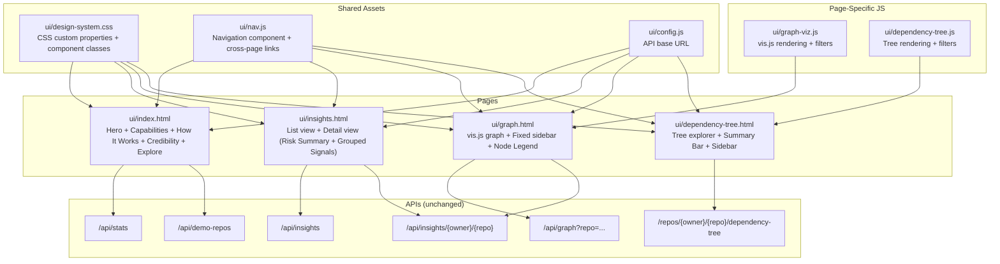

# Design Document: UI/UX Redesign

## Overview

This design transforms the Deep Signal frontend from a functional technical tool into a polished, insight-driven product experience. The redesign consolidates duplicated CSS custom properties and component styles from four separate inline `<style>` blocks into a single shared `ui/design-system.css` file, standardizes the navigation component, adds new content sections to the Homepage, restructures the Insights detail view around a Risk Summary Block with grouped signal sections, fixes the Graph page panel overflow, and introduces consistent loading states and micro-interactions across all pages.

The scope is frontend-only: static HTML/JS, no framework, no new backend endpoints. All pages consume existing API contracts (Stats, Insights, Demo Repos, Graph, Dependency Tree). Note: `/api/stats` already exists in `api/app.py` (added in the pre-deployment-finalization spec) — no new endpoint creation is needed.

### Key Design Decisions

1. **Single shared stylesheet over per-page styles**: All four pages currently define ~60 identical CSS custom properties inline. Extracting these into `design-system.css` eliminates drift and makes global changes trivial. Page-specific styles remain in `<style>` blocks after the shared import.

2. **CSS-only component catalog**: Reusable classes (`.ds-card`, `.ds-kpi`, `.ds-risk-tag`, `.ds-nav`, `.ds-btn-primary`, `.ds-btn-subtle`, `.ds-section`) replace ad-hoc per-page class names. No CSS framework — custom design system only.

3. **Navigation via shared JS module**: The navigation bar is currently copy-pasted as inline JS in each page. The redesign extracts it into a shared `ui/nav.js` module that all pages import, ensuring identical markup and behavior.

4. **Insight data mapping to grouped sections**: The Insight API's `direct_signals` array is grouped by `signal_name` prefix into three UI categories: Dependency Risk (`cve_*`, `dependency_*`), Maintainer Risk (`maintainer_*`), and Release Health (`release_*`, `stale_*`). This is a pure frontend mapping — no API changes.

5. **Graph overflow fix via CSS constraints**: The right-side panel gets `max-height: calc(100vh - 60px)`, `overflow-y: auto`, and `word-break: break-word`. Below 1200px viewport, it reflows to full-width with 400px max-height.

## Architecture



## Page State Model

Each page manages a small set of state variables. No shared state store — each page is independent, connected only by URL query parameters.

### Homepage (`ui/index.html`)
```
repoInputValue: string          // current text in the CTA input
stats: {                        // from /api/stats, null until loaded
  total_repos: number,
  fully_analyzed_repos: number,
  coverage_ratio: number
} | null
demoRepos: Array<{repo, name, owner, tags, risk_label}> | null
statsError: boolean             // true if /api/stats fetch failed
demoReposError: boolean         // true if /api/demo-repos fetch failed
```

### Insights Page (`ui/insights.html`)
```
repo: string | null             // from ?repo= query param
insightData: {                  // from /api/insights/{owner}/{repo}
  base_maintenance_risk: number | null,
  base_maintenance_label: string | null,
  graph_signal_score: number,
  graph_signal_label: string,
  reasons: string[],
  direct_signals: Array<{signal_name, severity, score_contribution, reason}>,
  top_risky_dependencies: Array<{package_name, registry_type, risk_score, risk_label, reasons, cve_count}>
} | null
loading: boolean
error: string | null
```

### Graph Page (`ui/graph.html`)
```
repo: string | null             // from ?repo= query param
graphData: {graph: {nodes, edges}, ...} | null
selectedNode: {id, label, type, ...} | null
loading: boolean
error: string | null
filterState: {refresh: boolean}
```

### Dependency Tree Page (`ui/dependency-tree.html`)
```
repo: string | null             // from ?repo= query param
treeData: {tree, summary, provenance} | null
loading: boolean
error: string | null
filters: {
  maxDepth: string,
  highRiskOnly: boolean,
  vulnerableOnly: boolean,
  directOnly: boolean,
  sortBy: string,
  truncateAfterChildren: string
}
expandedKeys: Set<string>
selectedKey: string | null
```

## Components and Interfaces

### 1. Design System CSS (`ui/design-system.css`)

The single source of truth for all visual tokens and reusable component classes.

#### CSS Custom Properties

Extracted from the current inline `:root` blocks (identical across all four pages):

```css
:root {
  /* Background layers */
  --bg: #0a0e13;
  --bg-surface: #0f1419;
  --bg-elevated: #151b23;
  --bg-overlay: #1a222c;

  /* Borders */
  --border: rgba(255, 255, 255, 0.06);
  --border-subtle: rgba(255, 255, 255, 0.04);
  --border-emphasis: rgba(255, 255, 255, 0.10);

  /* Text */
  --text-primary: rgba(255, 255, 255, 0.92);
  --text-secondary: rgba(255, 255, 255, 0.55);
  --text-tertiary: rgba(255, 255, 255, 0.35);

  /* Accent */
  --accent: #3b82f6;
  --accent-muted: rgba(59, 130, 246, 0.15);

  /* Status colors */
  --status-high-bg: rgba(239, 68, 68, 0.12);
  --status-high-text: #ef4444;
  --status-high-border: rgba(239, 68, 68, 0.35);
  --status-medium-bg: rgba(234, 179, 8, 0.12);
  --status-medium-text: #eab308;
  --status-medium-border: rgba(234, 179, 8, 0.35);
  --status-low-bg: rgba(34, 197, 94, 0.12);
  --status-low-text: #22c55e;
  --status-low-border: rgba(34, 197, 94, 0.35);
  --status-mild-bg: rgba(234, 88, 12, 0.12);
  --status-mild-text: #ea580c;

  /* Spacing scale (4px increments) */
  --sp-4: 4px; --sp-8: 8px; --sp-12: 12px;
  --sp-16: 16px; --sp-24: 24px; --sp-32: 32px;

  /* Radius */
  --radius-sm: 6px; --radius-md: 10px;
  --radius-lg: 14px; --radius-pill: 999px;

  /* Shadows */
  --shadow-sm: 0 1px 2px rgba(0, 0, 0, 0.3);
  --shadow-md: 0 2px 8px rgba(0, 0, 0, 0.25);

  /* Typography */
  --font-sans: -apple-system, BlinkMacSystemFont, "Segoe UI", Roboto, Helvetica, Arial, sans-serif;
  --font-mono: "SF Mono", SFMono-Regular, ui-monospace, Menlo, Monaco, Consolas, monospace;

  /* Backward-compat aliases */
  --mono: var(--font-mono);
  --sans: var(--font-sans);
  --green: #22c55e; --yellow: #eab308; --red: #ef4444;
  --orange: #f97316; --indigo: #6366f1;
  --muted: var(--text-secondary);
  --muted2: var(--text-tertiary);
}
```

#### Component Classes

| Class | Purpose | Key Properties |
|-------|---------|----------------|
| `.ds-card` | Generic card container | `bg-elevated`, `border`, `radius-lg`, `shadow-sm`, `padding: sp-24`, hover border transition |
| `.ds-section` | Page section wrapper | `max-width`, `margin: 0 auto`, `padding: 0 sp-12` |
| `.ds-kpi` | KPI stat block | Centered layout, `.ds-kpi-value` (mono font, 20px bold), `.ds-kpi-label` (11px tertiary uppercase) |
| `.ds-risk-tag` | Color-coded risk label | Pill shape, `.ds-risk-tag--high/medium/low` modifiers using status colors |
| `.ds-btn-primary` | Primary action button | Accent bg, white text, radius-md, 14px bold, hover opacity |
| `.ds-btn-subtle` | Secondary/subtle button | Transparent bg, border, tertiary text, hover surface bg |
| `.ds-nav` | Navigation bar | Flex row, elevated bg, border, brand left + links right |
| `.ds-nav-link` | Nav link item | Padding, radius-md, 13px semibold, `.active` modifier |
| `.ds-loading` | Loading skeleton | CSS keyframe pulse animation, bg-surface to bg-overlay |
| `.ds-spinner` | Spinner animation | 20px circle, border animation, CSS-only |

### 2. Navigation Module (`ui/nav.js`)

Extracted from the currently duplicated inline `<script>` blocks across all four pages.

```javascript
// Public API:
// - renderNav(currentPageId, repo) → injects <nav> into .wrap
// - getRepoFromUrl() → string|null
// - buildPageUrl(page, repo) → string
// - getCrossLinks(currentPageId, repo) → [{label, href}]
// - renderCrossLinks(containerId, repo) → void
// - parseRepoParam(searchString) → string|null
// - getCurrentPageId() → string
```

Each page imports `nav.js` after `config.js` and calls `renderNav(getCurrentPageId(), getRepoFromUrl())`. This replaces ~50 lines of duplicated inline JS per page.

Required script loading order in every HTML page's `<head>` or before `</body>`:

```html
<script src="/ui/config.js"></script>
<script src="/ui/nav.js"></script>
<script>
  renderNav(getCurrentPageId(), getRepoFromUrl());
</script>
```

`config.js` must load first (sets `window.DS_API_BASE`), then `nav.js` (defines navigation functions), then the inline call renders the nav bar. Page-specific scripts load after this block.

### 3. Homepage Layout (`ui/index.html`)

```
┌─────────────────────────────────────────────┐
│  Navigation Bar (.ds-nav)                   │
├─────────────────────────────────────────────┤
│  Hero Section                               │
│  ┌─────────────────────────────────────┐    │
│  │ h1: "Open Source Risk Intelligence" │    │
│  │ Subtitle (value proposition)        │    │
│  │ "Analyze any public GitHub repo..." │    │
│  │ [input: owner/repo] [Scan a Repo]   │    │
│  └─────────────────────────────────────┘    │
├─────────────────────────────────────────────┤
│  Capabilities Section (4-6 cards grid)      │
│  ┌──────┐ ┌──────┐ ┌──────┐ ┌──────┐       │
│  │ Vuln │ │Maint │ │Chain │ │Score │       │
│  │ Deps │ │ Risk │ │Anlys │ │ Calc │       │
│  └──────┘ └──────┘ └──────┘ └──────┘       │
├─────────────────────────────────────────────┤
│  How It Works (3-step horizontal)           │
│  [Analyze] ──→ [Evaluate] ──→ [Surface]    │
├─────────────────────────────────────────────┤
│  Credibility Section (KPI blocks)           │
│  ┌──────────┐ ┌──────────┐ ┌──────────┐    │
│  │ Repos    │ │ Deps     │ │ Packages │    │
│  │ Analyzed │ │ Mapped   │ │ Evaluated│    │
│  └──────────┘ └──────────┘ └──────────┘    │
├─────────────────────────────────────────────┤
│  Explore Repositories (existing, refined)   │
│  Higher Risk | Well Maintained | Popular    │
└─────────────────────────────────────────────┘
```

New sections added: Capabilities, How It Works, Credibility. Existing sections refined: Hero (new CTA label, guidance text), Explore (unchanged logic, design-system classes).

The CTA input uses `placeholder="numpy/numpy"` (not a submitted value). On submit, if input is empty/whitespace, focus is retained. Otherwise, navigate to `insights.html?repo={value}`.

Stats API integration for Credibility section:
- `total_repos` → "Repositories Analyzed"
- `fully_analyzed_repos` → "Dependencies Mapped"
- Third KPI: "Packages Evaluated" — derived from `total_repos` with a multiplier or static fallback
- On API failure: display "100+", "500+", "1000+" as fallbacks

### 4. Insights Page Detail View (`ui/insights.html`)

When a single repo is selected (detail mode), the layout becomes:

```
┌─────────────────────────────────────────────┐
│  Navigation Bar                             │
├─────────────────────────────────────────────┤
│  Detail Hero: repo name + subtitle          │
│  [← Back] [Graph] [Dependency Tree]         │
├─────────────────────────────────────────────┤
│  Risk Summary Block                         │
│  ┌──────────────────┐ ┌──────────────────┐  │
│  │ Maintenance Risk │ │ Graph Signal Risk│  │
│  │ 0.350  [LOW]     │ │ 0.420  [MEDIUM]  │  │
│  └──────────────────┘ └──────────────────┘  │
│  "3 known CVEs in dependency chain..."      │
├─────────────────────────────────────────────┤
│  Top Risk Drivers (3-5 bullets from reasons)│
│  • 3 known CVEs in dependency chain         │
│  • Single maintainer controls 2 packages    │
│  • Last release was 180+ days ago           │
├─────────────────────────────────────────────┤
│  Grouped Insight Sections (collapsible)     │
│  ┌─ Dependency Risk ──────── [HIGH] ──────┐ │
│  │  Signal: cve_risk (0.250)              │ │
│  │  Top risky deps: requests [HIGH]       │ │
│  └────────────────────────────────────────┘ │
│  ┌─ Maintainer Risk ─────── [MEDIUM] ────┐ │
│  │  Signal: maintainer_concentration      │ │
│  └────────────────────────────────────────┘ │
│  ┌─ Release Health ──────── [No issues] ──┐ │
│  │  No issues detected                    │ │
│  └────────────────────────────────────────┘ │
└─────────────────────────────────────────────┘
```

#### Signal-to-Category Mapping

The `direct_signals` array from the Insight API is grouped by `signal_name` prefix:

| Signal Name Prefix | UI Category | Section Header |
|---|---|---|
| `cve_*`, `dependency_*`, `vulnerable_*` | Dependency Risk | "Dependency Risk" |
| `maintainer_*`, `contributor_*`, `bus_factor_*` | Maintainer Risk | "Maintainer Risk" |
| `release_*`, `stale_*`, `version_*` | Release Health | "Release Health" |
| (unmatched) | Dependency Risk (default) | — |

Each section shows:
- Section header with category name + severity indicator (highest severity signal in that group)
- Signal table rows: signal_name, severity badge, score_contribution, reason
- For Dependency Risk: also shows `top_risky_dependencies` cards below the signal table

The Risk Summary Block maps directly from the API response:
- `base_maintenance_risk` + `base_maintenance_label` → left KPI
- `graph_signal_score` + `graph_signal_label` → right KPI
- `reasons[0]` → one-sentence insight summary (first reason, or generated from dominant signal)

### 5. Graph Page Fixes (`ui/graph.html`)

#### Panel Overflow Fix

```css
.details-panel {
  width: 350px;
  flex-shrink: 0;
  align-self: flex-start;
  max-height: calc(100vh - 60px);
  overflow-y: auto;
}

.detail-item .value {
  word-break: break-word;
  overflow-wrap: break-word;
}

@media (max-width: 1200px) {
  .main-container { flex-direction: column; }
  .details-panel {
    width: 100%;
    max-height: 400px;
  }
}
```

#### Node Legend

Added as a static element within the `.filters-panel`:

```html
<div class="filter-group">
  <h4>Legend</h4>
  <div class="ds-node-legend">
    <div class="legend-item">
      <span class="legend-swatch" style="background:#2563eb;"></span>
      <span>Repository</span>
    </div>
    <!-- ... one per NODE_TYPES entry -->
  </div>
</div>
```

The legend is always visible when the graph is loaded — no toggle required.

#### Node Label Positioning

vis.js configuration update:

```javascript
// All nodes: labels below shapes
nodes: {
  font: {
    size: 11,
    color: "rgba(255, 255, 255, 0.55)", // --text-secondary
    face: "ui-sans-serif, system-ui",
    vadjust: 20  // push label below shape
  }
}
```

Risk factor nodes already use `vadjust: -24` — this is preserved for that specific type.

### 6. Dependency Tree Page Enhancements

The Summary Bar and sidebar summary already exist in the current implementation. The redesign:
- Applies `.ds-kpi` classes to the summary grid stat cards
- Ensures sidebar summary recalculates on filter changes (already implemented via `refetch()`)
- Adds ecosystem breakdown and risk level distribution to the sidebar summary content

### 7. Loading States

All pages use a consistent loading pattern:

```css
.ds-loading {
  background: linear-gradient(90deg, var(--bg-surface) 25%, var(--bg-overlay) 50%, var(--bg-surface) 75%);
  background-size: 200% 100%;
  animation: ds-shimmer 1.5s ease-in-out infinite;
  border-radius: var(--radius-md);
}

@keyframes ds-shimmer {
  0% { background-position: 200% 0; }
  100% { background-position: -200% 0; }
}

.ds-spinner {
  display: inline-block;
  width: 20px; height: 20px;
  border: 3px solid rgba(255, 255, 255, 0.1);
  border-top-color: var(--text-primary);
  border-radius: 50%;
  animation: ds-spin 0.8s linear infinite;
}

@keyframes ds-spin {
  to { transform: rotate(360deg); }
}
```

Pages show `.ds-loading` skeleton blocks in content areas during fetch, replaced by rendered content on completion.

## Data Models

### Signal Category Mapping (Frontend-only)

```javascript
const SIGNAL_CATEGORIES = {
  "Dependency Risk": {
    prefixes: ["cve_", "dependency_", "vulnerable_"],
    icon: "🔗",
    includesRiskyDeps: true
  },
  "Maintainer Risk": {
    prefixes: ["maintainer_", "contributor_", "bus_factor_"],
    icon: "👤",
    includesRiskyDeps: false
  },
  "Release Health": {
    prefixes: ["release_", "stale_", "version_"],
    icon: "📦",
    includesRiskyDeps: false
  }
};

// Categorize a signal:
function categorizeSignal(signalName) {
  for (const [category, config] of Object.entries(SIGNAL_CATEGORIES)) {
    if (config.prefixes.some(p => signalName.startsWith(p))) {
      return category;
    }
  }
  return "Dependency Risk"; // default fallback
}
```

### Risk Label Color Mapping

```javascript
const RISK_COLORS = {
  HIGH:   { bg: "var(--status-high-bg)",   text: "var(--status-high-text)",   border: "var(--status-high-border)" },
  MEDIUM: { bg: "var(--status-medium-bg)", text: "var(--status-medium-text)", border: "var(--status-medium-border)" },
  LOW:    { bg: "var(--status-low-bg)",    text: "var(--status-low-text)",    border: "var(--status-low-border)" }
};

function riskTagClass(label) {
  return "ds-risk-tag ds-risk-tag--" + label.toLowerCase();
}
```

### Node Legend Data (Graph Page)

```javascript
const NODE_LEGEND = [
  { type: "repo",        color: "#2563eb", label: "Repository" },
  { type: "release",     color: "#16a34a", label: "Release" },
  { type: "maintainer",  color: "#9333ea", label: "Maintainer" },
  { type: "cve",         color: "#dc2626", label: "CVE" },
  { type: "registry",    color: "#ea580c", label: "Registry" },
  { type: "risk_factor", color: "#ca8a04", label: "Risk Factor" }
];
```


## Correctness Properties

*A property is a characteristic or behavior that should hold true across all valid executions of a system — essentially, a formal statement about what the system should do. Properties serve as the bridge between human-readable specifications and machine-verifiable correctness guarantees.*

### Property 1: CTA Navigation URL Construction

*For any* valid repository identifier string in `owner/repo` format, submitting it via the Homepage CTA input SHALL produce a navigation URL containing that exact string as the `repo` query parameter value.

**Validates: Requirements 1.4**

### Property 2: Empty Input Rejection

*For any* string composed entirely of whitespace characters (including the empty string), submitting it via the Homepage CTA input SHALL not trigger navigation and SHALL retain focus on the input element.

**Validates: Requirements 1.5**

### Property 3: CSS Custom Property Single Source of Truth

*For any* CSS custom property defined in the design system specification (backgrounds, borders, text colors, accents, status colors, spacing, radii, shadows, fonts), the property SHALL be defined exactly once in `design-system.css` and SHALL NOT be redefined in any page-specific `<style>` block.

**Validates: Requirements 5.2, 20.2**

### Property 4: Component Class Definitions in Shared Stylesheet

*For any* required component class name in the design system specification (`.ds-card`, `.ds-section`, `.ds-kpi`, `.ds-risk-tag`, `.ds-btn-primary`, `.ds-btn-subtle`, `.ds-nav`), the class SHALL be defined in `design-system.css`.

**Validates: Requirements 5.3**

### Property 5: Navigation Bar Structural Consistency

*For any* pair of pages in the application, the navigation bar SHALL have identical HTML structure: a `<nav>` element with class `ds-nav` containing a brand span and a links container with the same set of page links in the same order.

**Validates: Requirements 6.1, 20.3**

### Property 6: Active Page Indication

*For any* page in the application, the navigation link corresponding to that page SHALL have the `active` class and `aria-current="page"` attribute, and no other navigation link SHALL have the `active` class.

**Validates: Requirements 6.3**

### Property 7: Repository Parameter Propagation in Navigation Links

*For any* valid repository string and any page, all navigation bar links and cross-page navigation links SHALL include the repository as a `repo` query parameter in their `href` attribute.

**Validates: Requirements 6.4, 19.1**

### Property 8: Risk Label to Color Class Mapping

*For any* risk label value (HIGH, MEDIUM, LOW), the corresponding Risk_Tag component SHALL apply the correct CSS modifier class (`ds-risk-tag--high`, `ds-risk-tag--medium`, `ds-risk-tag--low`) that maps to the design system's status color variables.

**Validates: Requirements 7.3, 13.2**

### Property 9: Insight Summary Sentence Generation

*For any* valid insight data object containing a non-empty `reasons` array, the Risk Summary Block SHALL produce a non-empty human-readable summary sentence.

**Validates: Requirements 7.4**

### Property 10: Risk Drivers Bullet Count

*For any* `reasons` array of length N, the "Top Risk Drivers" section SHALL display `min(N, 5)` bullet points, and when N > 0 the displayed count SHALL be at least `min(N, 3)`.

**Validates: Requirements 8.2**

### Property 11: Signal Severity Ordering

*For any* set of direct signals with mixed severity levels, the "Top Risk Drivers" section SHALL order items by severity priority: high signals first, then medium, then mild.

**Validates: Requirements 8.3**

### Property 12: Empty Category Fallback

*For any* insight data where a signal category (Dependency Risk, Maintainer Risk, or Release Health) contains zero matching signals, the corresponding grouped section SHALL display the text "No issues detected" with a low-severity indicator.

**Validates: Requirements 9.3**

### Property 13: Node Legend Completeness

*For any* node type defined in the graph visualization configuration (Repository, Release, Maintainer, CVE, Registry, Risk Factor), the Node Legend SHALL contain an entry with the matching color swatch and label text.

**Validates: Requirements 11.2**

### Property 14: Filter-Driven Metric Recalculation

*For any* filter state applied on the Dependency Tree page, the Summary Bar and sidebar summary metrics SHALL reflect the counts and distributions of the filtered dataset, not the unfiltered dataset.

**Validates: Requirements 14.3, 15.2**

### Property 15: Hover Transition Duration

*For any* interactive component class in the design system (buttons, cards, links, table rows), the CSS `transition-duration` value SHALL be between 100 milliseconds and 200 milliseconds.

**Validates: Requirements 16.1**

### Property 16: Loading Indicator Visibility

*For any* page in the application, when data is being fetched, a loading indicator (skeleton or spinner) SHALL be visible in the content area where data will appear.

**Validates: Requirements 17.1**

### Property 17: Guidance Text on Pages Without Repository

*For any* non-Homepage page (Insights, Graph, Dependency Tree) loaded without a `repo` query parameter, the page SHALL display guidance text explaining how to load a repository.

**Validates: Requirements 18.3**

### Property 18: Auto-Load from Repository Query Parameter

*For any* page that receives a valid `repo` query parameter, the page SHALL automatically initiate data loading for that repository without requiring additional user interaction.

**Validates: Requirements 19.3**

## Error Handling

### API Failure Scenarios

| Page | API | Failure Behavior |
|------|-----|-----------------|
| Homepage | `/api/stats` | Display fallback KPI values ("100+", "500+", "1000+"). No error banner. |
| Homepage | `/api/demo-repos` | Display "Unable to load repositories" in the Explore section. |
| Insights (list) | `/api/insights` | Display error banner with status code and message. Hide table. |
| Insights (detail) | `/api/insights/{owner}/{repo}` | Display error message in detail view with "← Back" button. |
| Graph | `/api/graph` | Display error in `.err` box. Show empty state in graph container. |
| Dependency Tree | `/repos/.../dependency-tree` | Display error in `#errBox`. Show initial state in tree container. |

### Network Errors

All `fetch()` calls wrap in try/catch. Network failures (no response) display a generic "Unable to connect to the server" message in the page's error container.

### Invalid Repository Input

- Empty or whitespace-only input: no navigation, retain focus (Homepage CTA)
- Invalid format (no slash, multiple slashes): pages that parse `?repo=` return `null` from `parseRepoParam()` and show guidance text
- 404 from API: display "Repository not found" message

### CSS Fallbacks

- If `design-system.css` fails to load, pages retain their existing inline `<style>` blocks as a degraded fallback during the migration period. Post-migration, inline styles are removed.
- CSS custom properties use the cascade — if a property is undefined, the browser uses the inherited or initial value. All critical properties have explicit fallback values in the shared stylesheet.

## Testing Strategy

### Unit Tests (Example-Based)

Unit tests cover specific structural checks, content verification, and edge cases:

- Homepage: h1 text content, subtitle presence, CTA button label, guidance text, capability card count (4-6), How It Works step labels, KPI block presence
- Insights: Risk Summary Block structure (two KPI blocks), grouped section headers (3 sections), collapsible panel toggle behavior
- Graph: panel overflow CSS properties, media query breakpoint, node legend presence, vis.js font configuration
- Dependency Tree: Summary Bar visibility, sidebar panel DOM ordering
- Design System: stylesheet link presence in all four pages, no animation library imports

### Property-Based Tests

Property-based tests verify universal properties across generated inputs using `fast-check` (JavaScript PBT library). Each test runs a minimum of 100 iterations.

Properties to implement:
1. **URL construction** (Property 1): Generate random `owner/repo` strings → verify URL encoding
2. **Empty input rejection** (Property 2): Generate whitespace strings → verify no navigation
3. **CSS single source** (Property 3): Parse CSS files → verify no duplicate custom property definitions
4. **Component classes** (Property 4): Check required class names exist in parsed CSS
5. **Nav consistency** (Property 5): Compare nav structure across page pairs
6. **Active page** (Property 6): For each page ID → verify exactly one active link
7. **Repo propagation** (Property 7): Generate repo strings → verify all link hrefs contain param
8. **Risk color mapping** (Property 8): For each risk label → verify correct CSS class
9. **Summary sentence** (Property 9): Generate insight objects with reasons → verify non-empty output
10. **Bullet count** (Property 10): Generate reasons arrays of varying length → verify count bounds
11. **Severity ordering** (Property 11): Generate mixed-severity signals → verify order
12. **Empty category fallback** (Property 12): Generate insights with missing categories → verify fallback text
13. **Legend completeness** (Property 13): For each node type → verify legend entry
14. **Filter metrics** (Property 14): Generate tree data + filter states → verify metric recalculation
15. **Transition duration** (Property 15): Parse CSS → verify duration values in range
16. **Loading indicator** (Property 16): For each page → verify loading state shows indicator
17. **Guidance text** (Property 17): For each non-home page without repo → verify guidance visible
18. **Auto-load** (Property 18): For each page with repo param → verify load triggered

Each property test is tagged: `Feature: ui-ux-redesign, Property {N}: {title}`

### Integration Tests

- Cross-page navigation: navigate from Homepage → Insights → Graph → Dependency Tree with a repo param, verify each page loads data
- Stats API fallback: mock API failure, verify fallback KPI values render
- Insights detail → grouped sections: load a real insight response, verify signals are grouped into correct categories

### CSS Regression

- Verify no layout overflow at zoom levels 67%–150% on all four pages
- Verify responsive breakpoints trigger correct layout changes (1200px for graph, 700px for mobile)
